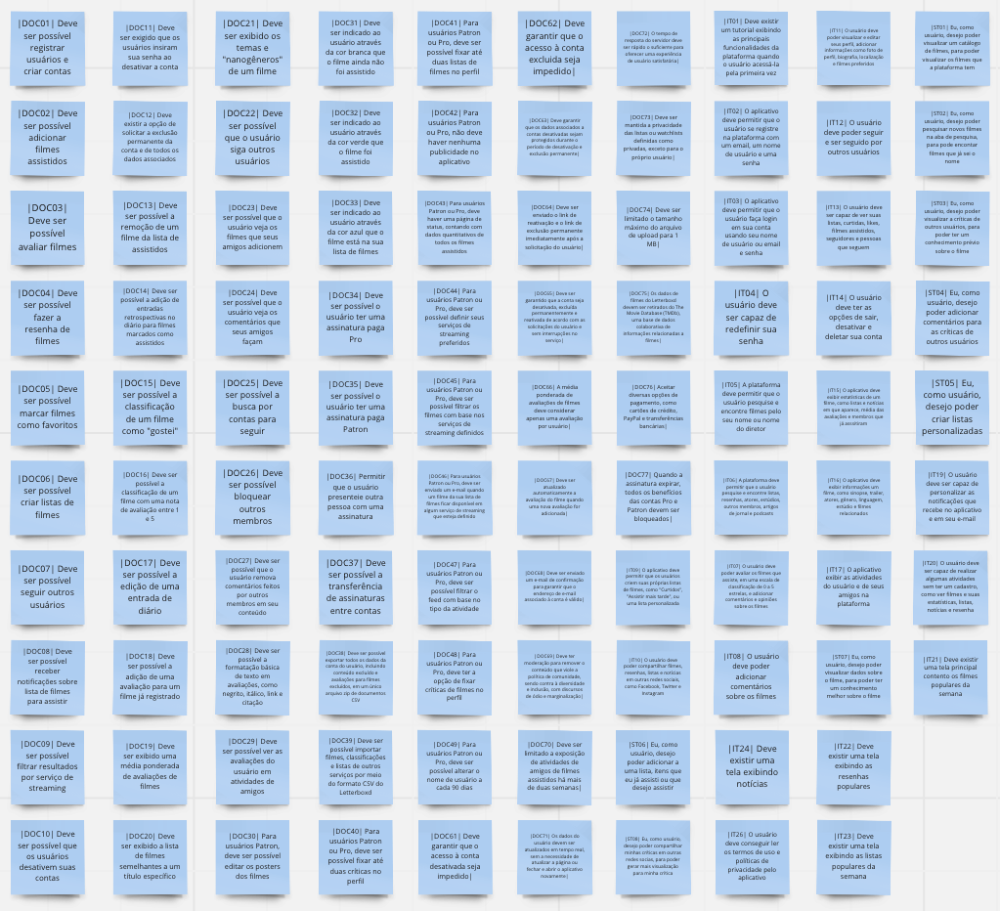
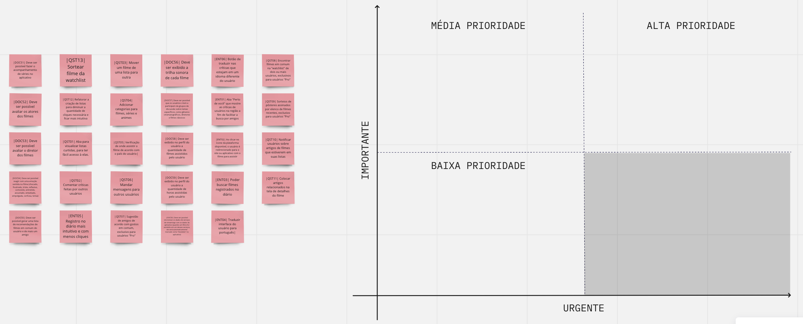
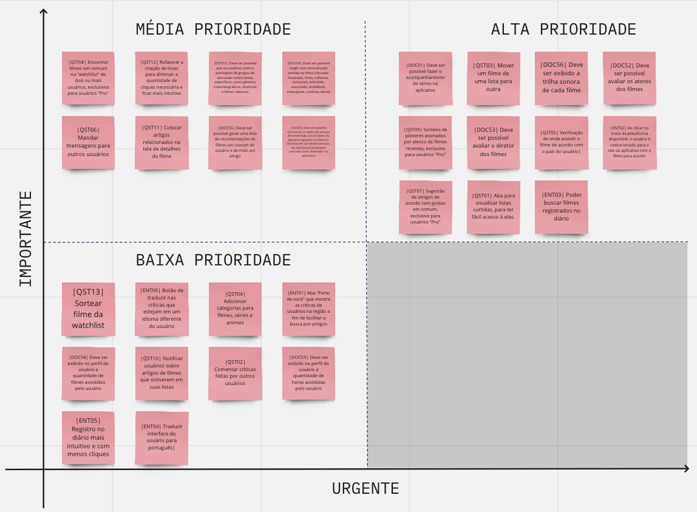
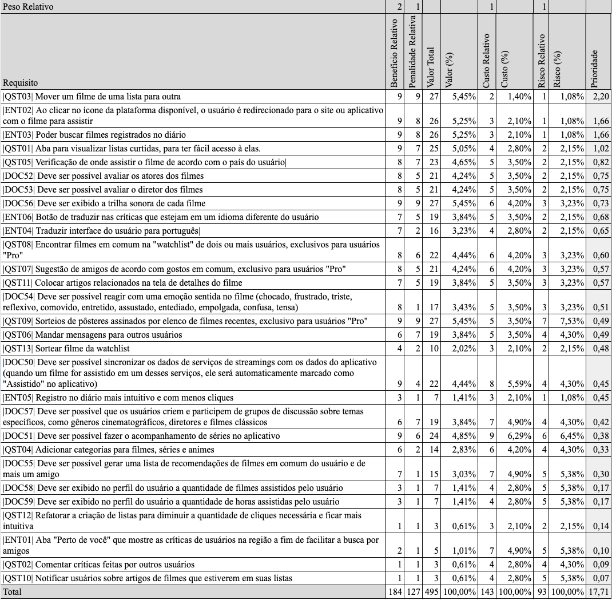

# Priorização

## Introdução

Este documento apresenta as técnicas de priorização de requisitos utilizadas no processo de desenvolvimento do projeto. As técnicas de priorização são fundamentais para orientar o desenvolvimento do software e garantir que as funcionalidades mais importantes sejam implementadas em primeiro lugar.

Duas técnicas de priorização foram utilizadas neste projeto: a Firts Things First [[1]](#ancora1) e a Escala de 3 Níveis [[2]](#ancora2). A técnica Firts Things First consiste em identificar os requisitos mais importantes, aqueles que têm maior impacto no usuário ou que são essenciais para o funcionamento do sistema, e priorizá-los em relação aos demais requisitos. Já a Escala de 3 níveis é uma técnica simples, na qual os requisitos são classificados em três categorias, de acordo com sua importância: alta, média e baixa prioridade.

Ambas as técnicas foram aplicadas no processo de priorização dos requisitos do Letterboxd, com o objetivo de identificar e dar prioridade às funcionalidades mais importantes e garantir que elas fossem implementadas primeiro. A aplicação dessas técnicas permitiu uma gestão eficiente dos requisitos e garantiu que as prioridades do projeto fossem bem definidas.

No decorrer deste documento, serão apresentados os requisitos do Letterboxd, classificados de acordo com a técnica de priorização utilizada. Isso permitirá uma melhor compreensão dos requisitos mais críticos e garantirá que o desenvolvimento do aplicativo atenda às necessidades dos usuários de forma mais eficiente.

## Escala de Três Níveis

A primeira técnica de priorização de requisitos usada foi a de Escala de 3 níveis. Essa técnica foi aplicada em conjunto com um usuário, que desempenhou o papel de stakeholder, e utilizou os critérios de importância e urgência para classificar os requisitos em alta, média e baixa prioridade.

A priorização dos requisitos foi realizada em uma reunião online, na qual os integrantes do grupo conduziram o processo, com o objetivo de garantir que as funcionalidades mais importantes do aplicativo fossem implementadas primeiro. A técnica de priorização Escala de 3 níveis permitiu que a equipe de desenvolvimento identificasse e priorizasse as funcionalidades mais críticas do ponto de vista do usuário, de forma clara e objetiva.

A Escala de 3 níveis se baseia na ideia de que os requisitos podem ser classificados em três categorias de prioridade, de acordo com a importância e urgência de cada um. Os requisitos considerados importantes e urgentes foram classificados como alta prioridade, enquanto aqueles considerados importantes, mas não urgentes foram classificados como média prioridade. Já os requisitos considerados não importantes e não urgentes foram classificados como baixa prioridade.

Os requisitos já implementados foram entendidos pela equipe de desenvolvimento do aplicativo como alta prioridade, portanto não iremos representá-los graficamente no quadro abaixo. Nós optamos por apresentar tais requisitos para os usuários a fim de terem uma referência dos requisitos que devem ser classificados como alta prioridade. Na Figura 1 podemos ver como os requisitos já implementados foram apresentados.

<figure markdown>
  
  <figcaption>Figura 1: apresentação dos requisitos já implementados (Fonte: autor, 2023)</figcaption>
</figure>

A Figura 2 apresenta a plataforma utilizada para essa priorização. Para uma melhor visualização do usuário, nós optamos por criar um quadro apontando os níveis de importância e urgência de cada quadrante, enquanto nos post-its está representado cada um dos requisitos não implementados da plataforma.

<figure markdown>
  
  <figcaption>Figura 2: apresentação dos requisitos a serem priorizados (Fonte: autor, 2023)</figcaption>
</figure>

Na Figura 3 pode-se visualizar como o quadro ficou após a priorização ser concluída.

<figure markdown>
  
  <figcaption>Figura 3: priorização concluída (Fonte: autor, 2023)</figcaption>
</figure>

Na Tabela 1 é apresentado os requisitos priorizados, com suas respectivas justificativas.

| Identificador | Requisito | Prioridade | Justificativa
| ------ | ------ | ------ | ------ |
| DOC51 | Deve ser possível fazer o acompanhamento de séries no aplicativo| Alta prioridade | |
| QST03 | Mover um filme de uma lista para outra | Alta prioridade | |
| DOC56 | Deve ser exibido a trilha sonora de cada filme | Alta prioridade | |
| DOC52 | Deve ser possível avaliar os atores dos filmes | Alta prioridade | |
| DOC53 | Deve ser possível avaliar o diretor dos filmes | Alta prioridade | |
| QST09 | Sorteios de pôsteres assinados por elenco de filmes recentes, exclusivo para usuários "Pro" | Alta prioridade | |
| QST05 | Verificação de onde assistir o filme de acordo com o país do usuário | Alta prioridade | |
| ENT02 | Ao clicar no ícone da plataforma disponível, o usuário é redirecionado para o site ou aplicativo com o filme para assistir | Alta prioridade | |
| QST07 | Sugestão de amigos de acordo com gostos em comum, exclusivo para usuários "Pro" | Alta prioridade | |
| QST01 | Aba para visualizar listas curtidas, para ter fácil acesso à elas. | Alta prioridade | |
| ENT03 | Poder buscar filmes registrados no diário  | Alta prioridade | |
| QST08 | Encontrar filmes em comum na "watchlist" de dois ou mais usuários, exclusivos para usuários "Pro" | Média prioridade | |
| QST12 | Refatorar a criação de listas para diminuir a quantidade de cliques necessária e ficar mais intuitiva | Média prioridade | |
| DOC57 | Deve ser possível que os usuários criem e participem de grupos de discussão sobre temas específicos, como gêneros cinematográficos, diretores e filmes clássicos | Média prioridade | |
| DOC54 | Deve ser possível reagir com uma emoção sentida no filme (chocado, frustrado, triste, reflexivo, comovido, entretido, assustado, entediado, empolgada, confusa, tensa)| Média prioridade | |
| QST06 | Mandar mensagens para outros usuários | Média prioridade | |
| QST11 | Colocar artigos relacionados na tela de detalhes do filme | Média prioridade | |
| DOC55 | Deve ser possível gerar uma lista de recomendações de filmes em comum do usuário e de mais um amigo | Média prioridade | |
| DOC50 | Deve ser possível sincronizar os dados de serviços de streamings com os dados do aplicativo (quando um filme for assistido em um desses serviços, ele será automaticamente marcado como "Assistido" no aplicativo)| Média prioridade | |
| QST13 | Sortear filme da watchlist | Baixa prioridade |
| ENT06 | Botão de traduzir nas críticas que estejam em um idioma diferente do usuário  | Baixa prioridade |
| QST04 | Adicionar categorias para filmes, séries e animes | Baixa prioridade |
| ENT01 | Aba "Perto de você" que mostre as críticas de usuários na região a fim de facilitar a busca por amigos  | Baixa prioridade |
| DOC58 | Deve ser exibido no perfil do usuário a quantidade de filmes assistidos pelo usuário | Baixa prioridade |
| DOC59 | Deve ser exibido no perfil do usuário a quantidade de horas assistidas pelo usuário | Baixa prioridade |
| QST10 | Notificar usuários sobre artigos de filmes que estiverem em suas listas | Baixa prioridade |
| ST04 | Poder adicionar comentários para as críticas de outros usuários |Baixa prioridade |
| ENT05 | Registro no diário mais intuitivo e com menos cliques | Baixa prioridade |
| ENT04 | Traduzir interface do usuário para português | Baixa prioridade |
| DOC01 | Deve ser possível registrar usuários e criar contas | Alta prioridade |
| DOC02 | Deve ser possível adicionar filmes assistidos | Alta prioridade |
| DOC03 | Deve ser possível avaliar filmes | Alta prioridade |
| DOC04 | Deve ser possível fazer a resenha de filmes | Alta prioridade |
| DOC05 | Deve ser possível marcar filmes como favoritos | Alta prioridade |
| DOC06 | Deve ser possível criar listas de filmes | Alta prioridade |
| DOC07 | Deve ser possível seguir outros usuários | Alta prioridade |
| DOC08 | Deve ser possível receber notificações sobre lista de filmes para assistir | Alta prioridade |
| DOC09 | Deve ser possível filtrar resultados por serviço de streaming | Alta prioridade |
| DOC10 | Deve ser possível que os usuários desativem suas contas | Alta prioridade |
| DOC11 | Deve ser exigido que os usuários insiram sua senha ao desativar a conta| Alta prioridade |
| DOC12 | Deve existir a opção de solicitar a exclusão permanente da conta e de todos os dados associados| Alta prioridade |
| DOC13 | Deve ser possível a remoção de um filme da lista de assistidos| Alta prioridade |
| DOC14 | Deve ser possível a adição de entradas retrospectivas no diário para filmes marcados como assistidos| Alta prioridade |
| DOC15 | Deve ser possível a classificação de um filme como "gostei"| Alta prioridade |
| DOC16 | Deve ser possível a classificação de um filme com uma nota de avaliação entre 1 e 5 | Alta prioridade |
| DOC17 | Deve ser possível a edição de uma entrada de diário | Alta prioridade |
| DOC18 | Deve ser possível a adição de uma avaliação para um filme já registrado | Alta prioridade |
| DOC19 | Deve ser exibido uma média ponderada de avaliações de filmes| Alta prioridade |
| DOC20 | Deve ser exibido a lista de filmes semelhantes a um título específico| Alta prioridade |
| DOC21 | Deve ser exibido os temas e "nanogêneros" de um filme | Alta prioridade |
| DOC22 | Deve ser possível que o usuário siga outros usuários| Alta prioridade |
| DOC23 | Deve ser possível que o usuário veja os filmes que seus amigos adicionem| Alta prioridade |
| DOC24 | Deve ser possível que o usuário veja os comentários que seus amigos façam| Alta prioridade |
| DOC25 | Deve ser possível a busca por contas para seguir| Alta prioridade |
| DOC26 | Deve ser possível bloquear outros membros| Alta prioridade |
| DOC27 | Deve ser possível que o usuário remova comentários feitos por outros membros em seu conteúdo| Alta prioridade |
| DOC28 | Deve ser possível a formatação básica de texto em avaliações, como negrito, itálico, link e citação| Alta prioridade |
| DOC29 | Deve ser possível ver as avaliações do usuário em atividades de amigos| Alta prioridade |
| DOC30 | Para usuários Patron, deve ser possível editar os posters dos filmes | Alta prioridade |
| DOC31 | Deve ser indicado ao usuário através da cor branca que o filme ainda não foi assistido| Alta prioridade |
| DOC32 | Deve ser indicado ao usuário através da cor verde que o filme foi assistido| Alta prioridade |
| DOC33 | Deve ser indicado ao usuário através da cor azul que o filme está na sua lista de filmes| Alta prioridade |
| DOC34 | Deve ser possível o usuário ter uma assinatura paga Pro| Alta prioridade |
| DOC35 | Deve ser possível o usuário ter uma assinatura paga Patron| Alta prioridade |
| DOC36 | Permitir que o usuário presenteie outra pessoa com uma assinatura| Alta prioridade |
| DOC37 | Deve ser possível a transferência de assinaturas entre contas| Alta prioridade |
| DOC38 | Deve ser possível exportar todos os dados da conta do usuário, incluindo conteúdo excluído e avaliações para filmes excluídos, em um único arquivo zip de documentos CSV| Alta prioridade |
| DOC39 | Deve ser possível importar filmes, classificações e listas de outros serviços por meio do formato CSV do Letterboxd| Alta prioridade |
| DOC40 | Para usuários Patron ou Pro, deve ser possível fixar até duas críticas no perfil| Alta prioridade |
| DOC41 | Para usuários Patron ou Pro, deve ser possível fixar até duas listas de filmes no perfil| Alta prioridade |
| DOC42 | Para usuários Patron ou Pro, não deve haver nenhuma publicidade no aplicativo| Alta prioridade |
| DOC43 | Para usuários Patron ou Pro, deve haver uma página de status, contando com dados quantitativos de todos os filmes assistidos| Alta prioridade |
| DOC44 | Para usuários Patron ou Pro, deve ser possível definir seus serviços de streaming preferidos| Alta prioridade |
| DOC45 | Para usuários Patron ou Pro, deve ser possível filtrar os filmes com base nos serviços de streaming definidos| Alta prioridade |
| DOC46 | Para usuários Patron ou Pro, deve ser enviado um e-mail quando um filme da sua lista de filmes ficar disponível em algum serviço de streaming que esteja definido| Alta prioridade |
| DOC47 | Para usuários Patron ou Pro, deve ser possível filtrar o feed com base no tipo da atividade | Alta prioridade |
| DOC48 | Para usuários Patron ou Pro, deve ter a opção de fixar críticas de filmes no perfil| Alta prioridade |
| DOC49 | Para usuários Patron ou Pro, deve ser possível alterar o nome de usuário a cada 90 dias | Alta prioridade |
| DOC50 | Deve ser possível sincronizar os dados de serviços de streamings com os dados do aplicativo (quando um filme for assistido em um desses serviços, ele será automaticamente marcado como "Assistido" no aplicativo)| Alta prioridade |
| DOC54 | Deve ser possível reagir com uma emoção sentida no filme (chocado, frustrado, triste, reflexivo, comovido, entretido, assustado, entediado, empolgada, confusa, tensa)| Alta prioridade |
| DOC55 | Deve ser possível gerar uma lista de recomendações de filmes em comum do usuário e de mais um amigo | Alta prioridade |
| DOC57 | Deve ser possível que os usuários criem e participem de grupos de discussão sobre temas específicos, como gêneros cinematográficos, diretores e filmes clássicos | Alta prioridade |
| DOC61 | Deve garantir que o acesso à conta desativada seja impedido | Alta prioridade |
| DOC62 | Deve garantir que o acesso à conta excluida seja impedido | Alta prioridade |
| DOC63 | Deve garantir que os dados associados a contas desativadas sejam protegidos durante o período de desativação e exclusão permanente | Alta prioridade |
| DOC64 | Deve ser enviado o link de reativação e o link de exclusão permanente imediatamente após a solicitação do usuário | Alta prioridade |
| DOC65 | Deve ser garantido que a conta seja desativada, excluída permanentemente e reativada de acordo com as solicitações do usuário e sem interrupções no serviço | Alta prioridade |
| DOC66 | A média ponderada de avaliações de filmes deve considerar apenas uma avaliação por usuário | Alta prioridade |
| DOC67 | Deve ser atualizado automaticamente a avaliação do filme quando uma nova avaliação for adicionada | Alta prioridade |
| DOC68 | Deve ser enviado um e-mail de confirmação para garantir que o endereço de e-mail associado à conta é válido | Alta prioridade |
| DOC69 | Deve ter moderação para remover o conteúdo que viole a política de comunidade, sendo contra à diversidade e inclusão, com discursos de ódio e marginalização | Alta prioridade |
| DOC70 | Deve ser limitado a exposição de atividades de amigos de filmes assistidos há mais de duas semanas | Alta prioridade |
| DOC71 | Os dados do usuário devem ser atualizados em tempo real, sem a necessidade de atualizar a página ou fechar e abrir o aplicativo novamente | Alta prioridade |
| DOC72 | O tempo de resposta do servidor deve ser rápido o suficiente para oferecer uma experiência de usuário satisfatória | Alta prioridade |
| DOC73 | Deve ser mantida a privacidade das listas ou watchlists definidas como privadas, exceto para o próprio usuário | Alta prioridade |
| DOC74 | Deve ser limitado o tamanho máximo do arquivo de upload para 1 MB | Alta prioridade |
| DOC75 | Os dados de filmes do Letterboxd devem ser retirados do The Movie Database (TMDb), uma base de dados colaborativa de informações relacionadas a filmes | Alta prioridade |
| DOC76 | Aceitar diversas opções de pagamento, como cartões de crédito, PayPal e transferências bancárias | Alta prioridade |
| DOC77 | Quando a assinatura expirar, todos os benefícios das contas Pro e Patron devem ser bloqueados | Alta prioridade |
| ENT06 | Botão de traduzir nas críticas que estejam em um idioma diferente do usuário  | Alta prioridade |
| IT01 | Deve existir um tutorial exibindo as principais funcionalidades da plataforma quando o usuário acessá-la pela primeira vez | Alta prioridade |
| IT02 | O aplicativo deve permitir que o usuário se registre na plataforma com um email, um nome de usuário e uma senha | Alta prioridade |
| IT03 | O aplicativo deve permitir que o usuário faça login em sua conta usando seu nome de usuário ou email e senha | Alta prioridade |
| IT04 | O usuário deve ser capaz de redefinir sua senha | Alta prioridade |
| IT05 | A plataforma deve permitir que o usuário pesquise e encontre filmes pelo seu nome ou nome do diretor | Alta prioridade |
| IT06 | A plataforma deve permitir que o usuário pesquise e encontre listas, resenhas, atores, estúdios, outros membros, artigos de jornal e podcas | Alta prioridade |
| IT07 | O usuário deve poder avaliar os filmes que assiste, em uma escala de classificação de 0 a 5 estrelas, e adicionar comentários e opiniões sobre os filmes | Alta prioridade |
| IT08 | O usuário deve poder adicionar comentários sobre os filmes | Alta prioridade |
| IT09 | O aplicativo deve permitir que os usuários criem suas próprias listas de filmes, como "Curtidos", "Assistir mais tarde", ou uma lista personalizada | Alta prioridade |
| IT10 | O usuário deve poder compartilhar filmes, resenhas, listas e notícias em outras redes sociais, como Facebook, Twitter e Instagram | Alta prioridade |
| IT11 | O usuário deve poder visualizar e editar seus perfil, adicionar informações como foto de perfil, biografia, localização e filmes preferidos | Alta prioridade |
| IT12 | O usuário deve poder seguir e ser seguido por outros usuários | Alta prioridade |
| IT13 | O usuário deve ser capaz de ver suas listas, curtidas, likes, filmes assistidos, seguidores e pessoas que seguem | Alta prioridade |
| IT14 | O usuário deve ter as opções de sair, desativar e deletar sua conta | Alta prioridade |
| IT15 | O aplicativo deve exibir estatísticas de um filme, como listas e notícias em que aparece, média das avaliações e membros que já asssitiram | Alta prioridade |
| IT16 | O aplicativo deve exibir informações um filme, como sinopse, trailer, atores, gênero, linguagem, estúdio e filmes relacionados | Alta prioridade |
| IT17 | O aplicativo exibir as atividades do usuário e de seus amigos na plataforma | Alta prioridade |
| IT18 | O usuário deve ser capaz de redefinir sua senha | Alta prioridade |
| IT19 | O usuário deve ser capaz de personalizar as notificações que recebe no aplicativo e em seu e-mail | Alta prioridade |
| IT20 | O usuário deve ser capaz de realizar algumas atividades sem ter um cadastro, como ver filmes e suas estatísticas, listas, notícias e resenh |RNF |
| IT21 | Deve existir uma tela principal contento os filmes populares da semana | Alta prioridade |
| IT22 | Deve existir uma tela exibindo as resenhas populares | Alta prioridade |
| IT23 | Deve existir uma tela exibindo as listas populares da semana | Alta prioridade |
| IT24 | Deve existir uma tela exibindo notícias | Alta prioridade |
| IT25 | O aplicativo deve ter uma versão paga para não exibir anúncios | Alta prioridade |
| IT26 | O usuário deve conseguir ler os termos de uso e políticas de privacidade pelo aplicativo | Alta prioridade |
| QST04 | Adicionar categorias para filmes, séries e animes | Alta prioridade |
| QST06 | Mandar mensagens para outros usuários | Alta prioridade |
| QST11 | Colocar artigos relacionados na tela de detalhes do filme | Alta prioridade |
| QST13 | Sortear filme da watchlist | Alta prioridade |
| ST01 | Poder visualizar um catálogo de filmes, para poder visualizar os filmes que a plataforma tem | Alta prioridade |
| ST02 | Poder pesquisar novos filmes na aba de pesquisa, para poder encontrar filmes que já sei o nome | Alta prioridade |
| ST03 | Poder visualizar a críticas de outros usuários, para poder ter um conhecimento prévio sobre o filme | Alta prioridade |
| ST08 | Poder compartilhar minhas críticas em outras redes socias, para poder gerar mais visualização para minha crítica | Alta prioridade |

Tabela 1: priorização dos requisitos em alta, média e baixa prioridade

## First Things Firts

A técnica de priorização First Things First foi aplicada em conjunto com um usuário que desempenhou o papel de stakeholder. Para esta técnica, foi criada uma tabela que lista os requisitos elicitados para o projeto. Os requisitos avaliados foram somente os que não foram implementados ainda, pois entende-se que os que já foram implementados possuem uma alta prioridade. A tabela foi organizada de acordo com as colunas de riscos, custos, benefícios e penalidades relativas de cada requisito.

O primeiro passo foi estimar o Benefício Relativo que cada requisito fornece ao cliente ou ao negócio, utilizando uma escala de 1 a 9, onde 1 representa o menos significativo e 9 o mais significativo. Este valor é subjetivo e pode variar de acordo com as necessidades do negócio ou do cliente.

Em seguida, estimou-se a Penalidade Relativa que o negócio sofreria se o requisito não fosse incluído, utilizando a mesma escala de 1 a 9. Neste caso, é importante considerar os impactos que a ausência do requisito pode ter no negócio.

A Coluna Valor Total foi calculada somando o Benefício Relativo multiplicado pelo Peso Benefício Relativo (que foi definido como 2) e a Penalidade Relativa multiplicada pelo Peso Penalidade Relativo (que foi definido como 1). O objetivo desta coluna é equilibrar os posicionamentos do cliente e do desenvolvedor.

O próximo passo foi estimar o Custo Relativo de implementação de cada requisito, utilizando a escala de 1 a 9. É importante considerar que os custos podem variar de acordo com o tempo e recursos necessários para implementação de cada requisito.

Outra coluna importante na tabela é o Risco Relativo, que foi estimado em uma escala de 1 a 9. Aqui, é importante considerar os riscos associados à implementação de cada requisito, como a possibilidade de atrasos, falhas e impactos na qualidade do produto.

Por fim, a prioridade de cada requisito foi calculada usando a fórmula: Valor (%) / (Custo (%) * Peso Custo + Risco (%) * Peso Risco). Os Pesos Custo e Risco utilizados foram iguais a 1. A prioridade calculada é uma porcentagem, que leva em consideração o Valor Total, o Custo Relativo e o Risco Relativo de cada requisito.

A lista de requisitos foi, então, ordenada em ordem decrescente de prioridade, sendo que os requisitos com as maiores prioridades devem ser implementados primeiro. Com essa técnica, é possível equilibrar os interesses do cliente e do desenvolvedor, além de garantir que os recursos sejam utilizados de maneira eficiente.

O resultado da priorização pode ser visualizado na Figura 4:

<figure markdown>
  
  <figcaption>Figura 4: tabela utilizada na priorização First Things First (Fonte: autor, 2023)</figcaption>
</figure>

Referência Bibliográfica

[1] KARL EUGENE WIEGERS; BEATTY, J. Software requirements. Redmond, Washington: Microsoft Press, 2015.
 
[2] WIEGERS Karl E. First Things First: Prioritizing Requirements. Setembro de 1999. Disponível em <https://www.processimpact.com/articles/prioritizing.pdf>. Acesso em 26 de abril de 2023.

## Tabela de Versionamento

| Data | Versão | Descrição | Autor | Revisor |
| ---- | ------ | --------- | ----- | ------- |
| 30/04/2023 | `1.0`  | Priorização dos requisitos elicitados | [Clara Ribeiro](https://github.com/clara-ribeiro) e [Débora Caires](https://github.com/deboracaires) |  |