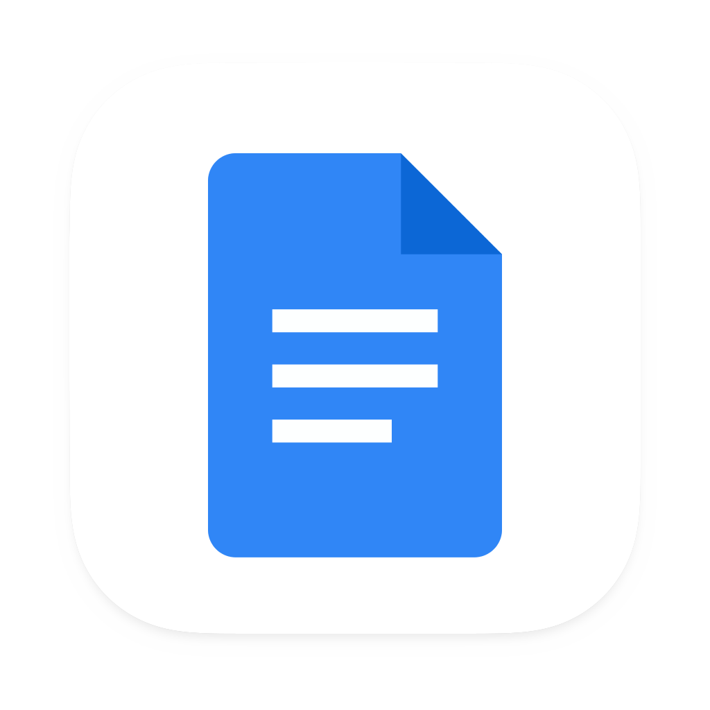
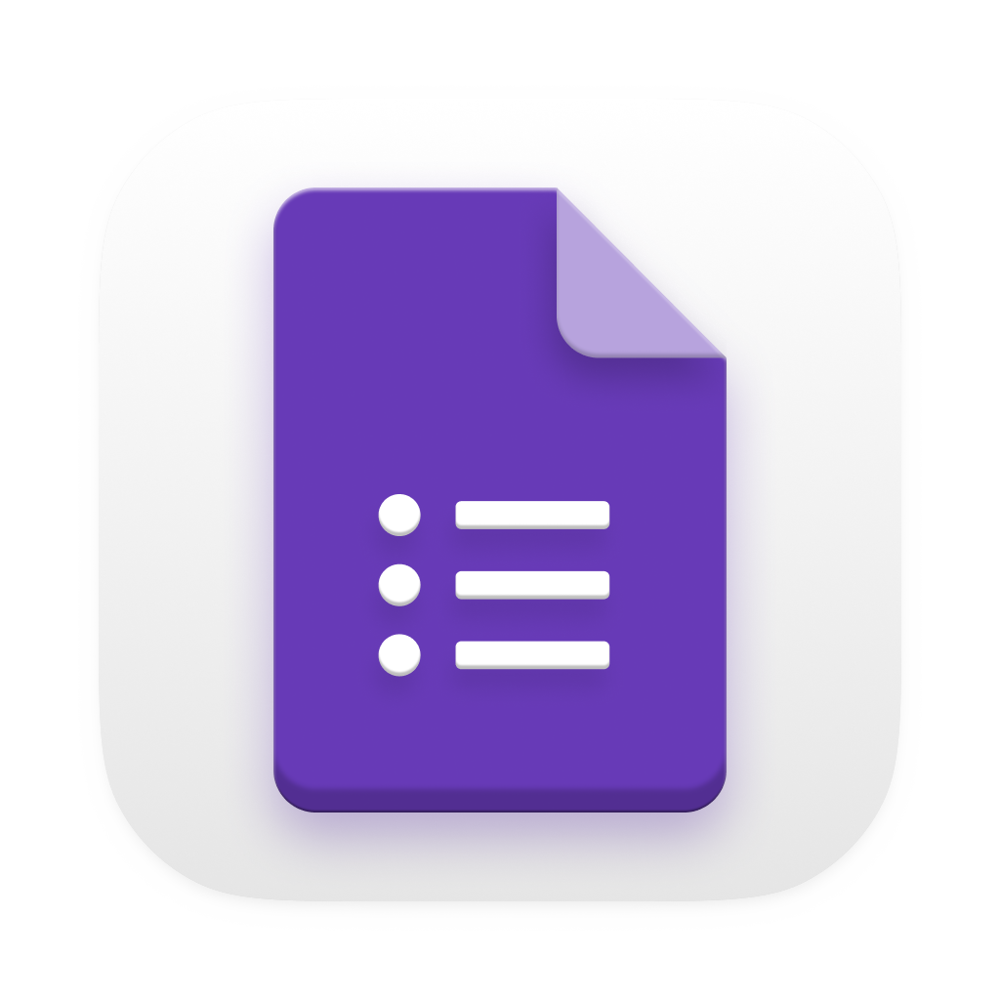

# Ferramentas do Projeto

## 1. Introdução

Nesta página, você encontrará uma lista completa das ferramentas que serão utilizadas durante o processo de levantamento de requisitos do aplicativo Letterboxd. Cada ferramenta possui um propósito específico, abrangendo desde a coleta de informações até o gerenciamento de tarefas e comunicação entre a equipe. Essas ferramentas são essenciais para garantir que todas as etapas do projeto sejam realizadas de forma adequada e dentro do prazo estabelecido.

## 2. Ferramentas

A Tabela 1 apresenta informações sobre as ferramentas que serão utilizadas durante o projeto, juntamente com uma breve descrição de seus objetivos.

|                                      Logo                                      |     Ferramenta     |                                                                          Finalidade                                                                           |
|:------------------------------------------------------------------------------:|:------------------:|:-------------------------------------------------------------------------------------------------------------------------------------------------------------:|
| { width=250px} |       GitHub[¹](#ancora1)       | O GitHub é uma plataforma de hospedagem de código-fonte de programação e será utilizada como repositório para armazenar a documentação do projeto. |
| { width=250px}  |      Telegram[²](#ancora2)       |                                            Aplicativo utilizado para manter uma rápida comunicação entre a equipe.                                            |
| { width=250px}  |       Teams[³](#ancora3)           |                                         Plataforma utilizada para conduzir e gravar as reuniões e entregas da equipe.                                         |
| { width=250px}  |       Canva[⁴](#ancora4)         |                                                 Utilizado para criar o Rich Picture do aplicativo Letterboxd.                                                 |
| { width=250px} |     Letterboxd[⁵](#ancora5)      |                                              Aplicativo escolhido como objeto de estudo para realizar o projeto.                                              |
| { width=250px}  |      Youtube[⁶](#ancora6)        |                                          Ferramenta utilizada para armazenar os vídeos das reuniões e apresentações.                                          |
| { width=250px}  | Visual Studio Code[⁷](#ancora7) |                                          Editor de texto usado para editar e fazer upload da documentação no GitHub.                                          |
| { width=250px}  |       Mkdocs[⁸](#ancora8)         |                                                      Utilizado para gerar a documentação no Github Pages                                                      |
| { width=250px}  |       Google Drive[⁹](#ancora9) |                                                      Plataforma de armazenamento na nuvem utilizada pela equipe para armazenar arquivos do projeto.                        |
|             { width=250px}             |      Google Docs[¹¹](#ancora11)      |                                          Utilizado para criar e armazenar as Atas das reuniões.                                           |
|             { width=250px}             |      Google Forms[¹²](#ancora12)      |                                          Plataforma utilizada para criar formulários para coletar informações para o projeto.                                          |
|             { width=250px}             |      This Person Does Not Exist[¹³](#ancora13)      |                                          Site que gera imagens de pessoas fictícias, será utilizado pela equipe para a criação das personas.                                             |

Tabela 1: Ferramentas utilizadas no projeto. Fonte: Autoria Própria

## 3. Referências

> - [1] GITHUB. Build software better, together. Disponível em: <https://github.com>. Acesso em: 16 abr. 2023.
> - [2] Telegram – a new era of messaging. Disponível em: <https://telegram.org>. Acesso em: 16 abr. 2023.
> - [3] Aplicativo de Chat Interno e Trabalho Remoto | Microsoft Teams. Disponível em: <https://www.microsoft.com/pt-br/microsoft-teams/group-chat-software>. Acesso em: 16 abr. 2023.
> - [4] CANVA. Canva. Disponível em: <https://www.canva.com/>. Acesso em: 16 abr. 2023.
> - [5] Letterboxd • Your life in film. Disponível em: <https://letterboxd.com>. Acesso em: 16 abr. 2023.
> - [6] YOUTUBE. YouTube. YouTube, 2022. Disponível em: <https://www.youtube.com> Acesso em: 16 abr. 2023.
> - [7] MICROSOFT. Visual Studio Code. Disponível em: <https://code.visualstudio.com>. Acesso em: 16 abr. 2023.
> - [8] MkDocs. Disponível em: <https://www.mkdocs.org>. Acesso em: 16 abr. 2023.
> - [9] Meet Google Drive – One place for all your files. Disponível em: <https://drive.google.com/drive/>. Acesso em: 16 abr. 2023.
> - [11] Google Docs. Disponível em: <https://docs.google.com/>. Acesso em: 22 abr. 2023.
> - [12] Google Forms. Disponível em: <https://docs.google.com/forms/>. Acesso em: 22 abr. 2023.
> - [13] This Person Does Not Exist. Disponível em: <https://thispersondoesnotexist.com/>. Acesso em: 22 abr. 2023. Refererenciado do grupo Fifa Plus da disciplina de Requisitos de Software. Disponível em: <https://requisitos-de-software.github.io/2022.2-FifaPlus/Planejamento/ferramentas/>
> - O que é GitHub? Disponível em: <https://tecnoblog.net/responde/o-que-e-github/>. Acesso em: 16 abr. 2023.
> - @ELRUMO. Over 5000+ free icons for macOS Monterey, Big Sur & iOS - massive app icon pack. Disponível em: <https://macosicons.com/#/>. Acesso em: 16 abr. 2023.

> - O que é GitHub? Disponível em: <https://tecnoblog.net/responde/o-que-e-github/>. Acesso em: 16 abr. 2023.
> - @ELRUMO. Over 5000+ free icons for macOS Monterey, Big Sur & iOS - massive app icon pack. Disponível em: <https://macosicons.com/#/>. Acesso em: 16 abr. 2023.

## 4. Histórico de Versão

|    Data    | Versão |                                                   Descrição                                                    |                      Autor                      |                 Revisor                |
|:----------:|:------:|:--------------------------------------------------------------------------------------------------------------:|:---------------------------------------------------:|:-------------------------------------------:|
| 13/04/2023 |  1.0   | Criação da primeira versão do documento, incluindo as primeiras ferramentas utilizadas, logotipo e sua função. | [Maciel Júnior](https://github.com/macieljuniormax) | [Rhuan Marques](https://github.com/RhuanMr) |
| 13/04/2023 |  2.0   | Alteração dos logos, adição da bibliografia, adição da ferramenta google drive. | [Maciel Júnior](https://github.com/macieljuniormax) | [Natan Santana](https://github.com/Neitan2001) |
| 22/04/2023 |  `0.4` |                Adição das ferramentas Google Docs, Google Forms e This Person Does Not Exist                 | [Maciel Júnior](https://github.com/macieljuniormax) |   [Arthur Loureiro](https://github.com/ArtAssLou)                                           |
