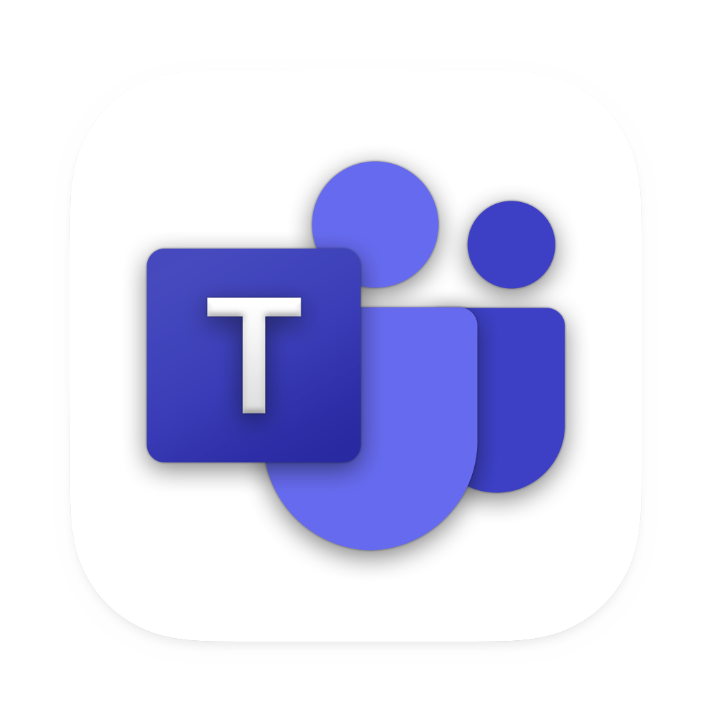
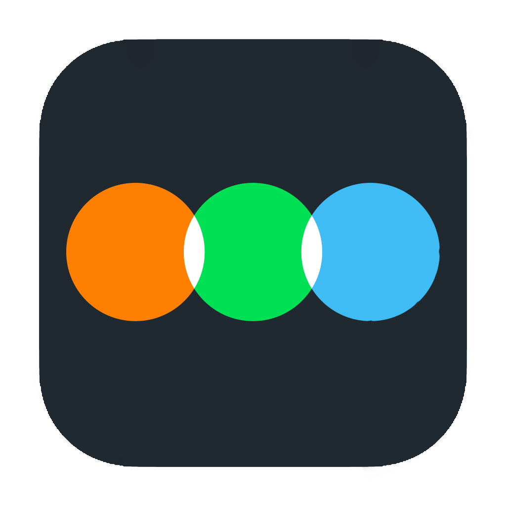
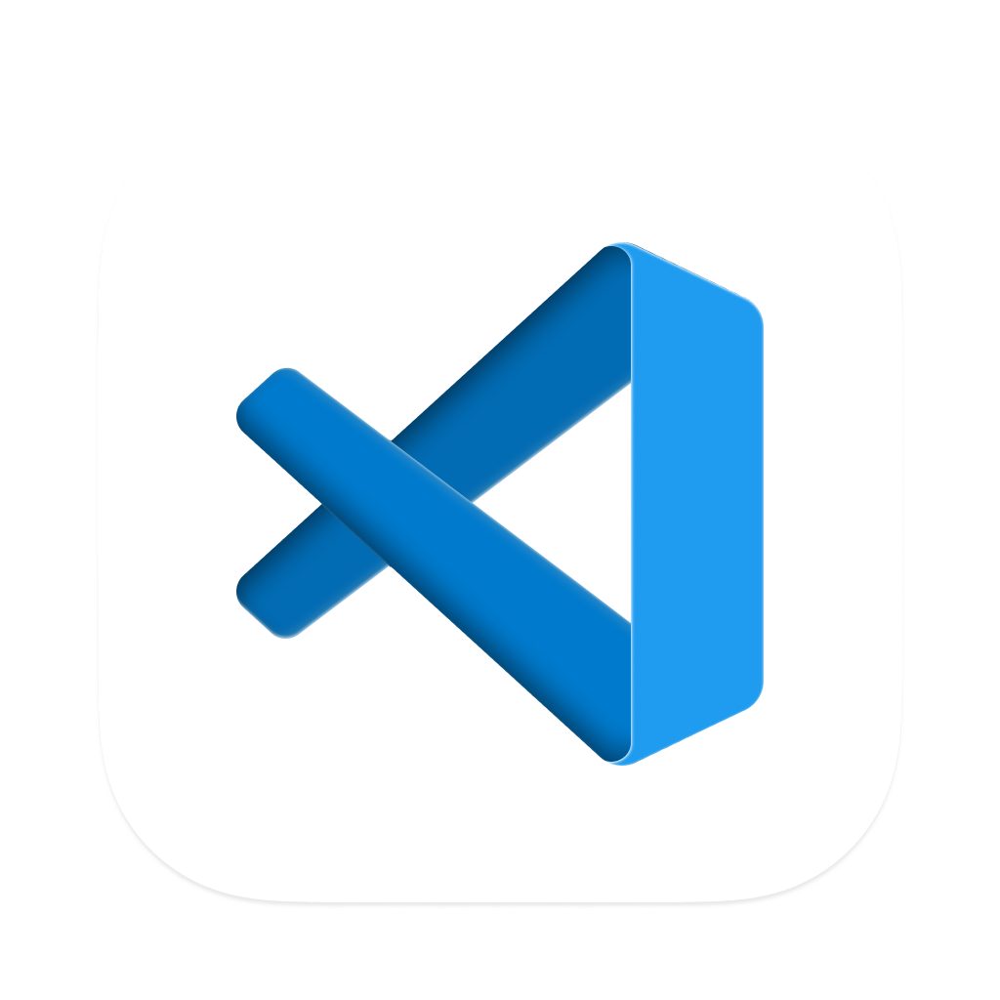

# Ferramentas do Projeto

## 1. Introdução

Nesta página, você encontrará uma lista completa das ferramentas que serão utilizadas durante o processo de levantamento de requisitos do aplicativo Letterboxd. Cada ferramenta possui um propósito específico, abrangendo desde a coleta de informações até o gerenciamento de tarefas e comunicação entre a equipe. Essas ferramentas são essenciais para garantir que todas as etapas do projeto sejam realizadas de forma adequada e dentro do prazo estabelecido.

## 2. Ferramentas

Abaixo, você encontrará uma tabela contendo as ferramentas que serão utilizadas durante o projeto juntamente com uma breve descrição de seus objetivos.

|                                      Logo                                      |     Ferramenta     |                                                                          Finalidade                                                                           |
|:------------------------------------------------------------------------------:|:------------------:|:-------------------------------------------------------------------------------------------------------------------------------------------------------------:|
| { width=250px} |       GitHub       | O GitHub é uma plataforma de hospedagem de código-fonte de programação e será utilizada como repositório para armazenar a documentação do projeto. |
| { width=250px}  |      Telegram      |                                            Aplicativo utilizado para manter uma rápida comunicação entre a equipe.                                            |
| { width=250px}  |       Teams        |                                         Plataforma utilizada para conduzir e gravar as reuniões e entregas da equipe.                                         |
| { width=250px}  |       Canva        |                                                 Utilizado para criar o Rich Picture do aplicativo Letterboxd.                                                 |
| { width=250px} |     Letterboxd     |                                              Aplicativo escolhido como objeto de estudo para realizar o projeto.                                              |
| { width=250px}  |      Youtube       |                                          Ferramenta utilizada para armazenar os vídeos das reuniões e apresentações.                                          |
| { width=250px}  | Visual Studio Code |                                          Editor de texto usado para editar e fazer upload da documentação no GitHub.                                          |
| { width=250px}  |       Mkdocs       |                                                      Utilizado para gerar a documentação no Github Pages                                                      |
| { width=250px}  |       Google Drive |                                                      Plataforma de armazenamento na nuvem utilizada pela equipe para armazenar arquivos do projeto.                        |

Tabela 1: Ferramentas utilizadas no projeto

## 3. Referências

> - O que é GitHub? Disponível em: <https://tecnoblog.net/responde/o-que-e-github/>. Acesso em: 16 abr. 2023.

## 4. Histórico de Versão

|    Data    | Versão |                                                   Descrição                                                    |                      Autor(es)                      |                 Revisor(es)                 |
|:----------:|:------:|:--------------------------------------------------------------------------------------------------------------:|:---------------------------------------------------:|:-------------------------------------------:|
| 13/04/2023 |  1.0   | Criação da primeira versão do documento, incluindo as primeiras ferramentas utilizadas, logotipo e sua função. | [Maciel Júnior](https://github.com/macieljuniormax) | [Rhuan Marques](https://github.com/RhuanMr) |
| 13/04/2023 |  1.1   | Alteração dos logos, adição da bibliografia, adição da ferramenta google drive. | [Maciel Júnior](https://github.com/macieljuniormax) |  |

