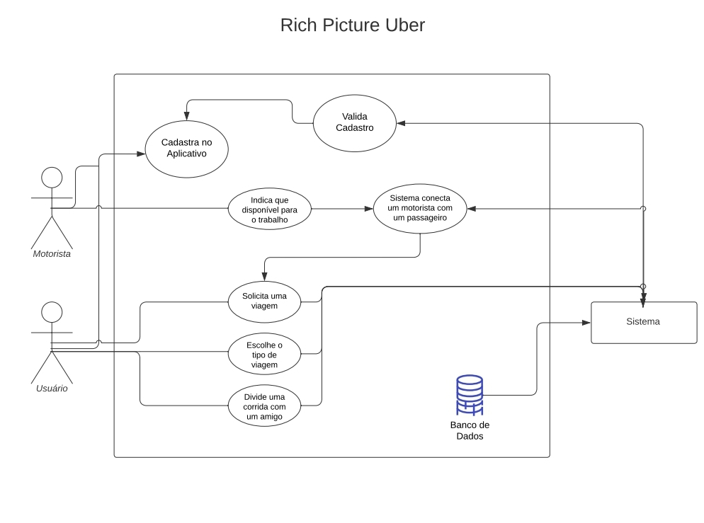

# Rich Picture

## Introdução

     Rich Picture é uma técnica de modelagem gráfica utilizada para representar de forma visual a complexidade de um sistema [2]. Basicamente, seu objetivo é proporcionar uma visão geral do problema a ser analisado, representando as principais características e desafios enfrentados pelo mesmo. Sendo assim, a Rich Picture pode ser utilizada como uma ferramenta para auxiliar na compreensão de problemas mais complexos e na identificação de possíveis soluções.

---

## Rich Picture - Letterboxd

### Clara Marcelino Ribeiro de Sousa - Letterboxd

Na Figura 1, é apresentada a Rich Picture do aplicativo selecionado para a produção deste projeto, o Letterboxd. Nela, é possível visualizar diferentes elementos interconectados, tais como usuários, filmes, recursos de avaliação, entre outros. Essa primeira versão foi elaborada pela membra Clara Sousa.

<figure markdown>
  {width: 90vw}
  <figcaption>Figura 1: Rich Picture do Letterboxd</figcaption>
  
Fonte: Autoria Própria

</figure>

---

## Rich Pictures - Membros

### Arthur D'Assumpção Loureiro - Buser

Na Figura 2, é apresentada a Rich Picture do aplicativo Buser, criada pelo membro Arthur Loureiro.

<figure markdown>
  {width: 90vw}
  <figcaption>Figura 2: Rich Picture do Buser</figcaption>
  
Fonte: Autoria Própria

</figure>

### Débora Caires de Souza Moreira - FGTS

Na Figura 3, é apresentada a Rich Picture do aplicativo FGTS, criada pela membra Débora Caires.

<figure markdown>
  {width: 90vw}
  <figcaption>Figura 3: Rich Picture do FGTS</figcaption>
  
Fonte: Autoria Própria

</figure>

### Gustavo Barbosa de Oliveira - Uber

Na Figura 4, é apresentada a Rich Picture do aplicativo Uber, criada pelo membro Gustavo Oliveira.

<figure markdown>
  {width: 90vw}
  <figcaption>Figura 4: Rich Picture do Uber</figcaption>
  
Fonte: Autoria Própria

</figure>

### Maciel Ferreira Custódio Júnior - Apple Music

Na Figura 5, é apresentada a Rich Picture do aplicativo Apple Music, criada pelo membro Maciel Júnior.

<figure markdown>
  {width: 90vw}
  <figcaption>Figura 5: Rich Picture do Apple Music</figcaption>
  
Fonte: Autoria Própria

</figure>

### Natan Tavares Santana - WebDiet

Na Figura 6, é apresentada a Rich Picture do aplicativo WebDiet, criada pelo membro Natan Santana.

<figure markdown>
  {width: 90vw}
  <figcaption>Figura 6: Rich Picture do WebDiet</figcaption>
  
Fonte: Autoria Própria

</figure>

### Rhuan Marques Róbias dos Santos - Tinder

Na Figura 7, é apresentada a Rich Picture do aplicativo Tinder, criada pelo membro Rhuan Santos.

<figure markdown>
  {width: 90vw}
  <figcaption>Figura 7: Rich Picture do Tinder</figcaption>
  
Fonte: Autoria Própria

</figure>

## Referência Bibliográfica

>  [1] MONK, Andrew; HOWARD, Steve. "The Rich Picture: A Tool for Reasoning About Work Context". 1998. Disponível em: <https://dl.acm.org/doi/pdf/10.1145/274430.274434>.
> 
> [2] CHECKLAND, P.; POULTER, J. (2006). Learning for action: A short definitive account of soft systems methodology and its use for practitioner, teachers and students. New York: John Wiley & Sons.

## Tabela de Versionamento

| Data       | Versão | Descrição             | Autor                                             | Revisor                                             |
| ---------- | ------ | --------------------- | ------------------------------------------------- | --------------------------------------------------- |
| 14/04/2023 | `1.0`  | Rich Pictures membros | [Débora Moreira](https://github.com/deboracaires) | [Maciel Júnior](https://github.com/macieljuniormax) 
| 15/04/2023 | `1.1` | Correção de erros |[Débora Moreira](https://github.com/deboracaires) | [Clara Ribeiro](https://github.com/clara-ribeiro) |
| 15/04/2023 | `1.2` | Correção de referenciamento de imagens |[Débora Moreira](https://github.com/deboracaires) | [Clara Ribeiro](https://github.com/clara-ribeiro) |
| 22/04/2023 | `1.3` | Correções de feedback apresentação 1 |[Débora Moreira](https://github.com/deboracaires) |  |
