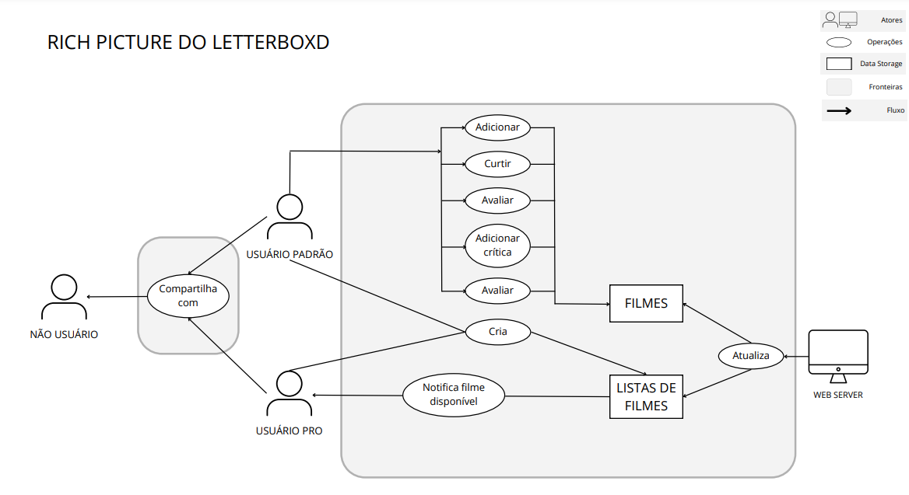
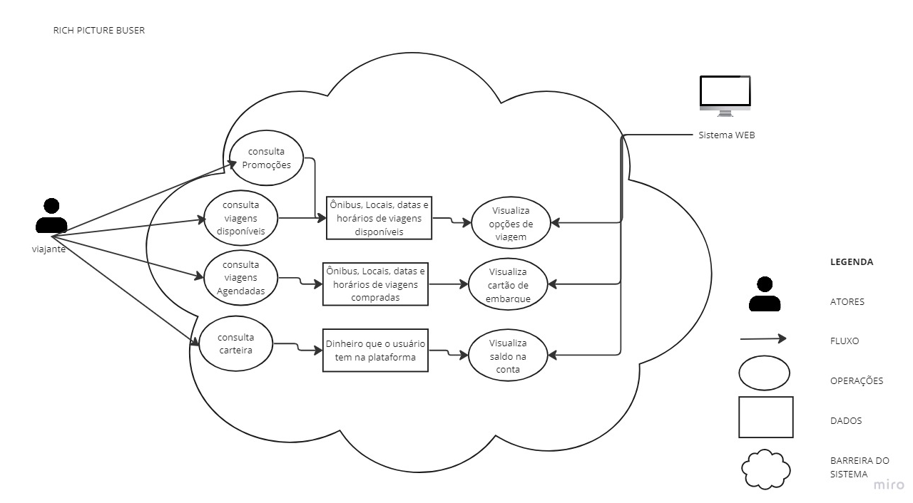
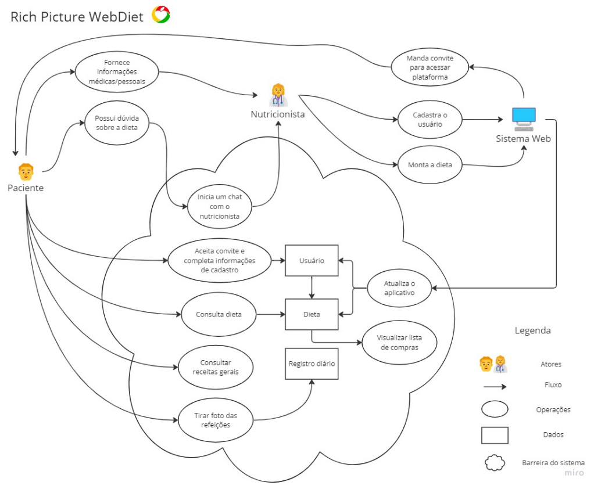
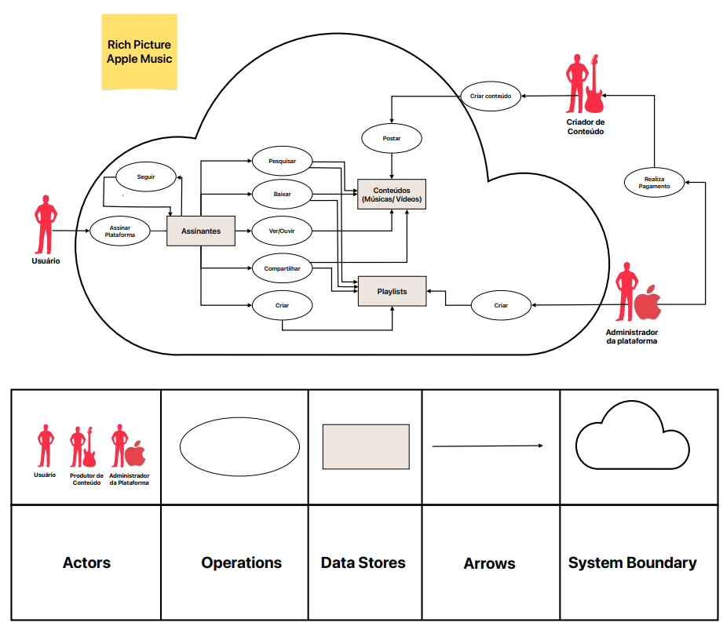
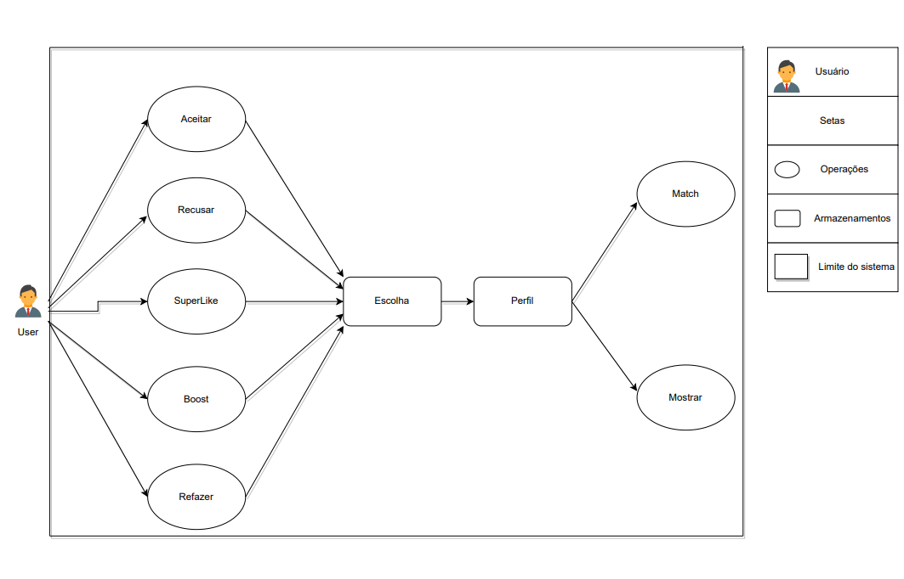

# Rich Picture
 

# Introdução

      Rich Picture é uma técnica de modelagem gráfica utilizada para representar de forma visual a complexidade de um sistema [2]. Basicamente, seu objetivo é proporcionar uma visão geral do problema a ser analisado, representando as principais características e desafios enfrentados pelo mesmo. Sendo assim, o Rich Picture pode ser utilizado como uma ferramenta para auxiliar na compreensão de problemas mais complexos e na identificação de possíveis soluções.

# Rich Picture - Letterboxd
## Clara Marcelino Ribeiro de Sousa - Letterboxd
 

    
    Figura 1: Rich Picture do LetterBoxd
     <small>Fonte: Autoria própria</small>

 
 

# Rich Pictures - Membros

## Arthur D'Assumpção Loureiro - Buser
 

    
    Figura 2: Rich Picture do Buser
     <small>Fonte: Autoria própria</small>

 
 

## Débora Caires de Souza Moreira - FGTS
 

    
    Figura 3: Rich Picture do FGTS
     <small>Fonte: Autoria própria</small>

 
 

## Gustavo Barbosa de Oliveira
 

    
    Figura 4: Rich Picture do 
     <small>Fonte: Autoria própria</small>

 
 

## Maciel Ferreira Custódio Júnior - Apple Music
 

    
    Figura 5: Rich Picture do Apple Music
     <small>Fonte: Autoria própria</small>

 
 

## Natan Tavares Santana - WebDiet
 

    
    Figura 6: Rich Picture do WebDiet
     <small>Fonte: Autoria própria</small>

 
 

## Rhuan Marques Róbias dos Santos - Tinder
 

    
    Figura 7: Rich Picture do Tinder
     <small>Fonte: Autoria própria</small>

 
 

# Referência Bibliográfica

>[1] MONK, Andrew; HOWARD, Steve. "The Rich Picture: A Tool for Reasoning About Work Context". 1998

>[2] CHECKLAND, P.; POULTER, J. (2006). Learning for action: A short definitive account of soft systems methodology and its use for practitioner, teachers and students. New York: John Wiley & Sons.

 
 

# Tabela de Versionamento

| Data | Versão | Descrição | Autor | Revisor |
| ---- | ------ | --------- | ----- | ------- |
| 14/04/2023 | `0.1`  | Rich Pictures membros | [Débora Moreira](https://github.com/deboracaires) | [Maciel Júnior](https://github.com/macieljuniormax)