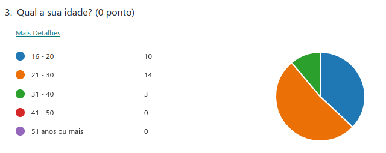
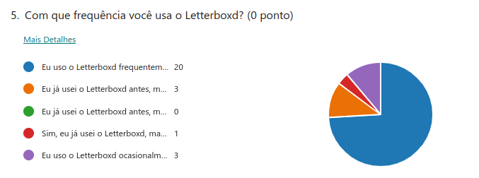
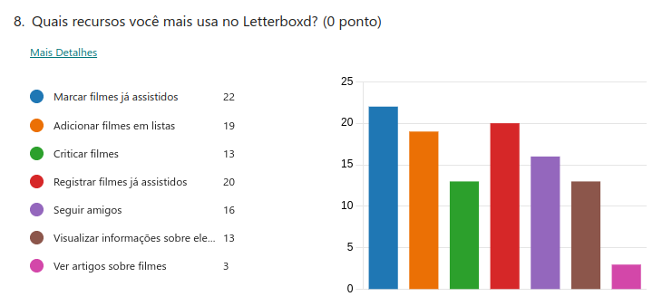

# Questionário - Perfil de Usuário e Elicitação

## 1 - Introdução

Realizar a especificação do perfil de usuário é muito importante para qualquer projeto que esteja começando por dois motivos principais: o perfil irá ajudar todos os envolvidos no desenvolvimento a entender quem irá utilizar o sistema, e quem serão os possíveis participantes de futuras entrevistas e validações que poderão ocorrer ao longo do projeto. Este perfil consiste na descrição detalhada das características dos usuário e para conseguir essas informações é necessário definir quais serão as características de interesse (como idade, gênero, profissão, entre outros) e depois realizar a coleta desses dados seguindo alguma metodologia (como entrevista ou questionários). Após a coleta dos dados, é possível realizar a análise e fazer a divisão dos usuários em grupos com características semelhantes[¹](#ancora1).

## 2 - Metodologia

A metodologia que será utilizada para coletar os dados a fim de definir o perfil de usuário será o questionário. O questionário é semelhante à entrevista no questio de que ambos possuem um roteiro de perguntas que o participante deverá responder, a diferença é que o primeiro não possui interação com os respondentes durante a resposta. Essa técnica foi escolhida pois permite a coleta rápida de uma grande quantidade de dados quantitativos e qualitativos dos vários usuários que o aplicativo possui em diferentes partes do país[²](#ancora2). Além de recolher dados sobre os usuários, o questionário será utilizado para elicitar requisitos ao perguntar sobre as funcionaldiades já existentes no aplicativo e sobre possíveis funcionalidades e melhorias que os usuários enxergam.

O questionário foi distribuído em grupos do telegram e whatsapp que os participantes do grupo participam. Além disso, também foi distribuído em grupos de cinéfilos do Facebook cujos membros utilizam o aplicativo.

## 3 - Dados coletados

### 3.1 - Termo de Consentimento

Antes do usuário responder o questionário, é apresentado um termo de consentimento que o usuário precisa concordar para participar da coleta de dados. Caso ele não concorde, o formulário é encerrado. Das 56 respostas que foram obtidas, todos os 56 respondentes deram consentimento para a realização do questionário. A figura 1 abaixo é a primeira parte do formulário com o termo de consentimento:

<figure markdown>
  
  <figcaption>Figura 1: termo de consentimento (Fonte: autor, 2023)</figcaption>
</figure>

### 3.2 - Utilização do App

Dos 56 respondentes, somente 16 utilizam ou já utilizaram o aplicativo. Como o objetivo do formulário é definir o perfil dos usuários do Letterboxd, ao responder "não" a pessoa é redirecionada para o fim do formulário. Na figura 2 é possível observar o gráfico de respostas dessa pergunta:

<figure markdown>
  
  <figcaption>Figura 2: gráfico da segunda pergunta (Fonte: autor, 2023)</figcaption>
</figure>

### 3.3 - Idade

É possível observar pelo gráfico apresentado na figura 3 que grande parte dos respondentes possuem uma idade entre 21-30 anos.

<figure markdown>
  
  <figcaption>Figura 3: gráfico da terceira pergunta (Fonte: autor, 2023)</figcaption>
</figure>

### 3.4 - Gênero

A maior parte dos respondentes desse formulário são homens, como é apresentado no gráfico da figura 4 abaixo.

<figure markdown>
  
  <figcaption>Figura 4: gráfico da quarta pergunta (Fonte: autor, 2023)</figcaption>
</figure>

### 3.5 - Frequência do uso do aplicativo

A maioria dos respondentes responderam que usam o aplicativo Letterboxd frequentemente, e a segunda maior parte utiliza ocasionalmente (Figura 5).

<figure markdown>
  
  <figcaption>Figura 5: gráfico da quinta pergunta (Fonte: autor, 2023)</figcaption>
</figure>

### 3.6 - Gostos pessoais

A fim de entender um pouco dos gostos pessoais do usuário com relação a filmes, foram feitas duas perguntas: qual o gênero de filme favorita, e se prefere assistir filmes em casa ou no cinema. O gênero favorito da maioria foi drama (Figura 6) e grande parte dos respondentes preferem assistir filmes no cinema (Figura 7). Essas informações serão úteis na construção das personas.

<figure markdown>
  
  <figcaption>Figura 6: gráfico da sexta pergunta (Fonte: autor, 2023)</figcaption>
</figure>

<figure markdown>
  
  <figcaption>Figura 7: gráfico da sétima pergunta (Fonte: autor, 2023)</figcaption>
</figure>

### 3.7 - Recursos utilizados

Na oitava pergunta foi listado os principais recursos que existem no aplicativo a fim de observar qual é o menos usado e que pode ser melhorada. De acordo com as respostas, o recurso menos utilizado é o de ver artigos relacionados a filmes (Figura 8). As próximas duas perguntas possuem o objetivo de verificar se o propósito do aplicativo, uma rede social onde os usuário descobrem novos filmes e interagem entre si, é cumprido. Quanto à interação de usuários, uma parte significativa nunca interagiu com outros (Figura 9) e quanto à descoberta de novos filmes, a grande maioria conheceu filmes que não tinham visto por causa das listas e recomendações (Figura 10).

<figure markdown>
  
  <figcaption>Figura 8: gráfico da oitava pergunta (Fonte: autor, 2023)</figcaption>
</figure>

<figure markdown>
  
  <figcaption>Figura 9: gráfico da nona pergunta (Fonte: autor, 2023)</figcaption>
</figure>

<figure markdown>
  
  <figcaption>Figura 10: gráfico da décima pergunta (Fonte: autor, 2023)</figcaption>
</figure>

A fim de verificar o interesse dos usuários pela assinatura que a plataforma oferece, foi listado as funcionalidades exclusivas de um usuário "Pro" (Figura 11) e depois foi perguntando se essas funcionalidades eram suficientes para que se interessassem em se tornar usuários "Pro". Grande parte dos respondentes não se interessaram pelos benefícios e justificaram respondendo que não eram o suficiente para justificar uma assinatura. 

<figure markdown>
  
  <figcaption>Figura 11: funcionalidades exclusivas para usuários "Pro" (Fonte: autor, 2023)</figcaption>
</figure>

### 3.8 - Elicitação

A fim de elicitar novos requisitos foram feitas duas perguntas: uma para apontar problemas e limitações que o usuário encontrou durante o uso do aplicativo, e a outra sobre funcionalidades que os usuários gostariam que fossem adicionados. O seguintes problemas foram citados:

> - Verificação de onde assistir o filme é limitado para os Estados Unidos
> - Séries e animes aparecem no aplicativo sem uma categoria específica para eles, sendo listados como filmes

Os usuários que apontaram esses problemas fizeram sugestões de funcionalidades que poderiam resolver essas limitações, e outros usuários sugeriram algumas outras funcionalidades. A seguinte lista agrupa essas sugestões:

1. Aba para visualizar listas curtidas, para ter fácil acesso à elas.
2. Comentar críticas feitas por outros usuários
3. Mover um filme de uma lista para outra
4. Adicionar categorias para filmes, séries e animes
5. Verificação de onde assistir o filme de acordo com o país do usuário
6. Mandar mensagens para outros usuários
7. Sugestão de amigos de acordo com gostos em comum
8. Encontrar filmes em comum na "watchlist" de dois ou mais usuários

A sugestão 2, 6, 7 e 8 são funcionaliades que poderiam aumentar a interação entre usuários, diminuindo o número de pessoas que nunca interagiram com outros. Nenhuma das sugestões feitas possuem relação com a funcionalidade de artigos sobre filmes, a funcionalidade menos utilizada de acordo com as respostas do questionário. Logo, foi feito algumas sugestões pelos membros do grupos:

1. Notificar usuários sobre artigos de filmes que estiverem em suas listas
2. Colocar artigos relacionados na tela de detalhes do filme

A fim de tornar o usuário "Pro" mais atraente, algumas dessas funcionalides sugeridas poderiam ser exclusivas para os assinantes da plataforma: como a sugestão 7 e 8. Além disso, os membros do grupo pensou em outra funcionalidade que poderia justificar uma assinatura:

1. Sorteios de pôsteres assinados por elenco de filmes recentes

## 4 - Requisitos Elicitados

De acordo com a análise das respostas do usuário, é possível definir alguns novos requisitos que poderiam ser adicionados no aplicativo. A tabela 1 agrupa todos os requisitos descobertos pela análise do formulário, para identificar os requisitos será utilizado a abreviação QST (questionário) seguido de um número.

| Identificação      | Descrição                          |
| ----------- | ------------------------------------ |
| QST01       | Aba para visualizar listas curtidas, para ter fácil acesso à elas. |
| QST02       | Comentar críticas feitas por outros usuários |
| QST03       | Mover um filme de uma lista para outra |
| QST04       | Adicionar categorias para filmes, séries e animes |
| QST05       | Verificação de onde assistir o filme de acordo com o país do usuário |
| QST06       | Mandar mensagens para outros usuários |
| QST07       | Sugestão de amigos de acordo com gostos em comum, exclusivo para usuários "Pro" |
| QST08       | Encontrar filmes em comum na "watchlist" de dois ou mais usuários, exclusivos para usuários "Pro" |
| QST09       | Sorteios de pôsteres assinados por elenco de filmes recentes, exclusivo para usuários "Pro" |
| QST10       | Notificar usuários sobre artigos de filmes que estiverem em suas listas |
| QST11       | Colocar artigos relacionados na tela de detalhes do filme |

## 5 - Referência Bibliográfica

> - [1] Barbosa, S. D. J.; Silva, B. S. da; Silveira, M. S.; Gasparini, I.; Darin, T.; Barbosa, G. D. J. (2021) Interação Humano-Computador e Experiência do usuário. Autopublicação. ISBN: 978-65-00-19677-1.
> - [2] CARLOS EDUARDO VAZQUEZ; GUILHERME SIQUEIRA SIMÕES. Engenharia de Requisitos. [s.l.] Brasport, 2016.

## 6 - Tabela de Versionamento
| Data | Versão | Descrição | Autor | Revisor |
| ---- | ------ | --------- | ----- | ------- |
| 21/04/2023 | `0.1`  | Documentação do perfil de usuário e elicitação de requisitos por questionários | [Natan Santana](https://github.com/Neitan2001) |  |
