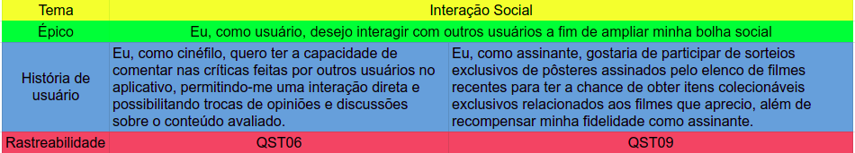
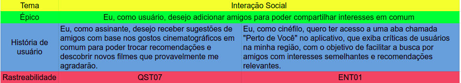
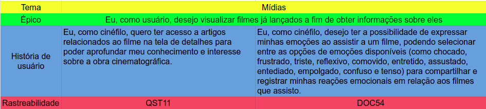
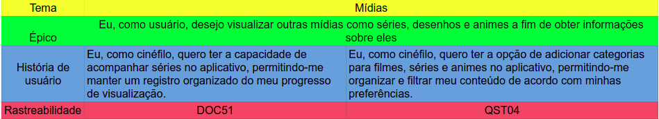
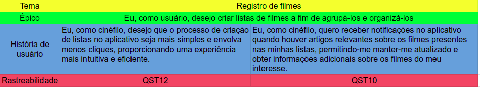
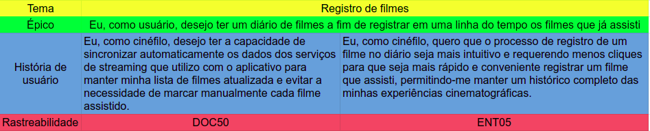
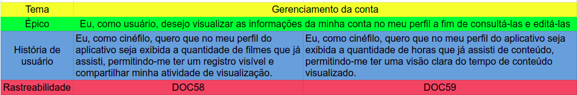

# Product Backlog

## 1. Introdução

O Product Backlog é uma ferramenta essencial no framework Scrum, pois representa a visão e as necessidades do cliente. Ele contém uma lista completa de itens que podem variar desde novas funcionalidades até correções de bugs. Esses itens são descritos em forma de histórias de usuário, fornecendo uma compreensão clara dos requisitos e do valor que eles trarão ao produto. O Product Backlog é dinâmico e evolui à medida que o conhecimento e as necessidades do produto se desenvolvem, sendo constantemente refinado e repriorizado pelo Product Owner para garantir que o trabalho mais valioso seja realizado em cada iteração.

## 2. Metodologia

O Product Backlog pode conter diferentes tipos de itens, como temas, épicos e histórias de usuário:

1. Temas: São áreas gerais de funcionalidades ou requisitos que fornecem uma visão ampla do que o produto deve abordar. Eles são de alto nível e ajudam a agrupar itens relacionados dentro do Product Backlog.

2. Épicos: São itens de maior escala e abrangência, representando funcionalidades ou requisitos maiores que geralmente precisam ser divididos em partes menores para serem implementados em um único sprint. Os épicos são mais detalhados do que os temas e fornecem uma descrição de alto nível do que precisa ser realizado.

3. Histórias de usuário: São itens mais granulares e detalhados que representam as necessidades específicas dos usuários. As histórias de usuário são escritas a partir da perspectiva do usuário final e descrevem uma funcionalidade ou requisito em um formato curto e simples. Geralmente, seguem uma estrutura "Como [tipo de usuário], eu desejo [ação], para [benefício]".

## 3. Temas

### 3.1 Tema 1 - Watchlist

Na tabela 1 é possível observar o épico e as histórias de usuário do tema Watchlist.

<figure markdown>
  
  <figcaption>Tabela 1: Tema Watchlist</figcaption>
  
Fonte: Autoria própria

</figure>

### 3.2 Tema 2 - Interação Social

Na tabela 2, 3 e 4 é possível observar os épicos e as histórias de usuário do tema Interação Social.

<figure markdown>
  
  <figcaption>Tabela 2: Tema Interação Social, épico 1 parte 1</figcaption>
  
Fonte: Autoria própria

</figure>

<figure markdown>
  
  <figcaption>Tabela 3: Tema Interação Social, épico 1 parte 2</figcaption>
  
Fonte: Autoria própria

</figure>

<figure markdown>
  
  <figcaption>Tabela 4: Tema Interação Social, épico 2</figcaption>
  
Fonte: Autoria própria

</figure>

### 3.3 Tema 3 - Mídias

Na tabela 5 e 6 é possível observar os épicos e as histórias de usuário do tema Mídia.

<figure markdown>
  
  <figcaption>Tabela 5: Tema Mídia, épico 1</figcaption>
  
Fonte: Autoria própria

</figure>

<figure markdown>
  
  <figcaption>Tabela 6: Tema Mídia, épico 2</figcaption>
  
Fonte: Autoria própria

</figure>

### 3.4 Tema 4 - Registro de Filmes

Na tabela 7 e 8 é possível observar os épicos e as histórias de usuário do tema Registro de Filmes.

<figure markdown>
  
  <figcaption>Tabela 7: Tema Registro de Filmes, épico 1</figcaption>
  
Fonte: Autoria própria

</figure>

<figure markdown>
  
  <figcaption>Tabela 8: Tema Registro de Filmes, épico 2</figcaption>
  
Fonte: Autoria própria

</figure>

### 3.5 Tema 5 - Gerenciamento da Conta

Na tabela 9 é possível observar o épico e as histórias de usuário do tema Gerenciamento da Conta.

<figure markdown>
  
  <figcaption>Tabela 9: Tema Gerenciamento da Conta, épico 1</figcaption>
  
Fonte: Autoria própria

</figure>

## 4. Validação com o PO

Uma reunião foi conduzida com um usuário da aplicação para validar as Histórias de usuário presentes no backlog proposto. Este usuário assumiu a função de PO, responsável por tomar decisões estratégicas em relação ao produto. A reunião ocorreu de forma remota na plataforma do Google Meet e teve um tempo de duração de 20 minutos. Pelo fato de o usuário ser leigo nos conceitos de software, foi feita uma explicação prévia sobre os termos técnicos abordados ao longo da reunião.
Os principais pontos evidenciados foram:

- Abdicar da funcionalidade de chat, visto que, perderia um pouco do propósito de ser uma rede nichada e se assemelharia mais a uma rede social comum;
- Um modelo de fórum já entende que seja mais compatível com a proposta da aplicação;
- Busca pelo gosto é mais interessante que a busca pela localização;
- Não acha necessário a feature de acompanhar o andamento de filmes e séries pela aplicação, visto que, nas plataformas de streaming já existem essa funcionalidade.

## 5. Bibliografia

> [1] PRESSMAN, R. S. Engenharia de software: uma abordagem profissional. [s.l.] Porto Alegre (Rs): Amgh, 2011.

---

## 6. Tabela de Versionamento

| Data       | Versão | Descrição                         | Autor                                          | Revisor                                           |
| ---------- | ------ | --------------------------------- | ---------------------------------------------- | ------------------------------------------------- |
| 23/05/2023 | `1.0`  | Adição da documentação do backlog | [Natan Santana](https://github.com/Neitan2001) | [Clara Ribeiro](https://github.com/clara-ribeiro) |
| 24/05/2023 | `1.1`  | Adição da Validação com o PO      | [Gustavo Barbosa](https://github.com/brbsg)    | [Clara Ribeiro](https://github.com/clara-ribeiro) |
