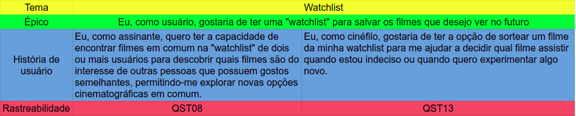
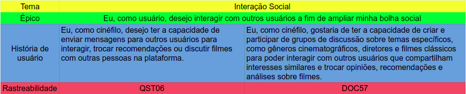

# Product Backlog

## 1. Introdução

O Product Backlog é uma ferramenta essencial no framework Scrum, pois representa a visão e as necessidades do cliente. Ele contém uma lista completa de itens que podem variar desde novas funcionalidades até correções de bugs. Esses itens são descritos em forma de histórias de usuário, fornecendo uma compreensão clara dos requisitos e do valor que eles trarão ao produto. O Product Backlog é dinâmico e evolui à medida que o conhecimento e as necessidades do produto se desenvolvem, sendo constantemente refinado e repriorizado pelo Product Owner para garantir que o trabalho mais valioso seja realizado em cada iteração.

## 2. Metodologia

## 3. Temas

### 3.1 Tema 1 - Watchlist

Na tabela 1 é possível observar o épico e as histórias de usuário do tema Watchlist.

<figure markdown>
  
  <figcaption>Tabela 1: Tema Watchlist</figcaption>
  
Fonte: Autoria própria

</figure>

### 3.2 Tema 2 - Interação Social

Na tabela 2 e 3 é possível observar o épico e as histórias de usuário do tema Interação Social.

<figure markdown>
  
  <figcaption>Tabela 2: Tema Interação Social parte 1</figcaption>
  
Fonte: Autoria própria

</figure>

<figure markdown>
  
  <figcaption>Tabela 3: Tema Interação Social parte 2</figcaption>
  
Fonte: Autoria própria

</figure>

