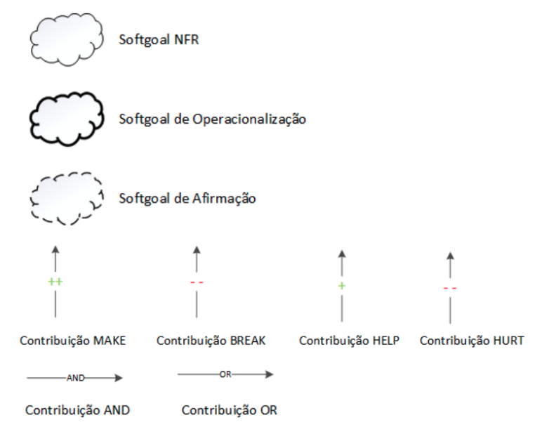

# NFR Framework

## Introdução

## Metodologia

## Legenda

Imagem 1: Legendas (Fonte: SILVA, 2019)

Imagem 2: Tipos de rótulos utilizados pelos Softgoals (Fonte: SILVA, 2019)

## Requisitos não funcionais.

| Identificador | Requisito | Tipo |
| ------------- | --------- | ---- |
| DOC61 | Deve garantir que o acesso à conta desativada seja impedido | RNF |
| DOC62 | Deve garantir que o acesso à conta excluida seja impedido | RNF |
| DOC63 | Deve garantir que os dados associados a contas desativadas sejam protegidos durante o período de desativação e exclusão permanente | RNF |
| DOC64 | Deve ser enviado o link de reativação e o link de exclusão permanente imediatamente após a solicitação do usuário | RNF |
| DOC65 | Deve ser garantido que a conta seja desativada, excluída permanentemente e reativada de acordo com as solicitações do usuário e sem interrupções no serviço | RNF |
| DOC66 | A média ponderada de avaliações de filmes deve considerar apenas uma avaliação por usuário | RNF |
| DOC67 | Deve ser atualizado automaticamente a avaliação do filme quando uma nova avaliação for adicionada | RNF |
| DOC68 | Deve ser enviado um e-mail de confirmação para garantir que o endereço de e-mail associado à conta é válido	 | RNF |
| DOC69 | Deve ter moderação para remover o conteúdo que viole a política de comunidade, sendo contra à diversidade e inclusão, com discursos de ódio e marginalização | RNF |
| DOC70 | Deve ser limitado a exposição de atividades de amigos de filmes assistidos há mais de duas semanas | RNF |
| DOC71 | Os dados do usuário devem ser atualizados em tempo real, sem a necessidade de atualizar a página ou fechar e abrir o aplicativo novamente | RNF |
| DOC72 | O tempo de resposta do servidor deve ser rápido o suficiente para oferecer uma experiência de usuário satisfatória | RNF |
| DOC73 | Deve ser mantida a privacidade das listas ou watchlists definidas como privadas, exceto para o próprio usuário | RNF |
| DOC74 | Deve ser limitado o tamanho máximo do arquivo de upload para 1 MB | RNF |
| DOC75 | Os dados de filmes do Letterboxd devem ser retirados do The Movie Database (TMDb), uma base de dados colaborativa de informações relacionadas a filmes | RNF |
| DOC76 | Aceitar diversas opções de pagamento, como cartões de crédito, PayPal e transferências bancárias | RNF |
| DOC77 | Quando a assinatura expirar, todos os benefícios das contas Pro e Patron devem ser bloqueados | RNF |
| ENT04 | Traduzir interface do usuário para português | RNF |
| ENT05 | Registro no diário mais intuitivo e com menos cliques | RNF |
| QST05 | Verificação de onde assistir o filme de acordo com o país do usuário | RNF |
| QST12 | Refatorar a criação de listas para diminuir a quantidade de cliques necessária e ficar mais intuitiva | RNF |

Tabela 1: Requisitos não funcionais (Fonte: Autor,2023)

## NFR

### NFR Usabilidade

#### Sem Propagação

#### Com Propagação

### Confiabilidade

#### Sem Propagação

#### Com Propagação

### Desempenho

#### Sem Propagação

#### Com Propagação

### Suportabilidade

#### Sem Propagação

#### Com Propagação

## Referências Bibliográficas

> - [1] SILVA, Reinaldo Antônio da. NFR4ES:Um Catálogo de Requisitos Não-Funcionais para Sistemas Embarcados. Recife, 2019. Disponível em: <https://repositorio.ufpe.br/handle/123456789/34150#:~:text=Neste%20trabalho%20foi%20desenvolvido%20um,n%C3%A3o%2Dfuncionais%20em%20sistemas%20embarcados./> Lido em: 18 mai. 2023.
> - [2] 2022.1 - TikTok, Requisitos de software. Disponível em: <https://requisitos-de-software.github.io/2022.1-TikTok/NRF/>. Acesso em: 18 mai. 2023.

## Tabela de Versionamento

| Data | Versão | Descrição | Autor | Revisor |
| ---- | ------ | --------- | ----- | ------- |
| 18/05/2023 | `1.0`  | Criação do NFR Framework | [Rhuan Marques](https://github.com/RhuanMr)  [Débora Caires](https://github.com/deboracaires) | [Natan Santana](https://github.com/Neitan2001) |