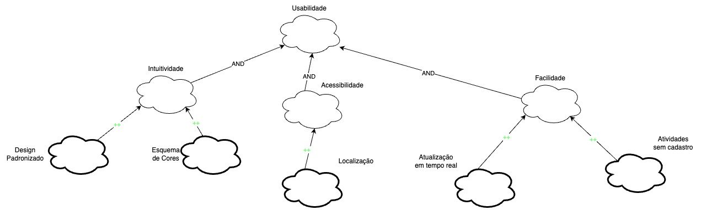
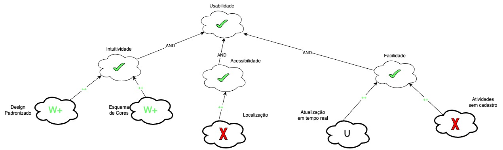
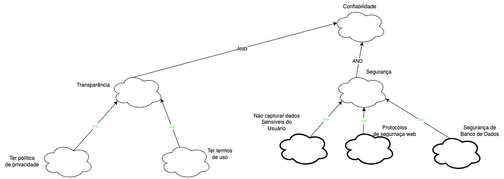
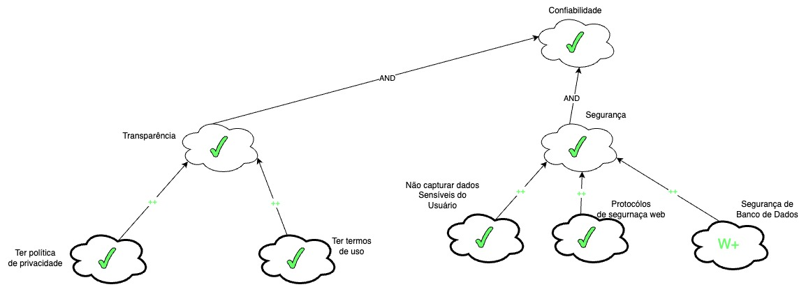
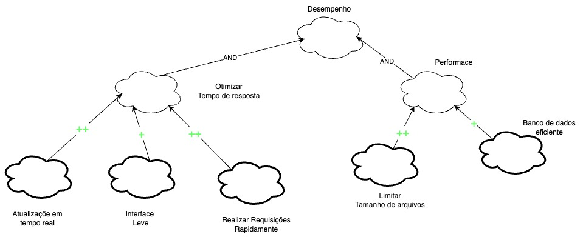
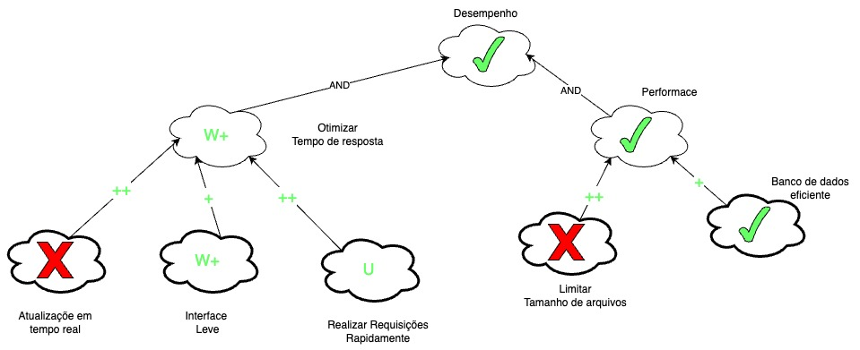
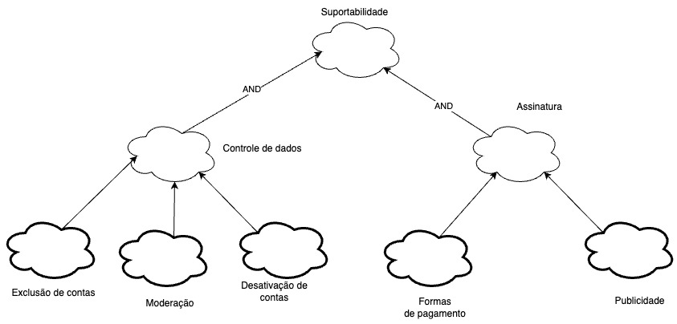
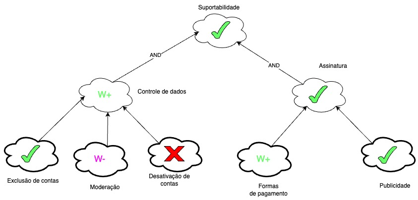

# NFR Framework

## Introdução

O Non-Functional Requirements Framework é uma abordagem para analisar, definir e identificar requisitos não funcionais em um projeto ou sistema. Esses descrevem características e restrições relacionadas ao desempensenho, confiabilidade, segurança e entre outros aspectos do projeto, além dos requisitos principais. No contexto deste projeto, o uso do NFR Frameworl permitirá uma análise abrangente dos requisitos NF do sistema, considerando aspectos de escabilidade, segurança de dados, eficiência de busca e entre outros. Ao aplicar o NFR Framework, será possível garantir que o Letterboxd atenda às expectativas dos usuários em termos de qualidade e experiência de uso, além de oferecer uma base sólida para a evolução e melhoria contínua da plataforma.

## Metodologia

Após a elicitação dos requisitos, foi decidido a utilização do Softgoal Interdependency Graph(SIG) para a implementação do NFR Framework. Cada categoria foi implemantada baseado no documento de especificação suplementar, que é visto nas imagens de 3 a 10.[²](#ancora2). As tabelas de 2 à 5 representão os cartões de especificação para a reallização da ratreabilidade de requisitos.

## Legenda

Imagem 1: Legendas (Fonte: SILVA, 2019)

Imagem 2: Tipos de rótulos utilizados pelos Softgoals (Fonte: SILVA, 2019)

## Requisitos não funcionais.

| Identificador | Requisito | Tipo |
| ------------- | ----------| ---- |
| DOC31         | Deve ser indicado ao usuário através da cor branca que o filme ainda não foi assistido | RNF |
| DOC32         | Deve ser indicado ao usuário através da cor verde que o filme foi assistido | RNF |
| DOC33         | Deve ser indicado ao usuário através da cor azul que o filme está na sua lista de filmes | RNF |
| DOC61         | Deve garantir que o acesso à conta desativada seja impedido                                                                                                  | RNF  |
| DOC62         | Deve garantir que o acesso à conta excluida seja impedido                                                                                                    | RNF  |
| DOC63         | Deve garantir que os dados associados a contas desativadas sejam protegidos durante o período de desativação e exclusão permanente                           | RNF  |
| DOC64         | Deve ser enviado o link de reativação e o link de exclusão permanente imediatamente após a solicitação do usuário                                            | RNF  |
| DOC65         | Deve ser garantido que a conta seja desativada, excluída permanentemente e reativada de acordo com as solicitações do usuário e sem interrupções no serviço  | RNF  |
| DOC66         | A média ponderada de avaliações de filmes deve considerar apenas uma avaliação por usuário                                                                   | RNF  |
| DOC67         | Deve ser atualizado automaticamente a avaliação do filme quando uma nova avaliação for adicionada                                                            | RNF  |
| DOC68         | Deve ser enviado um e-mail de confirmação para garantir que o endereço de e-mail associado à conta é válido                                                  | RNF  |
| DOC69         | Deve ter moderação para remover o conteúdo que viole a política de comunidade, sendo contra à diversidade e inclusão, com discursos de ódio e marginalização | RNF  |
| DOC70         | Deve ser limitado a exposição de atividades de amigos de filmes assistidos há mais de duas semanas                                                           | RNF  |
| DOC71         | Os dados do usuário devem ser atualizados em tempo real, sem a necessidade de atualizar a página ou fechar e abrir o aplicativo novamente                    | RNF  |
| DOC72         | O tempo de resposta do servidor deve ser rápido o suficiente para oferecer uma experiência de usuário satisfatória                                           | RNF  |
| DOC73         | Deve ser mantida a privacidade das listas ou watchlists definidas como privadas, exceto para o próprio usuário                                               | RNF  |
| DOC74         | Deve ser limitado o tamanho máximo do arquivo de upload para 1 MB                                                                                            | RNF  |
| DOC75         | Os dados de filmes do Letterboxd devem ser retirados do The Movie Database (TMDb), uma base de dados colaborativa de informações relacionadas a filmes       | RNF  |
| DOC76         | Aceitar diversas opções de pagamento, como cartões de crédito, PayPal e transferências bancárias                                                             | RNF  |
| DOC77         | Quando a assinatura expirar, todos os benefícios das contas Pro e Patron devem ser bloqueados                                                                | RNF  |
| ENT04         | Traduzir interface do usuário para português                                                                                                                 | RNF  |
| ENT05         | Registro no diário mais intuitivo e com menos cliques                                                                                                        | RNF  |
| QST05         | Verificação de onde assistir o filme de acordo com o país do usuário                                                                                         | RNF  |
| QST12         | Refatorar a criação de listas para diminuir a quantidade de cliques necessária e ficar mais intuitiva                                                        | RNF  |

Tabela 1: Requisitos não funcionais (Fonte: Autor,2023)

## NFR

### Usabilidade

#### Cartão de específicação

| Identificador | Descrição | Prioridade | História | Justificativa |
| ------------- | --------- | ---------- | -------- | ------------- |
| DOC31 | Deve ser indicado ao usuário através da cor branca que o filme ainda não foi assistido | Alta prioridade | 13/05/2023 | Funcionalidade já implementada, portanto é tida como Alta Prioridade |
| DOC32 | Deve ser indicado ao usuário através da cor verde que o filme foi assistido | Alta prioridade | 13/05/2023 | Funcionalidade já implementada, portanto é tida como Alta Prioridade |
| DOC33 | Deve ser indicado ao usuário através da cor azul que o filme está na sua lista de filmes | Alta prioridade | 13/05/2023 | Funcionalidade já implementada, portanto é tida como Alta Prioridade |
| DOC71 | Os dados do usuário devem ser atualizados em tempo real, sem a necessidade de atualizar a página ou fechar e abrir o aplicativo novamente | Alta prioridade | 13/05/2023 | Funcionalidade já implementada, portanto é tida como Alta Prioridade |
| DOC76 | Aceitar diversas opções de pagamento, como cartões de crédito, PayPal e transferências bancárias | Alta prioridade | 13/05/2023 | Funcionalidade já implementada, portanto é tida como Alta Prioridade |
| ENT04 | Traduzir interface do usuário para português | Baixa prioridade | 13/05/2023 | Não prejudica muito a navegação do aplicativo |
| ENT05 | Registro no diário mais intuitivo e com menos cliques | Baixa prioridade | 13/05/2023 | Não prejudica muito a navegação do aplicativo |
| IT20 | O usuário deve ser capaz de realizar algumas atividades sem ter um cadastro, como ver filmes e suas estatísticas, listas, notícias e resenhas | Alta prioridade | 13/05/2023 | Funcionalidade já implementada, portanto é tida como Alta Prioridade |
| QST05 | Verificação de onde assistir o filme de acordo com o país do usuário | Alta prioridade | 13/05/2023 | Feature muito valiosa na hora de assistir um filme |

Tabela 2: Cartão de específicação Usabilidade (Fonte: Autor,2023)

#### Sem Propagação

Imagem 3: NFR Usabilidade (Fonte: Autor, 2023)

#### Com Propagação

Imagem 4: NFR Usabilidade com propagação (Fonte: Autor, 2023)

### Confiabilidade

#### Cartão de específicação

| Identificador | Descrição | Prioridade | História | Justificativa |
| ------------- | --------- | ---------- | -------- | ------------- |
| DOC61 | Deve garantir que o acesso à conta desativada seja impedido | Alta prioridade | 13/05/2023 | Funcionalidade já implementada, portanto é tida como Alta Prioridade |
| DOC62 | Deve garantir que o acesso à conta excluida seja impedido | Alta prioridade | 13/05/2023 | Funcionalidade já implementada, portanto é tida como Alta Prioridade |
| DOC63 | Deve garantir que os dados associados a contas desativadas sejam protegidos durante o período de desativação e exclusão permanente | Alta prioridade | 13/05/2023 | Funcionalidade já implementada, portanto é tida como Alta Prioridade |
| DOC65 | Deve ser garantido que a conta seja desativada, excluída permanentemente e reativada de acordo com as solicitações do usuário e sem interrupções no serviço | Alta prioridade | 13/05/2023 | Funcionalidade já implementada, portanto é tida como Alta Prioridade |
| DOC68 | Deve ser enviado um e-mail de confirmação para garantir que o endereço de e-mail associado à conta é válido | Alta prioridade | 13/05/2023 | Funcionalidade já implementada, portanto é tida como Alta Prioridade |
| DOC69 | Deve ter moderação para remover o conteúdo que viole a política de comunidade, sendo contra à diversidade e inclusão, com discursos de ódio e marginalização | Alta prioridade | 13/05/2023 | Funcionalidade já implementada, portanto é tida como Alta Prioridade |
| DOC73 | Deve ser mantida a privacidade das listas ou watchlists definidas como privadas, exceto para o próprio usuário | Alta prioridade | 13/05/2023 | Funcionalidade já implementada, portanto é tida como Alta Prioridade |
| DOC77 | Quando a assinatura expirar, todos os benefícios das contas Pro e Patron devem ser bloqueados | Alta prioridade | 13/05/2023 | Funcionalidade já implementada, portanto é tida como Alta Prioridade |

Tabela 3: Cartão de específicação Confiabilidade (Fonte: Autor,2023)

#### Sem Propagação

Imagem 5: NFR Confiabilidade (Fonte: Autor, 2023)

#### Com Propagação

Imagem 6: NFR Confiabilidade com propagação (Fonte: Autor, 2023)

### Desempenho

#### Cartão de específicação

| Identificador | Descrição | Prioridade | História | Justificativa |
| ------------- | --------- | ---------- | -------- | ------------- |
| DOC64 | Deve ser enviado o link de reativação e o link de exclusão permanente imediatamente após a solicitação do usuário | Alta prioridade | 13/05/2023 | Funcionalidade já implementada, portanto é tida como Alta Prioridade |
| DOC67 | Deve ser atualizado automaticamente a avaliação do filme quando uma nova avaliação for adicionada | Alta prioridade | 13/05/2023 | Funcionalidade já implementada, portanto é tida como Alta Prioridade |
| DOC72 | O tempo de resposta do servidor deve ser rápido o suficiente para oferecer uma experiência de usuário satisfatória | Alta prioridade | 13/05/2023 | Funcionalidade já implementada, portanto é tida como Alta Prioridade |
| DOC72 | Deve ser limitado o tamanho máximo do arquivo de upload para 1 MB | Alta prioridade | 13/05/2023 | Funcionalidade já implementada, portanto é tida como Alta Prioridade |

Tabela 4: Cartão de específicação Desempenho (Fonte: Autor,2023)

#### Sem Propagação

Imagem 7: NFR Desempenho (Fonte: Autor, 2023)

#### Com Propagação

Imagem 8: NFR Desempenho com propagação (Fonte: Autor, 2023)

### Suportabilidade

#### Cartão de específicação

| Identificador | Descrição | Prioridade | História | Justificativa |
| ------------- | --------- | ---------- | -------- | ------------- |
| DOC75 |Os dados de filmes do Letterboxd devem ser retirados do The Movie Database (TMDb), uma base de dados colaborativa de informações relacionadas a filmes | Alta prioridade | 13/05/2023 | Funcionalidade já implementada, portanto é tida como Alta Prioridade |

Tabela 5: Cartão de específicação Suportabilidade (Fonte: Autor,2023)

#### Sem Propagação

Imagem 9: NFR Suportabilidade (Fonte: Autor, 2023)

#### Com Propagação

Imagem 10: NFR Suportabilidade com propagação (Fonte: Autor, 2023)

## Referências Bibliográficas

> - [1] SILVA, Reinaldo Antônio da. NFR4ES:Um Catálogo de Requisitos Não-Funcionais para Sistemas Embarcados. Recife, 2019. Disponível em: <https://repositorio.ufpe.br/handle/123456789/34150#:~:text=Neste%20trabalho%20foi%20desenvolvido%20um,n%C3%A3o%2Dfuncionais%20em%20sistemas%20embarcados./> Lido em: 18 mai. 2023.
> - [2] 2022.1 - TikTok, Requisitos de software. Disponível em: <https://requisitos-de-software.github.io/2022.1-TikTok/NRF/>. Acesso em: 18 mai. 2023.

## Tabela de Versionamento

| Data       | Versão | Descrição                | Autor                                                                                             | Revisor                                             |
| ---------- | ------ | ------------------------ | ------------------------------------------------------------------------------------------------- | --------------------------------------------------- |
| 22/05/2023 | `1.0`  | Criação do NFR Framework | [Rhuan Marques](https://github.com/RhuanMr)  [Débora Caires](https://github.com/deboracaires) | [Maciel Júnior](https://github.com/macieljuniormax) |
| 05/07/2023 | `1.1`  | Correção do NFR Framework | [Rhuan Marques](https://github.com/RhuanMr) | [Maciel Júnior](https://github.com/macieljuniormax) |