# Casos de Uso

## 1. Introdução

O diagrama de caso de uso é uma ferramenta de modelagem na Linguagem de Modelagem Unificada (UML) que fornece uma visão geral das interações entre os usuários (atores) e o sistema em questão. Ele ajuda a representar os cenários em que o sistema interage com pessoas, organizações ou sistemas externos e as metas que o sistema ajuda os atores a atingir. Além disso, o diagrama de caso de uso é útil para definir e organizar requisitos funcionais do sistema, especificar o contexto e os requisitos do sistema e modelar o fluxo básico de eventos em um caso de uso.

O diagrama de caso de uso é composto por símbolos e conectores especializados, como a forma oval rotulada para representar o caso de uso, bonecos palito para representar os atores e linhas que conectam o ator ao caso de uso para modelar a participação do ator no sistema. Além disso, é comum desenhar uma caixa em torno do caso de uso para representar o limite do sistema.

É importante destacar que o diagrama de caso de uso não oferece muitos detalhes sobre a ordem em que os passos são executados, mas fornece uma visão geral do relacionamento entre casos de uso, atores e sistemas. Por isso, é recomendado utilizar o diagrama de caso de uso para complementar um caso de uso descrito em texto¹.

## 2. Metodologia

Um diagrama de caso de uso é composto por vários elementos que ajudam a representar as interações entre os atores e o sistema. A seguir, estão os elementos mais comuns que aparecem em um diagrama de caso de uso:

1. Caso de Uso: Representado por uma forma oval rotulada, é a descrição de uma funcionalidade ou ação que o sistema pode realizar em relação a um ator. Os casos de uso são descritos em linguagem natural e ajudam a entender como o sistema funciona.

2. Ator: É uma entidade externa ao sistema que interage com o sistema. Os atores são representados por bonecos palito e podem ser humanos, outros sistemas ou dispositivos.

3. Linha de comunicação: É uma linha que conecta um ator a um caso de uso e representa a interação entre eles.

4. Sistema: É o limite do sistema e é representado por uma caixa em torno dos casos de uso.

5. Relacionamentos: Os relacionamentos entre casos de uso e atores são representados por setas ou linhas com setas que indicam o tipo de relacionamento entre eles. Os tipos mais comuns de relacionamentos são:

   1. Associação: Indica que o ator está envolvido no caso de uso, mas não é necessário para que ele ocorra.
   2. Inclusão: Indica que um caso de uso inclui outro caso de uso como uma etapa necessária.
   3. Extensão: Indica que um caso de uso pode ser estendido com novas funcionalidades adicionais.

6. Notas e comentários: São adicionados ao diagrama de caso de uso para fornecer informações adicionais, como restrições, regras de negócios, entre outros.

Todos esses elementos trabalham juntos para fornecer uma representação visual clara das interações entre os atores e o sistema. A repesentação gráfica de cada um desses elementos pode ser visualizado na Figura 1 a seguir.

<figure markdown>
  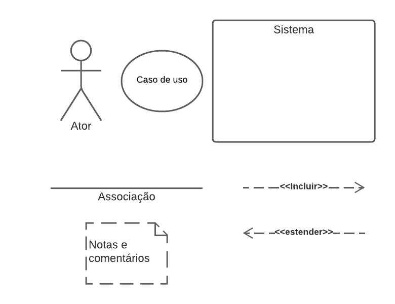
  <figcaption>Figura 1: Elementos de um diagrama de casos de uso</figcaption>
  
Fonte: Autoria própria, Natan Santana

</figure>

## 3. Diagramas

Os requisitos selecionados para a modelagem por casos de uso foram escolhidos de acordo com a priorização realizada pelo método First Things First. Esses requisitos foram divididos em dois fluxos de atividade, cada um com o seu próprio digrama e especificação de casos de uso. A seguir é possível observar a modelagem desses dois fluxos.

### 3.1 Críticas e Filmes

O diagrama de casos de uso do fluxo de Críticas e Filmes pode ser acessado por este [link](../assets/casosDeUso/criticasFilmes.pdf). A especificação de cada caso de uso pode ser observado a seguir.

#### UC01

A especificação do UC01 pode ser observada na tabela 1 a seguir.

<table style="width: 100%;">
  <tr>
    <th style="text-align: center;" colspan="2">UC01 - Visualizar detalhes do filme</th>
  </tr>
  <tr>
    <td style="vertical-align: middle;">Descrição</td>
    <td style="vertical-align: middle;">Ao selecionar um filme, deverá ser mostrado todos os detalhes do filme selecionado</td>
  </tr>
  <tr>
    <td style="vertical-align: middle;">Atores</td>
    <td style="vertical-align: middle;">Usuário</td>
  </tr> 
  <tr>
    <td style="vertical-align: middle;">Pré-Condição</td>
    <td style="vertical-align: middle;">Dado que o usuário esteja na tela principal do aplicativo e aperte em um filme</td>
  </tr>
  <tr>
    <td style="vertical-align: middle;">Pós-Condição</td>
    <td style="vertical-align: middle;">Todos os dados do filme devem estar visíveis para o usuário</td>
  </tr>
  <tr>
    <td style="vertical-align: middle;">Fluxo Principal</td>
    <td style="vertical-align: middle;">
    1 - Apertar em um filme  
    2 - Visualizar os detalhes do filme selecionado  
    3 - Visualizar plataformas que possuem o filme disponível  
    4 - Visualizar trilha sonora do filme  
    5 - Visualizar atores e equipe do filme  
    6 - Visualizar críticas de outros usuários sobre o filme  
    7 - Visualizar artigos relacionados ao filme
    </td>
  </tr>
  <tr>
    <td style="vertical-align: middle;">Fluxo alternativo</td>
    <td style="vertical-align: middle; text-align:center">---</td>
  </tr>
  <tr>
    <td style="vertical-align: middle;">Fluxo de exceção</td>
    <td style="vertical-align: middle;">
      <strong>Fluxo de Exceção 1: Não há críticas de outros usuários sobre o filme</strong> 
      O sistema exibe uma mensagem indicando que não há críticas de outros usuários sobre o filme.
      

      <strong>Fluxo de Exceção 2: Não há artigos relacionados ao filme</strong> 
      O sistema exibe uma mensagem indicando que não há artigos relacionados ao filme.
    </td>
  </tr>
  <tr>
    <td style="vertical-align: middle;">Rastreabilidade</td>
    <td style="vertical-align: middle; text-align:center">IT16</td>
  </tr>
</table>

<figure markdown>
  <figcaption>Tabela 1: Especificação de caso 1</figcaption>
  
Fonte: Autoria própria, Natan Santana e Maciel Júnior

</figure>

#### UC02

A especificação do UC02 pode ser observador na tabela 2 a seguir.

<table style="width: 100%;">
  <tr>
    <th style="text-align: center;" colspan="2">UC02 - Visualizar plataformas que possuem o filme disponível</th>
  </tr>
  <tr>
    <td style="vertical-align: middle;">Descrição</td>
    <td style="vertical-align: middle;">Dentro da tela de detalhes, deve ser possível visualizar as plataformas 
    que possuem o filme de acordo com a localização do usuário</td>
  </tr>
  <tr>
    <td style="vertical-align: middle;">Atores</td>
    <td style="vertical-align: middle;">Usuário</td>
  </tr> 
  <tr>
    <td style="vertical-align: middle;">Pré-Condição</td>
    <td style="vertical-align: middle;">Dado que o usuário tenha acessado a tela 
de detalhes de um filme</td>
  </tr>
  <tr>
    <td style="vertical-align: middle;">Pós-Condição</td>
    <td style="vertical-align: middle;">Deve ser listado os plataformas que possuem o video para alugar, as que
possuem para comprar e as que possuem para assistir</td>
  </tr>
  <tr>
    <td style="vertical-align: middle;">Fluxo Principal</td>
    <td style="vertical-align: middle;">
    1 - Apertar na opção de "Where to watch"  
    2 - Visualizar a lista de plataformas  
    </td>
  </tr>
  <tr>
    <td style="vertical-align: middle;">Fluxo alternativo</td>
    <td style="vertical-align: middle;">
    1 - Redirecionar para filme em uma plataforma disponivel
    </td>
  </tr>
  <tr>
    <td style="vertical-align: middle;">Fluxo de exceção</td>
    <td style="vertical-align: middle;">
      <strong>Fluxo de Exceção: Nenhuma plataforma possui o filme disponível</strong> 
      O sistema exibe uma mensagem indicando que nenhuma plataforma possui o filme disponível.
    </td>
  </tr>
  <tr>
    <td style="vertical-align: middle;">Rastreabilidade</td>
    <td style="vertical-align: middle; text-align:center">QST05</td>
  </tr>
</table>
<figure markdown>
  <figcaption>Tabela 2: Especificação de caso 2</figcaption>
  
Fonte: Autoria própria, Natan Santana e Maciel Júnior

</figure>

#### UC03

A especificação do UC03 pode ser observador na tabela 3 a seguir.

<table style="width: 100%;">
  <tr>
    <th style="text-align: center;" colspan="2">UC03 - Redirecionar para filme em uma plataforma disponível</th>
  </tr>
  <tr>
    <td style="vertical-align: middle;">Descrição</td>
    <td style="vertical-align: middle;">Ao clicar em uma das plataformas da lista, o aplicativo deve redirecionar o usuário para a página do filme no app ou site da plataforma selecionada</td>
  </tr>
  <tr>
    <td style="vertical-align: middle;">Atores</td>
    <td style="vertical-align: middle;">Usuário</td>
  </tr> 
  <tr>
    <td style="vertical-align: middle;">Pré-Condição</td>
    <td style="vertical-align: middle;">Dado que o usuário esteja na tela de visualização das plataformas disponíveis do
filme</td>
  </tr>
  <tr>
    <td style="vertical-align: middle;">Pós-Condição</td>
    <td style="vertical-align: middle;">O usuário deve ser redirecionado para a página do filme no app ou site da plataforma
selecionada</td>
  </tr>
  <tr>
    <td style="vertical-align: middle;">Fluxo Principal</td>
    <td style="vertical-align: middle;">
    1 - Apertar em uma das plataformas listadas  
    2 - Redirecionar para a pagina do filme no app
ou site da plataforma selecionada  
    </td>
  </tr>
  <tr>
    <td style="vertical-align: middle;">Fluxo alternativo</td>
    <td style="vertical-align: middle; text-align: center;">
    ---
    </td>
  </tr>
  <tr>
    <td style="vertical-align: middle;">Fluxo de exceção</td>
    <td style="vertical-align: middle; text-align: center;">
      ---
    </td>
  </tr>
  <tr>
    <td style="vertical-align: middle;">Rastreabilidade</td>
    <td style="vertical-align: middle; text-align:center">ENT02</td>
  </tr>
</table>
<figure markdown>
  <figcaption>Tabela 3: Especificação de caso 3</figcaption>
  
Fonte: Autoria própria, Natan Santana

</figure>

#### UC04

A especificação do UC04 pode ser observador na tabela 4 a seguir.

<table style="width: 100%;">
  <tr>
    <th style="text-align: center;" colspan="2">UC04 - Visualizar trilha sonora do filme</th>
  </tr>
  <tr>
    <td style="vertical-align: middle;">Descrição</td>
    <td style="vertical-align: middle;">Dentro da tela de detalhes de um filme, deve ser possível verificar as informações da trilha sonora do filme</td>
  </tr>
  <tr>
    <td style="vertical-align: middle;">Atores</td>
    <td style="vertical-align: middle;">Usuário</td>
  </tr> 
  <tr>
    <td style="vertical-align: middle;">Pré-Condição</td>
    <td style="vertical-align: middle;">Dado que o usuário tenha acessado a tela de detalhes de um filme</td>
  </tr>
  <tr>
    <td style="vertical-align: middle;">Pós-Condição</td>
    <td style="vertical-align: middle;">O usuário deve visualizar as informações da trilha sonora do filme</td>
  </tr>
  <tr>
    <td style="vertical-align: middle;">Fluxo Principal</td>
    <td style="vertical-align: middle;">
    1 - Acessar tela de detalhes do filme  
    2 - Visualizar informações da trilha sonora  
    </td>
  </tr>
  <tr>
    <td style="vertical-align: middle;">Fluxo alternativo</td>
    <td style="vertical-align: middle; text-align: center;">
    ---
    </td>
  </tr>
  <tr>
    <td style="vertical-align: middle;">Fluxo de exceção</td>
    <td style="vertical-align: middle; text-align: center;">
      ---
    </td>
  </tr>
  <tr>
    <td style="vertical-align: middle;">Rastreabilidade</td>
    <td style="vertical-align: middle; text-align:center">DOC56</td>
  </tr>
</table>
<figure markdown>
  <figcaption>Tabela 4: Especificação de caso 4</figcaption>
  
Fonte: Autoria própria, Natan Santana e Maciel Júnior

</figure>

#### UC05

A especificação do UC05 pode ser observador na tabela 5 a seguir.

<table style="width: 100%;">
  <tr>
    <th style="text-align: center;" colspan="2">UC05 - Visualizar atores e equipe do filme</th>
  </tr>
  <tr>
    <td style="vertical-align: middle;">Descrição</td>
    <td style="vertical-align: middle;">Dentro da tela de detalhes deve ser possivel visualizar a lista de atores e equipe envolvida na produção do filme</td>
  </tr>
  <tr>
    <td style="vertical-align: middle;">Atores</td>
    <td style="vertical-align: middle;">Usuário</td>
  </tr> 
  <tr>
    <td style="vertical-align: middle;">Pré-Condição</td>
    <td style="vertical-align: middle;">Dado que o usuário tenha acessado a tela de detalhes de um filme</td>
  </tr>
  <tr>
    <td style="vertical-align: middle;">Pós-Condição</td>
    <td style="vertical-align: middle;">O usuário deve visualizar uma lista com todos os atores e equipe do filme</td>
  </tr>
  <tr>
    <td style="vertical-align: middle;">Fluxo Principal</td>
    <td style="vertical-align: middle;">
    1 - Acessar tela de detalhes do filme  
    2 - Visualizar lista de atores e equipe do filme  
    </td>
  </tr>
  <tr>
    <td style="vertical-align: middle;">Fluxo alternativo</td>
    <td style="vertical-align: middle;">
    1 - Avaliar atores do filme  
    2 - Avaliar diretores do filme  
    </td>
  </tr>
  <tr>
    <td style="vertical-align: middle;">Fluxo de exceção</td>
    <td style="vertical-align: middle; text-align: center;">
      ---
    </td>
  </tr>
  <tr>
    <td style="vertical-align: middle;">Rastreabilidade</td>
    <td style="vertical-align: middle; text-align:center">IT16</td>
  </tr>
</table>

<figure markdown>
  <figcaption>Tabela 5: Especificação de caso 5</figcaption>
  
Fonte: Autoria própria, Natan Santana

</figure>

#### UC06

A especificação do UC06 pode ser observador na tabela 6 a seguir.

<table style="width: 100%;">
  <tr>
    <th style="text-align: center;" colspan="2">UC06 - Avaliar atores do filme</th>
  </tr>
  <tr>
    <td style="vertical-align: middle;">Descrição</td>
    <td style="vertical-align: middle;">Ao clicar em um dos atores da lista, o usuário poderá dar de 1 a 5 estrelas para o ator ou atriz</td>
  </tr>
  <tr>
    <td style="vertical-align: middle;">Atores</td>
    <td style="vertical-align: middle;">Usuário</td>
  </tr> 
  <tr>
    <td style="vertical-align: middle;">Pré-Condição</td>
    <td style="vertical-align: middle;">Dado que o usuário tenha acessado a tela de detalhes de um filme e selecionado um
ator ou atriz</td>
  </tr>
  <tr>
    <td style="vertical-align: middle;">Pós-Condição</td>
    <td style="vertical-align: middle;">A avaliação do usuário será registrada no banco de dados</td>
  </tr>
  <tr>
    <td style="vertical-align: middle;">Fluxo Principal</td>
    <td style="vertical-align: middle;">
    1 - Acessar tela de detalhes do filme  
    2 - Visualizar lista de atores e equipe do filme  
    3 - Apertar em um ator ou atriz  
    4 - Avaliar o ator ou atriz com 1 a 5 estrelas  
    </td>
  </tr>
  <tr>
    <td style="vertical-align: middle;">Fluxo alternativo</td>
    <td style="vertical-align: middle; text-align: center;">
    ---
    </td>
  </tr>
  <tr>
    <td style="vertical-align: middle;">Fluxo de exceção</td>
    <td style="vertical-align: middle; text-align: center;">
      ---
    </td>
  </tr>
  <tr>
    <td style="vertical-align: middle;">Rastreabilidade</td>
    <td style="vertical-align: middle; text-align:center">DOC52</td>
  </tr>
</table>

<figure markdown>
  <figcaption>Tabela 6: Especificação de caso 6</figcaption>
  
Fonte: Autoria própria, Natan Santana

</figure>

#### UC07

A especificação do UC07 pode ser observador na tabela 7 a seguir.

<table style="width: 100%;">
  <tr>
    <th style="text-align: center;" colspan="2">UC07 - Avaliar diretores do filme</th>
  </tr>
  <tr>
    <td style="vertical-align: middle;">Descrição</td>
    <td style="vertical-align: middle;">Ao clicar em um dos diretores da lista, o usuário poderá dar de 1 a 5 estrelas para o diretor ou diretora</td>
  </tr>
  <tr>
    <td style="vertical-align: middle;">Atores</td>
    <td style="vertical-align: middle;">Usuário</td>
  </tr> 
  <tr>
    <td style="vertical-align: middle;">Pré-Condição</td>
    <td style="vertical-align: middle;">Dado que o usuário tenha acessado a tela de detalhes de um filme e selecionado um diretor
ou diretora</td>
  </tr>
  <tr>
    <td style="vertical-align: middle;">Pós-Condição</td>
    <td style="vertical-align: middle;">A avaliação do usuário será registrada no banco de dados</td>
  </tr>
  <tr>
    <td style="vertical-align: middle;">Fluxo Principal</td>
    <td style="vertical-align: middle;">
    1 - Acessar tela de detalhes do filme  
    2 - Visualizar lista de atores e equipe do filme  
    3 - Apertar em um diretor ou diretora  
    4 - Avaliar o diretora ou diretora com 1 a 5
estrelas  
    </td>
  </tr>
  <tr>
    <td style="vertical-align: middle;">Fluxo alternativo</td>
    <td style="vertical-align: middle; text-align: center;">
    ---
    </td>
  </tr>
  <tr>
    <td style="vertical-align: middle;">Fluxo de exceção</td>
    <td style="vertical-align: middle; text-align: center;">
      ---
    </td>
  </tr>
  <tr>
    <td style="vertical-align: middle;">Rastreabilidade</td>
    <td style="vertical-align: middle; text-align:center">DOC53</td>
  </tr>
</table>

<figure markdown>
  <figcaption>Tabela 7: Especificação de caso 7</figcaption>
  
Fonte: Autoria própria, Natan Santana

</figure>

#### UC08

A especificação do UC08 pode ser observador na tabela 8 a seguir.

<table style="width: 100%;">
  <tr>
    <th style="text-align: center;" colspan="2">UC08 - Visualizar críticas de outros usuários sobre o filme</th>
  </tr>
  <tr>
    <td style="vertical-align: middle;">Descrição</td>
    <td style="vertical-align: middle;">Dentro da tela de detalhes deve ser possível visualizar todas as críticas de outros usuários sobre o filme</td>
  </tr>
  <tr>
    <td style="vertical-align: middle;">Atores</td>
    <td style="vertical-align: middle;">Usuário</td>
  </tr> 
  <tr>
    <td style="vertical-align: middle;">Pré-Condição</td>
    <td style="vertical-align: middle;">Dado que o usuário tenha acessado a tela de detalhes de um filme</td>
  </tr>
  <tr>
    <td style="vertical-align: middle;">Pós-Condição</td>
    <td style="vertical-align: middle;">O usuário poderá visualizar as críticas de outros usuários ordenado pela quantidade de curtidas das críticas</td>
  </tr>
  <tr>
    <td style="vertical-align: middle;">Fluxo Principal</td>
    <td style="vertical-align: middle;">
    1 - Acessar tela de detalhes do filme  
    2 - Visualizar as três críticas mais curtidas  
    3 - Apertar em "AlI Reviews"  
    4 - Visualizar todas as criticas ordenadas
por curtidas  
    </td>
  </tr>
  <tr>
    <td style="vertical-align: middle;">Fluxo alternativo</td>
    <td style="vertical-align: middle;">
    1 - Traduzir críticas que estão em idioma diferente do usuário  
    2 - Comentar críticas feita por outros usuários  
    </td>
  </tr>
  <tr>
    <td style="vertical-align: middle;">Fluxo de exceção</td>
    <td style="vertical-align: middle;">
      <strong>Fluxo de Exceção: Não há críticas de outros usuários sobre o filme</strong> 
      O sistema exibe uma mensagem indicando que não há críticas de outros usuários sobre o filme.
    </td>
  </tr>
  <tr>
    <td style="vertical-align: middle;">Rastreabilidade</td>
    <td style="vertical-align: middle; text-align:center">ST03</td>
  </tr>
</table>

<figure markdown>
  <figcaption>Tabela 8: Especificação de caso 8</figcaption>
  
Fonte: Autoria própria, Natan Santana e Maciel Júnior

</figure>

#### UC09

A especificação do UC09 pode ser observador na tabela 9 a seguir.

<table style="width: 100%;">
  <tr>
    <th style="text-align: center;" colspan="2">UCO9 - Traduzir críticas que estão em um idioma diferente do usuário</th>
  </tr>
  <tr>
    <td style="vertical-align: middle;">Descrição</td>
    <td style="vertical-align: middle;">Adicionar um botão de traduzir nas críticas que estejam em um idioma diferente do
usuário</td>
  </tr>
  <tr>
    <td style="vertical-align: middle;">Atores</td>
    <td style="vertical-align: middle;">Usuário, Servidor</td>
  </tr> 
  <tr>
    <td style="vertical-align: middle;">Pré-Condição</td>
    <td style="vertical-align: middle;">Dado que o usuário esteja visualizando uma
crítica de algum filme</td>
  </tr>
  <tr>
    <td style="vertical-align: middle;">Pós-Condição</td>
    <td style="vertical-align: middle;">A tradução será feita pelo servidor e disponibilizada automaticamente para o
usuário</td>
  </tr>
  <tr>
    <td style="vertical-align: middle;">Fluxo Principal</td>
    <td style="vertical-align: middle;">
    1 - Acessar uma crítica sobre algum filme em um idioma diferente  
    2 - Apertar o botão de traduzir  
    3 - Traduzir crítica (Servidor)  
    4 - Visualizar a critca traduzida  
    </td>
  </tr>
  <tr>
    <td style="vertical-align: middle;">Fluxo alternativo</td>
    <td style="vertical-align: middle; text-align:center">---</td>
  </tr>
  <tr>
    <td style="vertical-align: middle;">Fluxo de exceção</td>
    <td style="vertical-align: middle; text-align:center">
      ---
    </td>
  </tr>
  <tr>
    <td style="vertical-align: middle;">Rastreabilidade</td>
    <td style="vertical-align: middle; text-align:center">ENT06</td>
  </tr>
</table>

<figure markdown>
  <figcaption>Tabela 9: Especificação de caso 9</figcaption>
  
Fonte: Autoria própria, Natan Santana e Maciel Júnior

</figure>

#### UC10

A especificação do UC10 pode ser observador na tabela 10 a seguir.

<table style="width: 100%;">

  <tr>
    <th style="text-align: center;" colspan="2">UC10 - Comentar críticas feita por outros usuários</th>
  </tr>
  <tr>
    <td style="vertical-align: middle;">Descrição</td>
    <td style="vertical-align: middle;">Adicionar um comentário em uma crítica de outro usuário</td>
  </tr>
  <tr>
    <td style="vertical-align: middle;">Atores</td>
    <td style="vertical-align: middle;">Usuário</td>
  </tr> 
  <tr>
    <td style="vertical-align: middle;">Pré-Condição</td>
    <td style="vertical-align: middle;">Dado que o usuário esteja visualizando uma crítica de algum filme</td>
  </tr>
  <tr>
    <td style="vertical-align: middle;">Pós-Condição</td>
    <td style="vertical-align: middle;">O comentário criado pelo usuário será registrado no banco de dados e outros usuários poderão visualizá-lo</td>
  </tr>
  <tr>
    <td style="vertical-align: middle;">Fluxo Principal</td>
    <td style="vertical-align: middle;">
    1 - Acessar uma crítica sobre algum filme  
    2 - Apertar no botão de comentário  
    3 - Adicionar comentário na critica  
    </td>
  </tr>
  <tr>
    <td style="vertical-align: middle;">Fluxo alternativo</td>
    <td style="vertical-align: middle; text-align:center">---</td>
  </tr>
  <tr>
    <td style="vertical-align: middle;">Fluxo de exceção</td>
    <td style="vertical-align: middle; text-align:center">
      ---
    </td>
  </tr>
  <tr>
    <td style="vertical-align: middle;">Rastreabilidade</td>
    <td style="vertical-align: middle; text-align:center">QST02</td>
  </tr>
</table>

<figure markdown>
  <figcaption>Tabela 10: Especificação de caso 10</figcaption>
  
Fonte: Autoria própria, Natan Santana

</figure>

#### UC11

A especificação do UC11 pode ser observador na tabela 11 a seguir.

<table style="width: 100%;">

  <tr>
    <th style="text-align: center;" colspan="2">UC11 - Visualizar artigos relacionados ao filme</th>
  </tr>
  <tr>
    <td style="vertical-align: middle;">Descrição</td>
    <td style="vertical-align: middle;">Na tela de detalhes do filme selecionado, deve ser listado os artigos relacionados ao filme</td>
  </tr>
  <tr>
    <td style="vertical-align: middle;">Atores</td>
    <td style="vertical-align: middle;">Usuário</td>
  </tr> 
  <tr>
    <td style="vertical-align: middle;">Pré-Condição</td>
    <td style="vertical-align: middle;">Dado que o usuário tenha acessado a tela de detalhes de um filme</td>
  </tr>
  <tr>
    <td style="vertical-align: middle;">Pós-Condição</td>
    <td style="vertical-align: middle;">O usuário poderá visualizar e acessar os artigos relacionados ao filme</td>
  </tr>
  <tr>
    <td style="vertical-align: middle;">Fluxo Principal</td>
    <td style="vertical-align: middle;">
    1 - Acessar a tela de detalhes de um filme  
    2 - Visualizar artigos relacionados  
    </td>
  </tr>
  <tr>
    <td style="vertical-align: middle;">Fluxo alternativo</td>
    <td style="vertical-align: middle; text-align:center">---</td>
  </tr>
  <tr>
    <td style="vertical-align: middle;">Fluxo de exceção</td>
    <td style="vertical-align: middle;">
      <strong>Fluxo de Exceção: Não há nenhum artigo relacionado ao filme</strong> 
      O sistema exibe uma mensagem indicando que não há nenhum artigo relacionado ao filme.
    </td>
  </tr>
  <tr>
    <td style="vertical-align: middle;">Rastreabilidade</td>
    <td style="vertical-align: middle; text-align:center">QST11</td>
  </tr>
</table>

<figure markdown>
  <figcaption>Tabela 11: Especificação de caso 11</figcaption>
  
Fonte: Autoria própria, Natan Santana e Maciel Júnior

</figure>

#### UC12

A especificação do UC12 pode ser observador na tabela 12 a seguir.

<table style="width: 100%;">

  <tr>
    <th style="text-align: center;" colspan="2">UC12 - Adcionar críticas sobre o filme</th>
  </tr>
  <tr>
    <td style="vertical-align: middle;">Descrição</td>
    <td style="vertical-align: middle;">Ao acessar um filme, deve ser possivel adicionar uma critica com comentario, estrelas e emoção</td>
  </tr>
  <tr>
    <td style="vertical-align: middle;">Atores</td>
    <td style="vertical-align: middle;">Usuário</td>
  </tr> 
  <tr>
    <td style="vertical-align: middle;">Pré-Condição</td>
    <td style="vertical-align: middle;">Dado que o usuário tenha acessado a tela de detalhes de um filme</td>
  </tr>
  <tr>
    <td style="vertical-align: middle;">Pós-Condição</td>
    <td style="vertical-align: middle;">A crítica será registrada no banco de dados e os outros usuário poderão
visualizá-la</td>
  </tr>
  <tr>
    <td style="vertical-align: middle;">Fluxo Principal</td>
    <td style="vertical-align: middle;">
    1 - Acessar a tela de detalhes de um filme  
    2 - Apertar em "review"  
    3 - Adicionar um comentário  
    4 - Dar um valor de 1 a 5 em estrelas para o filme  
    5 - Adicionar uma emoção  
    6 - O filme é adicionado como um registro no diário  
    </td>
  </tr>
  <tr>
    <td style="vertical-align: middle;">Fluxo alternativo</td>
    <td style="vertical-align: middle; text-align:center">---</td>
  </tr>
  <tr>
    <td style="vertical-align: middle;">Fluxo de exceção</td>
    <td style="vertical-align: middle; text-align:center">
      ---
    </td>
  </tr>
  <tr>
    <td style="vertical-align: middle;">Rastreabilidade</td>
    <td style="vertical-align: middle; text-align:center">IT07</td>
  </tr>
</table>

<figure markdown>
  <figcaption>Tabela 12: Especificação de caso 12</figcaption>
  
Fonte: Autoria própria, Natan Santana

</figure>

#### UC13

A especificação do UC13 pode ser observador na tabela 13 a seguir.

<table style="width: 100%;">
  <tr>
    <th style="text-align: center;" colspan="2">UC13 - Avaliar o filme de 1 a 5 estrelas
  </th>
  </tr>
  <tr>
    <td style="vertical-align: middle;">Descrição</td>
    <td style="vertical-align: middle;">Durante a adição da avaliação, o usuário deve colocar um valor de 1 a 5 estrelas para o filme</td>
  </tr>
  <tr>
    <td style="vertical-align: middle;">Atores</td>
    <td style="vertical-align: middle;">Usuário, Sistema</td>
  </tr> 
  <tr>
    <td style="vertical-align: middle;">Pré-Condição</td>
    <td style="vertical-align: middle;">Dado que o usuário esteja fazendo uma
critica</td>
  </tr>
  <tr>
    <td style="vertical-align: middle;">Pós-Condição</td>
    <td style="vertical-align: middle;">O valor da avaliação será registrada no banco de dados</td>
  </tr>
  <tr>
    <td style="vertical-align: middle;">Fluxo Principal</td>
    <td style="vertical-align: middle;">
    1 - Acessar a tela de detalhes de um filme  
    2 - Apertar em "review"  
    3 - Adicionar um comentário  
    4 - Dar um valor de 1 a 5 em estrelas para o filme  
    5 - Adicionar uma emoção  
    6 - Calcular avaliação média do filme com todas as avaliações (Sistema)  
    </td>
  </tr>
  <tr>
    <td style="vertical-align: middle;">Fluxo alternativo</td>
    <td style="vertical-align: middle; text-align:center">---</td>
  </tr>
  <tr>
    <td style="vertical-align: middle;">Fluxo de exceção</td>
    <td style="vertical-align: middle; text-align:center">
      ---
    </td>
  </tr>
  <tr>
    <td style="vertical-align: middle;">Rastreabilidade</td>
    <td style="vertical-align: middle; text-align:center">IT07</td>
  </tr>
</table>

<figure markdown>
  <figcaption>Tabela 13: Especificação de caso 13</figcaption>
  
Fonte: Autoria própria, Natan Santana e Maciel Júnior

</figure>

#### UC14

A especificação do UC14 pode ser observador na tabela 14 a seguir.

<table style="width: 100%;">
  <tr>
    <th style="text-align: center;" colspan="2">UC14 - Calcular avaliação média do filme com todas as avaliações
  </th>
  </tr>
  <tr>
    <td style="vertical-align: middle;">Descrição</td>
    <td style="vertical-align: middle;">A cada nova avaliação a um filme, deve ser calculado a avaliação média com todas as outras avaliações</td>
  </tr>
  <tr>
    <td style="vertical-align: middle;">Atores</td>
    <td style="vertical-align: middle;">Servidor</td>
  </tr> 
  <tr>
    <td style="vertical-align: middle;">Pré-Condição</td>
    <td style="vertical-align: middle;">Dado que o usuário tenha feito uma
avaliação</td>
  </tr>
  <tr>
    <td style="vertical-align: middle;">Pós-Condição</td>
    <td style="vertical-align: middle;">A avaliação média será disponibilizada para todos os usuários</td>
  </tr>
  <tr>
    <td style="vertical-align: middle;">Fluxo Principal</td>
    <td style="vertical-align: middle;">
    1 - Acessar a tela de detalhes de um filme 
    2 - Apertar em "review"  
    3 - Adicionar um comentário  
    4 - Dar um valor de 1 a 5 em estrlas para o
filme  
    5 - calcular avaliação média do filme com todas as avaliações 
    </td>
  </tr>
  <tr>
    <td style="vertical-align: middle;">Fluxo alternativo</td>
    <td style="vertical-align: middle; text-align:center">---</td>
  </tr>
  <tr>
    <td style="vertical-align: middle;">Fluxo de exceção</td>
    <td style="vertical-align: middle; text-align:center">
      ---
    </td>
  </tr>
  <tr>
    <td style="vertical-align: middle;">Rastreabilidade</td>
    <td style="vertical-align: middle; text-align:center">DOC19</td>
  </tr>
</table>

<figure markdown>
  <figcaption>Tabela 14: Especificação de caso 14</figcaption>
  
Fonte: Autoria própria, Natan Santana

</figure>

#### UC15

A especificação do UC15 pode ser observador na tabela 15 a seguir.

<table style="width: 100%;">
  <tr>
    <th style="text-align: center;" colspan="2">UC15 - Adicionar emoção sentida ao ver o filme
  </th>
  </tr>
  <tr>
    <td style="vertical-align: middle;">Descrição</td>
    <td style="vertical-align: middle;">Durante a adição da avaliação, poderá registrar a emoção que teve ao assistir o filme</td>
  </tr>
  <tr>
    <td style="vertical-align: middle;">Atores</td>
    <td style="vertical-align: middle;">Usuário</td>
  </tr> 
  <tr>
    <td style="vertical-align: middle;">Pré-Condição</td>
    <td style="vertical-align: middle;">Dado que o usuário esteja fazendo uma
critica</td>
  </tr>
  <tr>
    <td style="vertical-align: middle;">Pós-Condição</td>
    <td style="vertical-align: middle;">A emoção será registrada no banco de dados e poderá ser visualizado por outros usuários</td>
  </tr>
  <tr>
    <td style="vertical-align: middle;">Fluxo Principal</td>
    <td style="vertical-align: middle;">
    1 - Acessar a tela de detalhes de um filme 
    2 - Apertar em "review"  
    3 - Adicionar um comentário  
    4 - Dar um valor de 1 a 5 em estrlas para o
filme  
    5 - Adicionar emoção 
    </td>
  </tr>
  <tr>
    <td style="vertical-align: middle;">Fluxo alternativo</td>
    <td style="vertical-align: middle; text-align:center">---</td>
  </tr>
  <tr>
    <td style="vertical-align: middle;">Fluxo de exceção</td>
    <td style="vertical-align: middle; text-align:center">
      ---
    </td>
  </tr>
  <tr>
    <td style="vertical-align: middle;">Rastreabilidade</td>
    <td style="vertical-align: middle; text-align:center">DOC54</td>
  </tr>
</table>

<figure markdown>
  <figcaption>Tabela 15: Especificação de caso 15</figcaption>
  
Fonte: Autoria própria, Natan Santana

</figure>

#### UC16

A especificação do UC16 pode ser observador na tabela 16 a seguir.

<table style="width: 100%;">
  <tr>
    <th style="text-align: center;" colspan="2">UC16 - Adicionar registro do filme no diário
  </th>
  </tr>
  <tr>
    <td style="vertical-align: middle;">Descrição</td>
    <td style="vertical-align: middle;">Após fazer a critica do filme, automaticamente é registrado no diário o filme que foi visto e criticado</td>
  </tr>
  <tr>
    <td style="vertical-align: middle;">Atores</td>
    <td style="vertical-align: middle;">Usuário</td>
  </tr> 
  <tr>
    <td style="vertical-align: middle;">Pré-Condição</td>
    <td style="vertical-align: middle;">DDado que o usuário tenha feito uma critica</td>
  </tr>
  <tr>
    <td style="vertical-align: middle;">Pós-Condição</td>
    <td style="vertical-align: middle;">Um registro será adicionado no diário e o usuário poderá acessá-la</td>
  </tr>
  <tr>
    <td style="vertical-align: middle;">Fluxo Principal</td>
    <td style="vertical-align: middle;">
    1 - Acessar a tela de detalhes de um filme 
    2 - Apertar em "review"  
    3 - Adicionar um comentário  
    4 - Dar um valor de 1 a 5 em estrlas para o
filme  
    5 - Adicionar emoção 
    6 - Registrar no diário 
    </td>
  </tr>
  <tr>
    <td style="vertical-align: middle;">Fluxo alternativo</td>
    <td style="vertical-align: middle; text-align:center">---</td>
  </tr>
  <tr>
    <td style="vertical-align: middle;">Fluxo de exceção</td>
    <td style="vertical-align: middle; text-align:center">
      ---
    </td>
  </tr>
  <tr>
    <td style="vertical-align: middle;">Rastreabilidade</td>
    <td style="vertical-align: middle; text-align:center">DOC14</td>
  </tr>
</table>

<figure markdown>
  <figcaption>Tabela 16: Especificação de caso 16</figcaption>
  
Fonte: Autoria própria, Natan Santana

</figure>

### 3.2 Listas e Diário

O diagrama de casos de uso do fluxo de Listas e Diário pode ser acessado por este [link](../assets/casosDeUso/listasDiario.pdf). A especificação de cada caso de uso pode ser observado a seguir.

#### UC01

A especificação do UC01 pode ser observado na tabela 1 a seguir.

<figure markdown>
  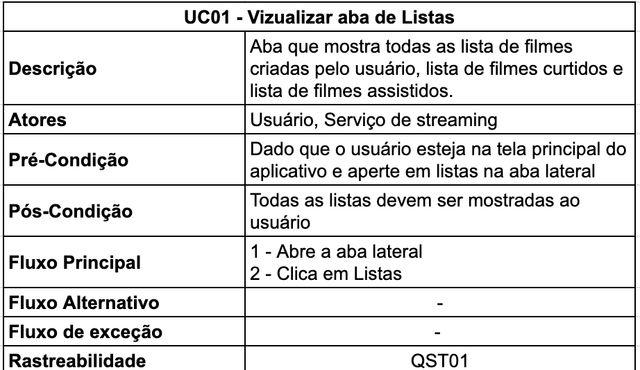
  <figcaption>Tabela 1: Especificação de caso 1</figcaption>
  
Fonte: Autoria própria, Gustavo Barbosa

</figure>

#### UC02

A especificação do UC02 pode ser observado na tabela 2 a seguir.

<figure markdown>
  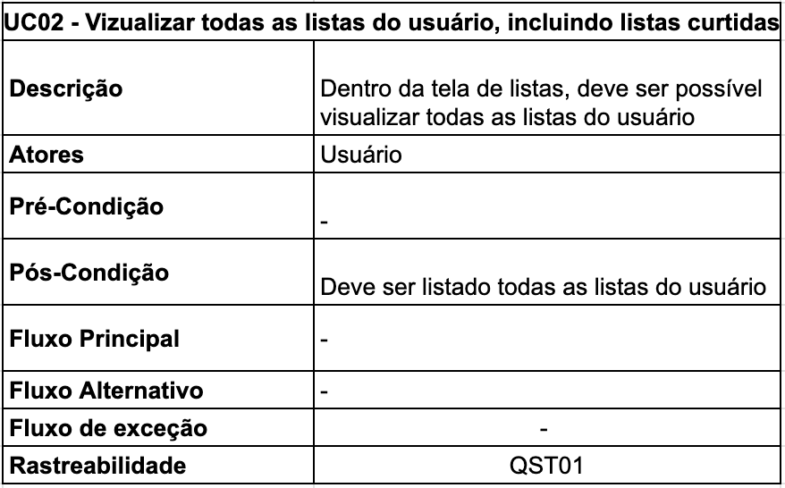
  <figcaption>Tabela 2: Especificação de caso 2</figcaption>
  
Fonte: Autoria própria, Gustavo Barbosa

</figure>

#### UC03

A especificação do UC03 pode ser observado na tabela 3 a seguir.

<figure markdown>
  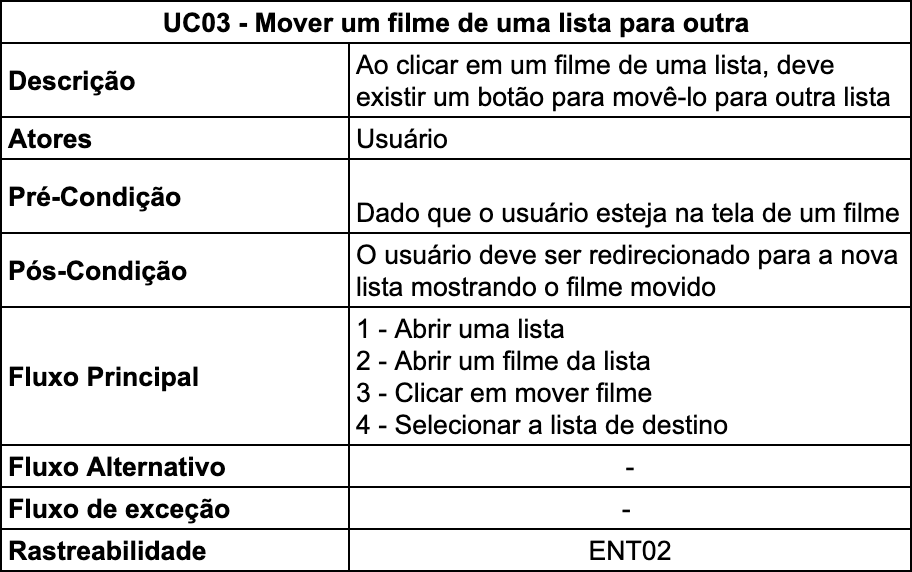
  <figcaption>Tabela 3: Especificação de caso 3</figcaption>
  
Fonte: Autoria própria, Gustavo Barbosa

</figure>

#### UC04

A especificação do UC04 pode ser observado na tabela 4 a seguir.

<figure markdown>
  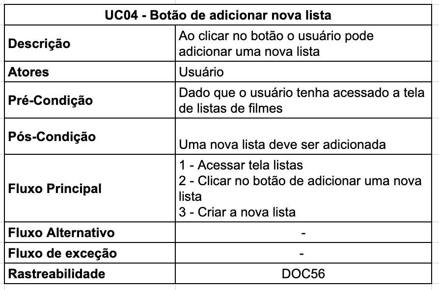
  <figcaption>Tabela 4: Especificação de caso 4</figcaption>
  
Fonte: Autoria própria, Gustavo Barbosa

</figure>

#### UC05

A especificação do UC05 pode ser observado na tabela 5 a seguir.

<figure markdown>
  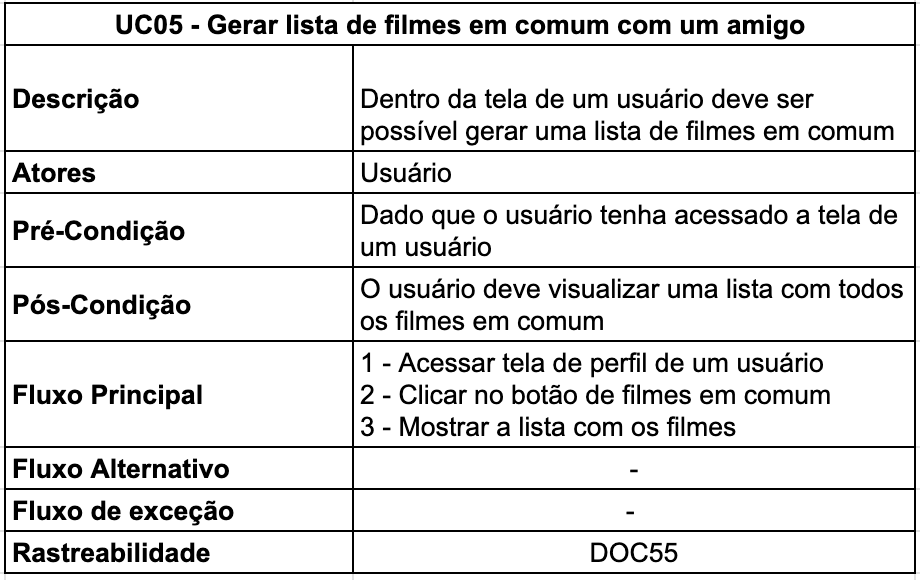
  <figcaption>Tabela 5: Especificação de caso 5</figcaption>
  
Fonte: Autoria própria, Gustavo Barbosa

</figure>

#### UC06

A especificação do UC06 pode ser observado na tabela 6 a seguir.

<figure markdown>
  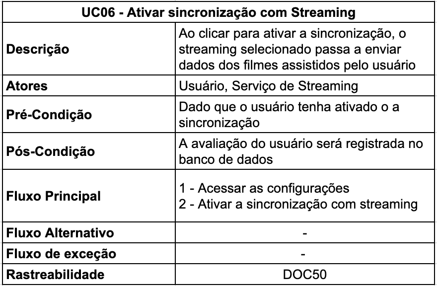
  <figcaption>Tabela 6: Especificação de caso 6</figcaption>
  
Fonte: Autoria própria, Gustavo Barbosa

</figure>

#### UC07

A especificação do UC07 pode ser observado na tabela 7 a seguir.

<figure markdown>
  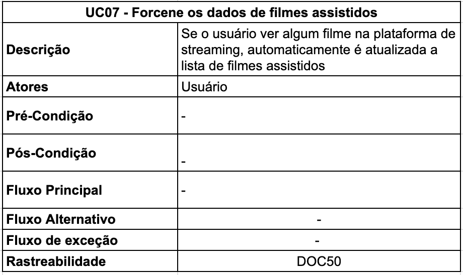
  <figcaption>Tabela 7: Especificação de caso 7</figcaption>
  
Fonte: Autoria própria, Gustavo Barbosa

</figure>

#### UC08

A especificação do UC08 pode ser observado na tabela 8 a seguir.

<figure markdown>
  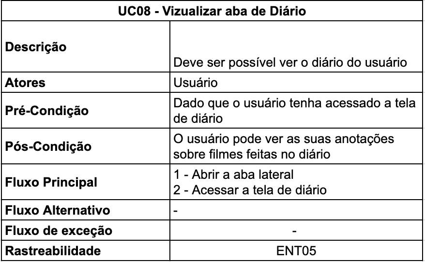
  <figcaption>Tabela 8: Especificação de caso 8</figcaption>
  
Fonte: Autoria própria, Gustavo Barbosa

</figure>

#### UC09

A especificação do UC09 pode ser observado na tabela 9 a seguir.

<figure markdown>
  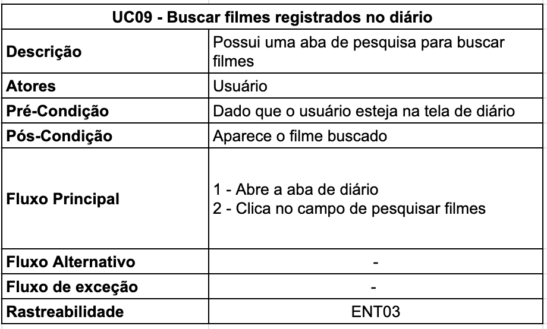
  <figcaption>Tabela 9: Especificação de caso 9</figcaption>
  
Fonte: Autoria própria, Gustavo Barbosa

</figure>

#### UC10

A especificação do UC010 pode ser observado na tabela 10 a seguir.

<figure markdown>
  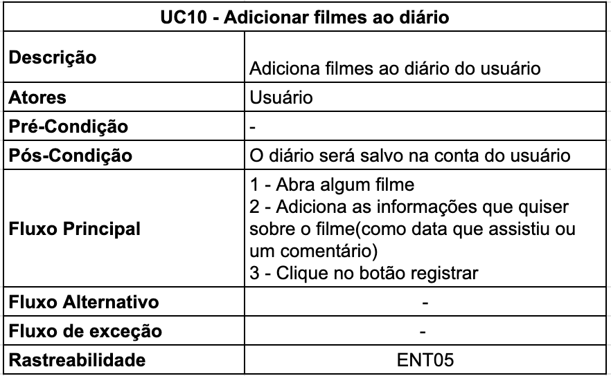
  <figcaption>Tabela 10: Especificação de caso 10</figcaption>
  
Fonte: Autoria própria, Gustavo Barbosa

</figure>

#### UC11

A especificação do UC011 pode ser observado na tabela 11 a seguir.

<figure markdown>
  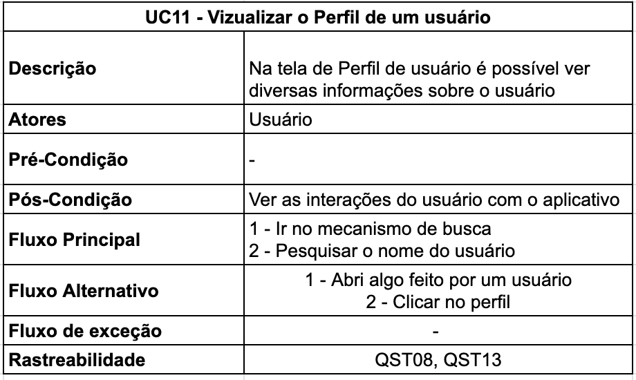
  <figcaption>Tabela 11: Especificação de caso 11</figcaption>
  
Fonte: Autoria própria, Gustavo Barbosa

</figure>

#### UC12

A especificação do UC012 pode ser observado na tabela 12 a seguir.

<figure markdown>
  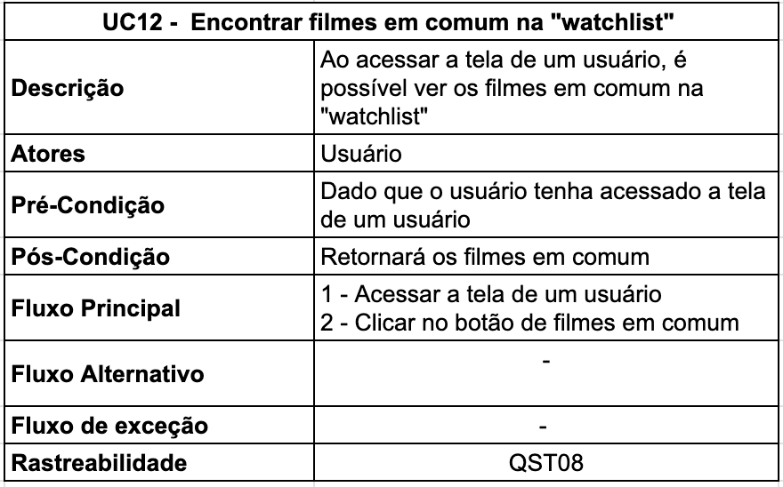
  <figcaption>Tabela 12: Especificação de caso 12</figcaption>
  
Fonte: Autoria própria, Gustavo Barbosa

</figure>

#### UC13

A especificação do UC013 pode ser observado na tabela 13 a seguir.

<figure markdown>
  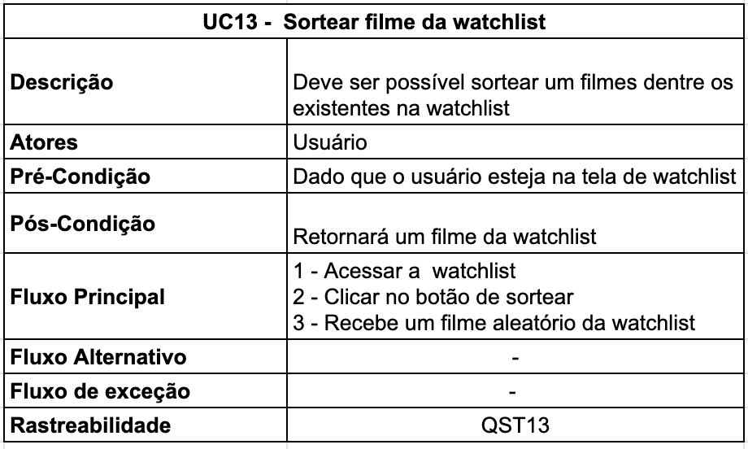
  <figcaption>Tabela 13: Especificação de caso 13</figcaption>
  
Fonte: Autoria própria, Gustavo Barbosa

</figure>

#### UC14

A especificação do UC014 pode ser observado na tabela 14 a seguir.

<figure markdown>
  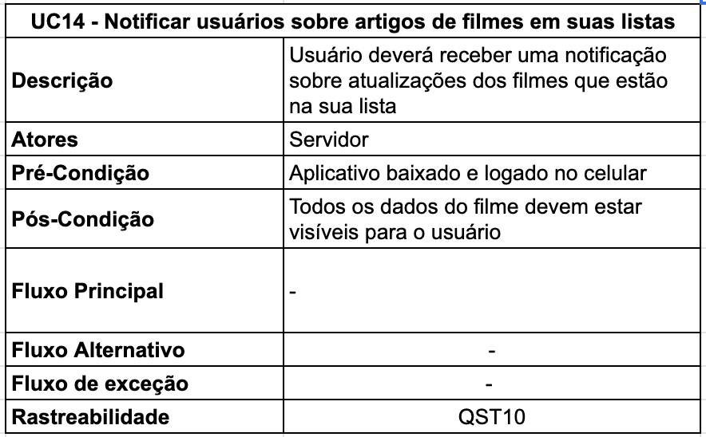
  <figcaption>Tabela 14: Especificação de caso 14</figcaption>
  
Fonte: Autoria própria, Gustavo Barbosa

</figure>

---

## 4. Referências Bibliográficas

> [1] Diagrama de caso de uso UML: O que é, como fazer e exemplos. Disponível em: <https://www.lucidchart.com/pages/pt/diagrama-de-caso-de-uso-uml>.

---

## 5. Tabela de Versionamento

| Data       | Versão | Descrição                                               | Autor                                          | Revisor                                             |
| ---------- | ------ | ------------------------------------------------------- | ---------------------------------------------- | --------------------------------------------------- |
| 14/05/2023 | `1.0`  | Adição da introdução e do diagrama de Criticas e Filmes | [Natan Santana](https://github.com/Neitan2001) | [Maciel Júnior](https://github.com/macieljuniormax) |
| 15/05/2023 | `1.1`  | Adição do diagrama de Listas e Diário                   | [Gustavo Barbosa](https://github.com/brbsg)    | [Maciel Júnior](https://github.com/macieljuniormax) |
