# Casos de Uso

## 1. Introdução

O diagrama de caso de uso é uma ferramenta de modelagem na Linguagem de Modelagem Unificada (UML) que fornece uma visão geral das interações entre os usuários (atores) e o sistema em questão. Ele ajuda a representar os cenários em que o sistema interage com pessoas, organizações ou sistemas externos e as metas que o sistema ajuda os atores a atingir. Além disso, o diagrama de caso de uso é útil para definir e organizar requisitos funcionais do sistema, especificar o contexto e os requisitos do sistema e modelar o fluxo básico de eventos em um caso de uso.

O diagrama de caso de uso é composto por símbolos e conectores especializados, como a forma oval rotulada para representar o caso de uso, bonecos palito para representar os atores e linhas que conectam o ator ao caso de uso para modelar a participação do ator no sistema. Além disso, é comum desenhar uma caixa em torno do caso de uso para representar o limite do sistema.

É importante destacar que o diagrama de caso de uso não oferece muitos detalhes sobre a ordem em que os passos são executados, mas fornece uma visão geral do relacionamento entre casos de uso, atores e sistemas. Por isso, é recomendado utilizar o diagrama de caso de uso para complementar um caso de uso descrito em texto¹.

## 2. Metodologia

Um diagrama de caso de uso é composto por vários elementos que ajudam a representar as interações entre os atores e o sistema. A seguir, estão os elementos mais comuns que aparecem em um diagrama de caso de uso:

1. Caso de Uso: Representado por uma forma oval rotulada, é a descrição de uma funcionalidade ou ação que o sistema pode realizar em relação a um ator. Os casos de uso são descritos em linguagem natural e ajudam a entender como o sistema funciona.

2. Ator: É uma entidade externa ao sistema que interage com o sistema. Os atores são representados por bonecos palito e podem ser humanos, outros sistemas ou dispositivos.

3. Linha de comunicação: É uma linha que conecta um ator a um caso de uso e representa a interação entre eles.

4. Sistema: É o limite do sistema e é representado por uma caixa em torno dos casos de uso.

5. Relacionamentos: Os relacionamentos entre casos de uso e atores são representados por setas ou linhas com setas que indicam o tipo de relacionamento entre eles. Os tipos mais comuns de relacionamentos são:

   1. Associação: Indica que o ator está envolvido no caso de uso, mas não é necessário para que ele ocorra.
   2. Inclusão: Indica que um caso de uso inclui outro caso de uso como uma etapa necessária.
   3. Extensão: Indica que um caso de uso pode ser estendido com novas funcionalidades adicionais.

6. Notas e comentários: São adicionados ao diagrama de caso de uso para fornecer informações adicionais, como restrições, regras de negócios, entre outros.

Todos esses elementos trabalham juntos para fornecer uma representação visual clara das interações entre os atores e o sistema. A repesentação gráfica de cada um desses elementos pode ser visualizado na Figura 1 a seguir.

<figure markdown>
  
  <figcaption>Figura 1: Elementos de um diagrama de casos de uso</figcaption>
  
Fonte: Autoria própria, Natan Santana

</figure>

## 3. Diagramas

Os requisitos selecionados para a modelagem por casos de uso foram escolhidos de acordo com a priorização realizada pelo método First Things First. Esses requisitos foram divididos em dois fluxos de atividade, cada um com o seu próprio digrama e especificação de casos de uso. A seguir é possível observar a modelagem desses dois fluxos.

### 3.1 Críticas e Filmes

O diagrama de casos de uso do fluxo de Críticas e Filmes pode ser acessado por este [link](../assets/casosDeUso/criticasFilmes.pdf). A especificação de cada caso de uso pode ser observado a seguir.

#### UC01

A especificação do UC01 pode ser observador na tabela 1 a seguir.

<figure markdown>
  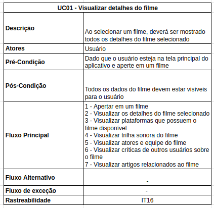
  <figcaption>Tabela 1: Especificação de caso 1</figcaption>
  
Fonte: Autoria própria, Natan Santana

</figure>

#### UC02

A especificação do UC02 pode ser observador na tabela 2 a seguir.

<figure markdown>
  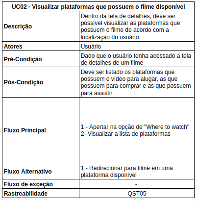
  <figcaption>Tabela 2: Especificação de caso 2</figcaption>
  
Fonte: Autoria própria, Natan Santana

</figure>

#### UC03

A especificação do UC03 pode ser observador na tabela 3 a seguir.

<figure markdown>
  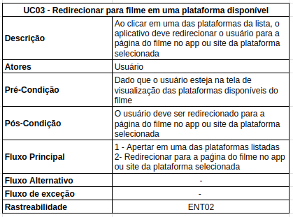
  <figcaption>Tabela 3: Especificação de caso 3</figcaption>
  
Fonte: Autoria própria, Natan Santana

</figure>

#### UC04

A especificação do UC04 pode ser observador na tabela 4 a seguir.

<figure markdown>
  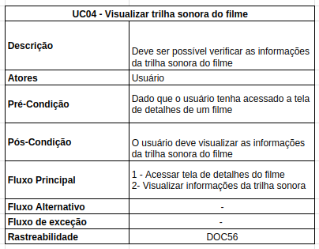
  <figcaption>Tabela 4: Especificação de caso 4</figcaption>
  
Fonte: Autoria própria, Natan Santana

</figure>

#### UC05

A especificação do UC05 pode ser observador na tabela 5 a seguir.

<figure markdown>
  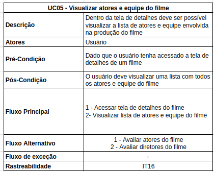
  <figcaption>Tabela 5: Especificação de caso 5</figcaption>
  
Fonte: Autoria própria, Natan Santana

</figure>

#### UC06

A especificação do UC06 pode ser observador na tabela 6 a seguir.

<figure markdown>
  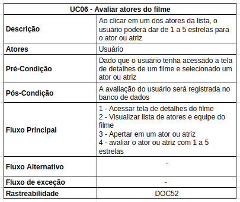
  <figcaption>Tabela 6: Especificação de caso 6</figcaption>
  
Fonte: Autoria própria, Natan Santana

</figure>

#### UC07

A especificação do UC07 pode ser observador na tabela 7 a seguir.

<figure markdown>
  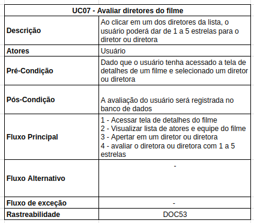
  <figcaption>Tabela 7: Especificação de caso 7</figcaption>
  
Fonte: Autoria própria, Natan Santana

</figure>

#### UC08

A especificação do UC08 pode ser observador na tabela 8 a seguir.

<figure markdown>
  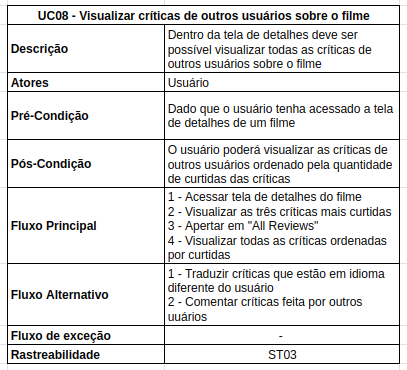
  <figcaption>Tabela 8: Especificação de caso 8</figcaption>
  
Fonte: Autoria própria, Natan Santana

</figure>

#### UC09

A especificação do UC09 pode ser observador na tabela 9 a seguir.

<figure markdown>
  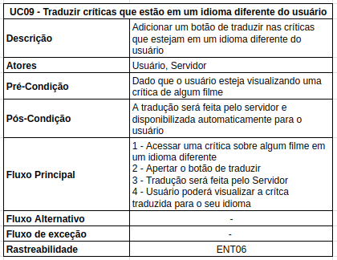
  <figcaption>Tabela 9: Especificação de caso 9</figcaption>
  
Fonte: Autoria própria, Natan Santana

</figure>

#### UC10

A especificação do UC10 pode ser observador na tabela 10 a seguir.

<figure markdown>
  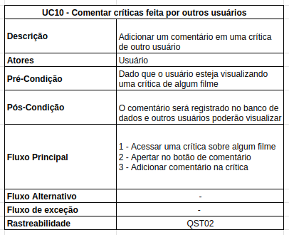
  <figcaption>Tabela 10: Especificação de caso 10</figcaption>
  
Fonte: Autoria própria, Natan Santana

</figure>

#### UC11

A especificação do UC11 pode ser observador na tabela 11 a seguir.

<figure markdown>
  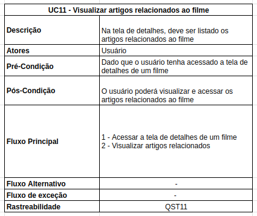
  <figcaption>Tabela 11: Especificação de caso 11</figcaption>
  
Fonte: Autoria própria, Natan Santana

</figure>

#### UC12

A especificação do UC12 pode ser observador na tabela 12 a seguir.

<figure markdown>
  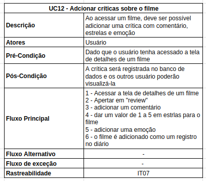
  <figcaption>Tabela 12: Especificação de caso 12</figcaption>
  
Fonte: Autoria própria, Natan Santana

</figure>

#### UC13

A especificação do UC13 pode ser observador na tabela 13 a seguir.

<figure markdown>
  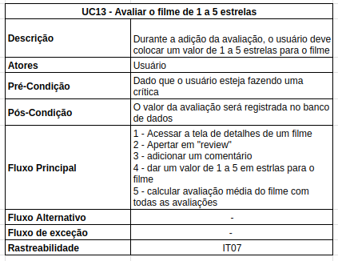
  <figcaption>Tabela 13: Especificação de caso 13</figcaption>
  
Fonte: Autoria própria, Natan Santana

</figure>

#### UC14

A especificação do UC14 pode ser observador na tabela 14 a seguir.

<figure markdown>
  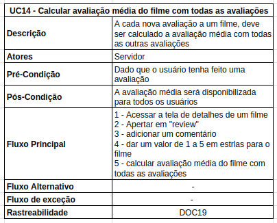
  <figcaption>Tabela 14: Especificação de caso 14</figcaption>
  
Fonte: Autoria própria, Natan Santana

</figure>

#### UC15

A especificação do UC15 pode ser observador na tabela 15 a seguir.

<figure markdown>
  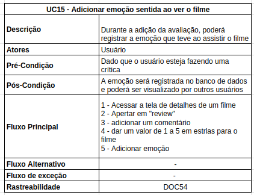
  <figcaption>Tabela 15: Especificação de caso 15</figcaption>
  
Fonte: Autoria própria, Natan Santana

</figure>

#### UC16

A especificação do UC16 pode ser observador na tabela 16 a seguir.

<figure markdown>
  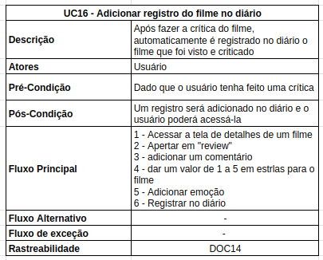
  <figcaption>Tabela 16: Especificação de caso 16</figcaption>
  
Fonte: Autoria própria, Natan Santana

</figure>

### 3.2 Listas e Diário

O diagrama de casos de uso do fluxo de Listas e Diário pode ser acessado por este [link](../assets/casosDeUso/listasDiario.pdf). A especificação de cada caso de uso pode ser observado a seguir.

#### UC01

A especificação do UC01 pode ser observado na tabela 1 a seguir.

<figure markdown>
  
  <figcaption>Tabela 1: Especificação de caso 1</figcaption>
  
Fonte: Autoria própria, Gustavo Barbosa

</figure>

A especificação do UC02 pode ser observado na tabela 2 a seguir.

<figure markdown>
  
  <figcaption>Tabela 2: Especificação de caso 2</figcaption>
  
Fonte: Autoria própria, Gustavo Barbosa

</figure>

A especificação do UC03 pode ser observado na tabela 3 a seguir.

<figure markdown>
  
  <figcaption>Tabela 3: Especificação de caso 3</figcaption>
  
Fonte: Autoria própria, Gustavo Barbosa

</figure>

A especificação do UC04 pode ser observado na tabela 4 a seguir.

<figure markdown>
  
  <figcaption>Tabela 4: Especificação de caso 4</figcaption>
  
Fonte: Autoria própria, Gustavo Barbosa

</figure>

A especificação do UC05 pode ser observado na tabela 5 a seguir.

<figure markdown>
  
  <figcaption>Tabela 5: Especificação de caso 5</figcaption>
  
Fonte: Autoria própria, Gustavo Barbosa

</figure>

A especificação do UC06 pode ser observado na tabela 6 a seguir.

<figure markdown>
  
  <figcaption>Tabela 6: Especificação de caso 6</figcaption>
  
Fonte: Autoria própria, Gustavo Barbosa

</figure>

A especificação do UC07 pode ser observado na tabela 7 a seguir.

<figure markdown>
  
  <figcaption>Tabela 7: Especificação de caso 7</figcaption>
  
Fonte: Autoria própria, Gustavo Barbosa

</figure>

A especificação do UC08 pode ser observado na tabela 8 a seguir.

<figure markdown>
  
  <figcaption>Tabela 8: Especificação de caso 8</figcaption>
  
Fonte: Autoria própria, Gustavo Barbosa

</figure>

A especificação do UC09 pode ser observado na tabela 9 a seguir.

<figure markdown>
  
  <figcaption>Tabela 9: Especificação de caso 9</figcaption>
  
Fonte: Autoria própria, Gustavo Barbosa

</figure>

A especificação do UC010 pode ser observado na tabela 10 a seguir.

<figure markdown>
  
  <figcaption>Tabela 10: Especificação de caso 10</figcaption>
  
Fonte: Autoria própria, Gustavo Barbosa

</figure>

A especificação do UC011 pode ser observado na tabela 11 a seguir.

<figure markdown>
  
  <figcaption>Tabela 11: Especificação de caso 11</figcaption>
  
Fonte: Autoria própria, Gustavo Barbosa

</figure>

A especificação do UC012 pode ser observado na tabela 12 a seguir.

<figure markdown>
  
  <figcaption>Tabela 12: Especificação de caso 12</figcaption>
  
Fonte: Autoria própria, Gustavo Barbosa

</figure>

A especificação do UC013 pode ser observado na tabela 13 a seguir.

<figure markdown>
  
  <figcaption>Tabela 13: Especificação de caso 13</figcaption>
  
Fonte: Autoria própria, Gustavo Barbosa

</figure>

A especificação do UC014 pode ser observado na tabela 14 a seguir.

<figure markdown>
  
  <figcaption>Tabela 14: Especificação de caso 14</figcaption>
  
Fonte: Autoria própria, Gustavo Barbosa

</figure>

---

## 4. Referências Bibliográficas

> [1] Diagrama de caso de uso UML: O que é, como fazer e exemplos. Disponível em: <https://www.lucidchart.com/pages/pt/diagrama-de-caso-de-uso-uml>.

---

## 5. Tabela de Versionamento

| Data       | Versão | Descrição                                               | Autor                                          | Revisor |
| ---------- | ------ | ------------------------------------------------------- | ---------------------------------------------- | ------- |
| 14/05/2023 | `1.0`  | Adição da introdução e do diagrama de Criticas e Filmes | [Natan Santana](https://github.com/Neitan2001) |         |
| 15/05/2023 | `1.1`  | Adição do diagrama de Listas e Diário                   | [Gustavo Barbosa](https://github.com/brbsg)    |         |
