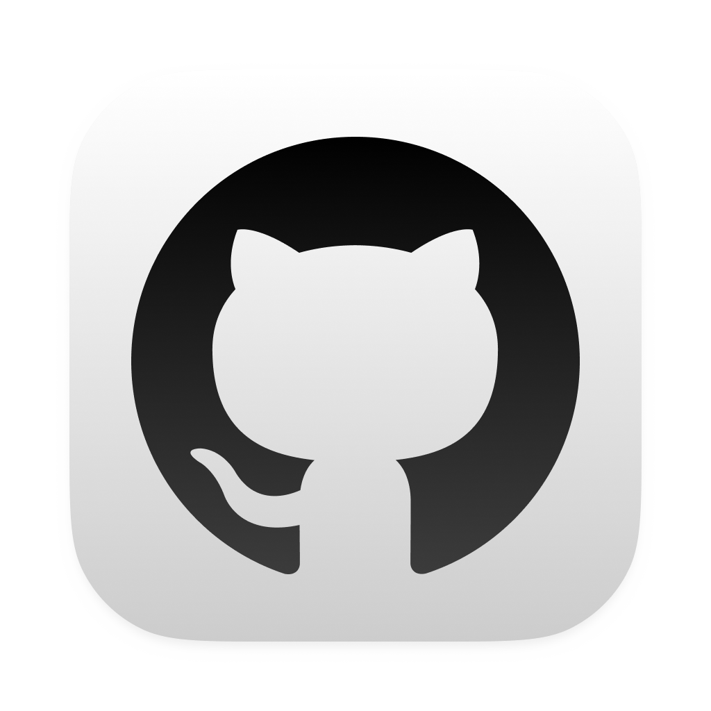
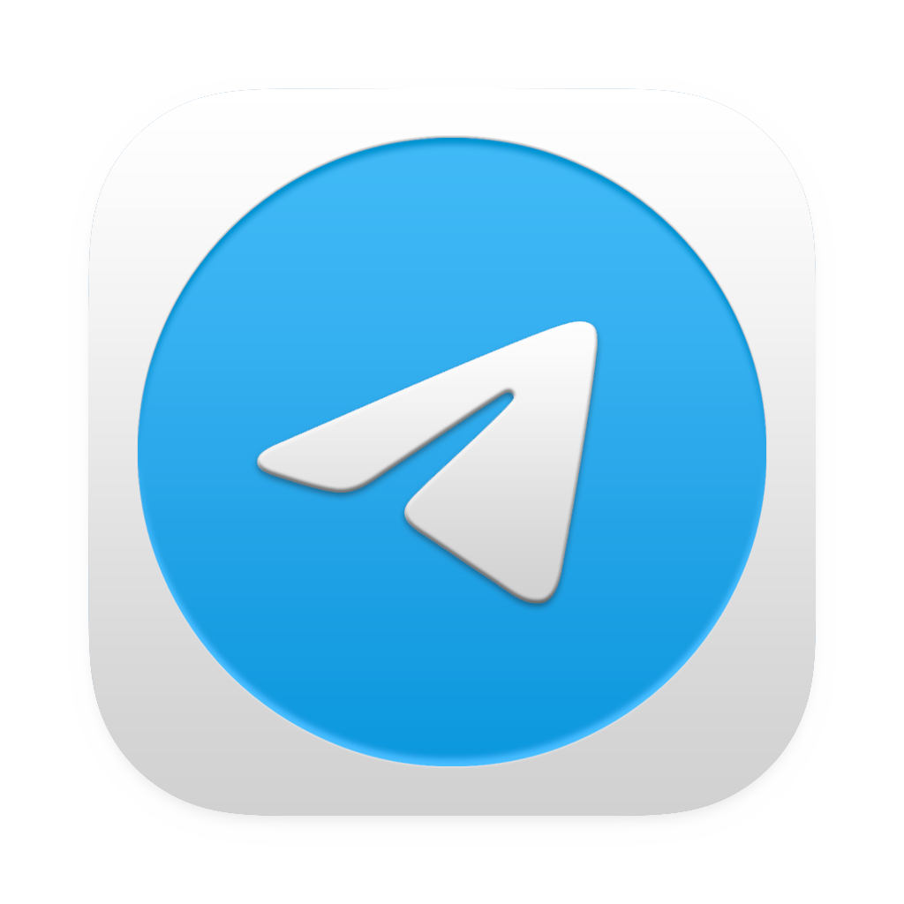
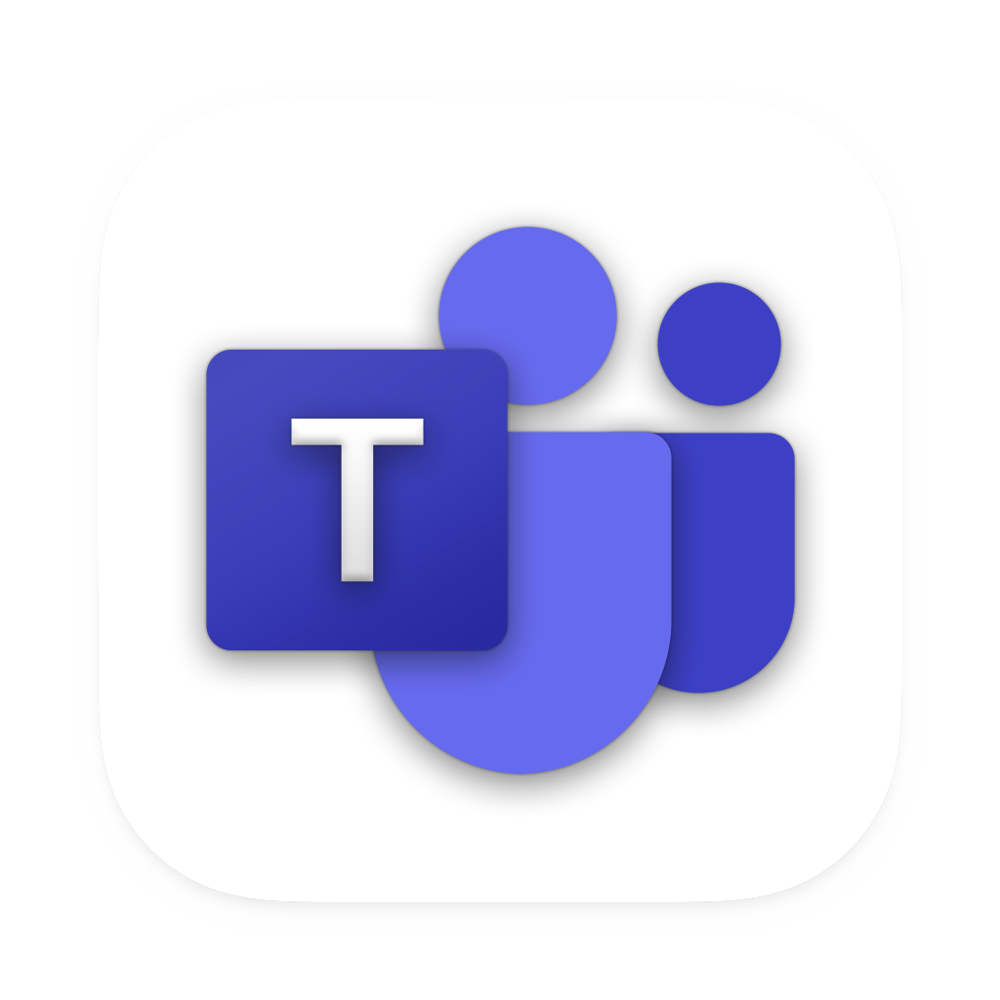
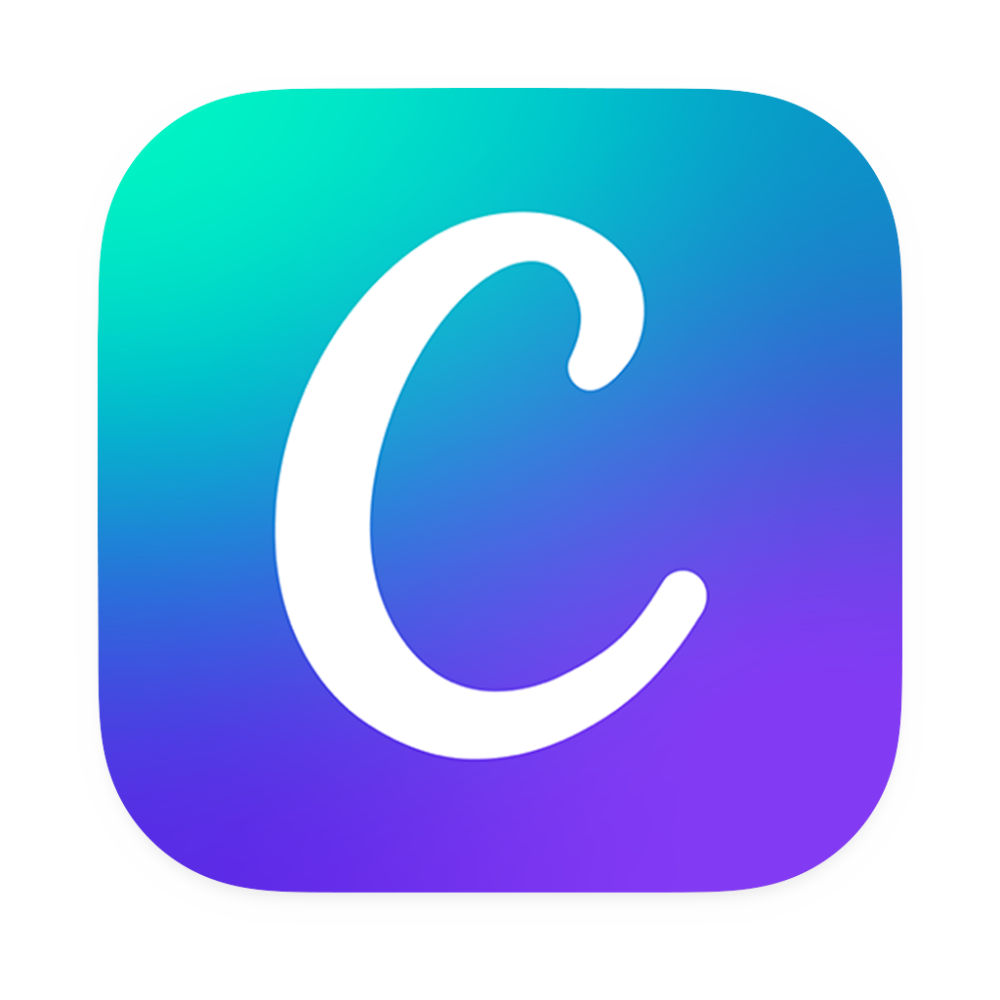
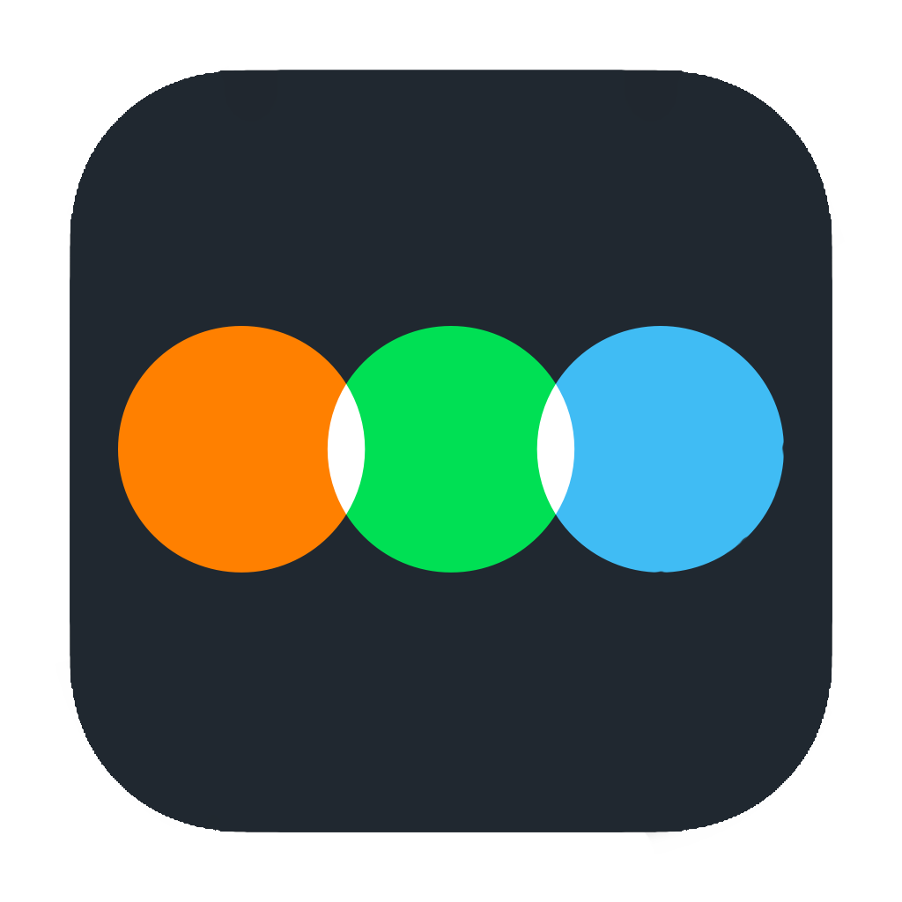
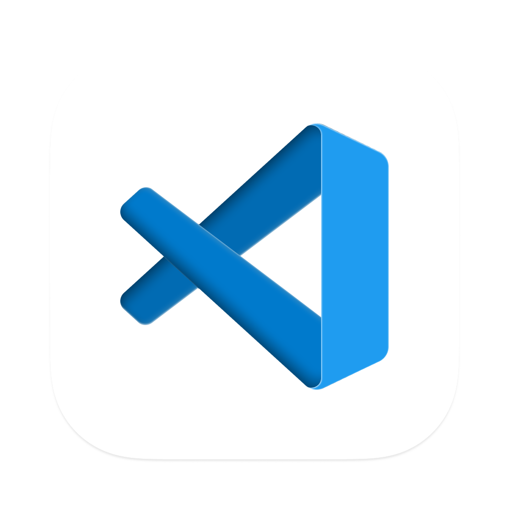
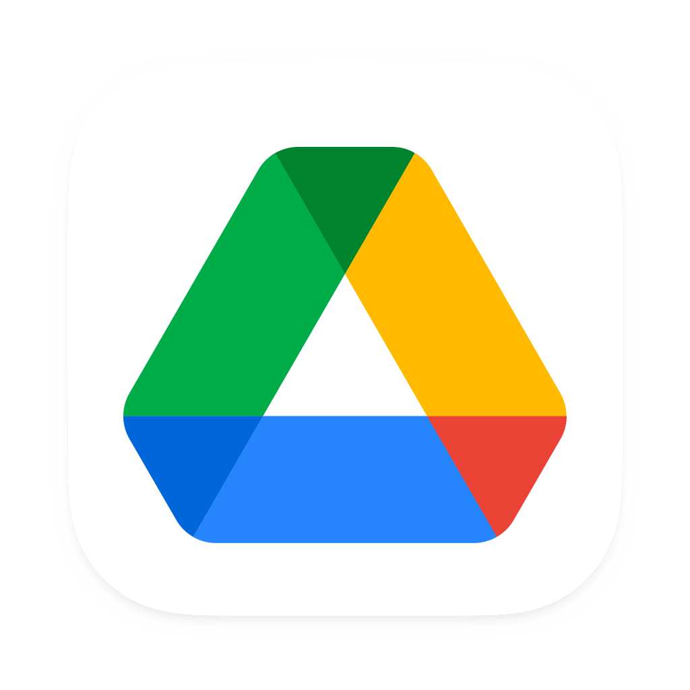

# Ferramentas do Projeto

## 1. Introdução

Nesta página, você encontrará uma lista completa das ferramentas que serão utilizadas durante o processo de levantamento de requisitos do aplicativo Letterboxd. Cada ferramenta possui um propósito específico, abrangendo desde a coleta de informações até o gerenciamento de tarefas e comunicação entre a equipe. Essas ferramentas são essenciais para garantir que todas as etapas do projeto sejam realizadas de forma adequada e dentro do prazo estabelecido.

## 2. Ferramentas

Abaixo, você encontrará uma tabela contendo as ferramentas que serão utilizadas durante o projeto juntamente com uma breve descrição de seus objetivos.

|                                      Logo                                       |           Ferramenta            |                                                                     Finalidade                                                                     |
| :-----------------------------------------------------------------------------: | :-----------------------------: | :------------------------------------------------------------------------------------------------------------------------------------------------: |
|            { width=250px}             |       GitHub[¹](#ancora1)       | O GitHub é uma plataforma de hospedagem de código-fonte de programação e será utilizada como repositório para armazenar a documentação do projeto. |
|           { width=250px}           |      Telegram[²](#ancora2)      |                                      Aplicativo utilizado para manter uma rápida comunicação entre a equipe.                                       |
|              { width=250px}              |       Teams[³](#ancora3)        |                                   Plataforma utilizada para conduzir e gravar as reuniões e entregas da equipe.                                    |
|              { width=250px}              |       Canva[⁴](#ancora4)        |                                           Utilizado para criar o Rich Picture do aplicativo Letterboxd.                                            |
|         { width=250px}         |     Letterboxd[⁵](#ancora5)     |                                        Aplicativo escolhido como objeto de estudo para realizar o projeto.                                         |
|            { width=250px}             |      Youtube[⁶](#ancora6)       |                                    Ferramenta utilizada para armazenar os vídeos das reuniões e apresentações.                                     |
| { width=250px} | Visual Studio Code[⁷](#ancora7) |                                    Editor de texto usado para editar e fazer upload da documentação no GitHub.                                     |
|             { width=250px}             |       Mkdocs[⁸](#ancora8)       |                                                Utilizado para gerar a documentação no Github Pages                                                 |
|       { width=250px}       |    Google Drive[⁹](#ancora9)    |                           Plataforma de armazenamento na nuvem utilizada pela equipe para armazenar arquivos do projeto.                           |
|             { width=250px}             |      Clideo[¹⁰](#ancora10)      |                                          Plataforma utilizada para cortar e juntar vídeos gratuitamente.                                           |

Tabela 1: Ferramentas utilizadas no projeto

## 3. Referências

> - [1] GITHUB. Build software better, together. Disponível em: <https://github.com>. Acesso em: 16 abr. 2023.
> - [2] Telegram – a new era of messaging. Disponível em: <https://telegram.org>. Acesso em: 16 abr. 2023.
> - [3] Aplicativo de Chat Interno e Trabalho Remoto | Microsoft Teams. Disponível em: <https://www.microsoft.com/pt-br/microsoft-teams/group-chat-software>. Acesso em: 16 abr. 2023.
> - [4] CANVA. Canva. Disponível em: <https://www.canva.com/>. Acesso em: 16 abr. 2023.
> - [5] Letterboxd • Your life in film. Disponível em: <https://letterboxd.com>. Acesso em: 16 abr. 2023.
> - [6] YOUTUBE. YouTube. YouTube, 2022. Disponível em: <https://www.youtube.com> Acesso em: 16 abr. 2023.
> - [7] MICROSOFT. Visual Studio Code. Disponível em: <https://code.visualstudio.com>. Acesso em: 16 abr. 2023.
> - [8] MkDocs. Disponível em: <https://www.mkdocs.org>. Acesso em: 16 abr. 2023.
> - [9] Meet Google Drive – One place for all your files. Disponível em: <https://drive.google.com/drive/>. Acesso em: 16 abr. 2023.
> - [10] Clideo. Disponível em: <https://clideo.com/pt/>. Acesso em: 17 abr. 2023.
> - O que é GitHub? Disponível em: <https://tecnoblog.net/responde/o-que-e-github/>. Acesso em: 16 abr. 2023.
> - @ELRUMO. Over 5000+ free icons for macOS Monterey, Big Sur & iOS - massive app icon pack. Disponível em: <https://macosicons.com/#/>. Acesso em: 16 abr. 2023.

## 4. Histórico de Versão

|    Data    | Versão |                                                   Descrição                                                    |                      Autor(es)                      |                 Revisor(es)                 |
| :--------: | :----: | :------------------------------------------------------------------------------------------------------------: | :-------------------------------------------------: | :-----------------------------------------: |
| 13/04/2023 |  `1.0`   | Criação da primeira versão do documento, incluindo as primeiras ferramentas utilizadas, logotipo e sua função. | [Maciel Júnior](https://github.com/macieljuniormax) | [Rhuan Marques](https://github.com/RhuanMr) |
| 13/04/2023 |  `2.0`   |                Alteração dos logos, adição da bibliografia, adição da ferramenta google drive.                 | [Maciel Júnior](https://github.com/macieljuniormax) |                                             |
| 13/04/2023 |  `3.0`   |                Adição da ferramenta Clideo                 | [Natan Santana](https://github.com/Neitan2001) |   [Débora Caires](https://github.com/deboracaires)                                          |

