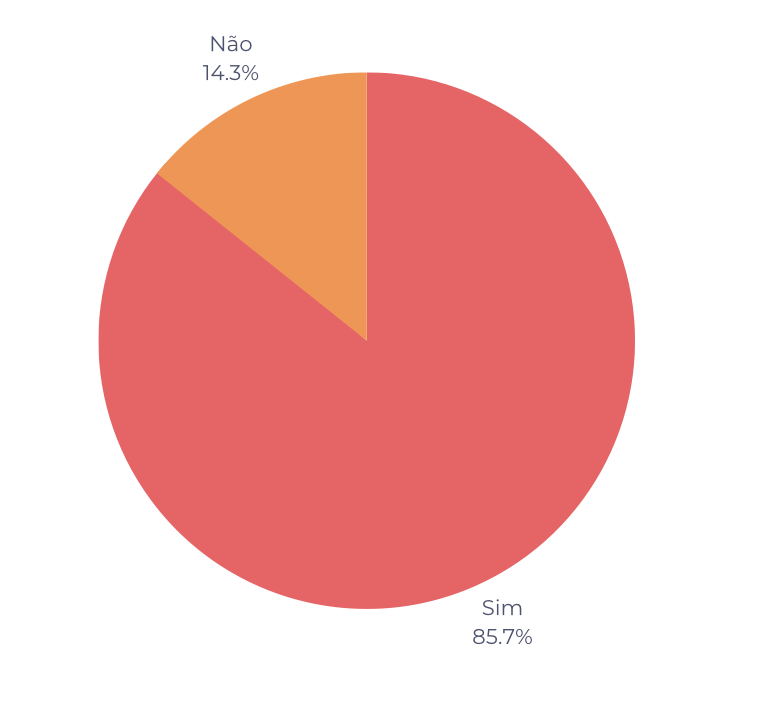

# Verificação Etapa 2

## Introdução

Este documento possui como objetivo documentar os resultados da verificação dos artefatos da etapa 2 do grupo 7. O responsável por esta avaliação é o avaliador Gustavo Barbosa de Oliveira e a data de execução foi no dia 13 de junho de 2023. Na tabela 1, pode-se observar os artefatos avaliados e a versão dos mesmos no dia da avaliação.

| Artefato                                     | Versão |
| -------------------------------------------- | ------ |
| Perfil de Usuário                            | `1.1`  |
| Personas                                     | `1.1`  |
| Elicitação: BrainStorming                    | `1.1`  |
| Elicitação: Storytelling                     | `1.1`  |
| Priorização: Escala de três níveis           | `1.1`  |
| Priorização: MosCow                          | `1.1`  |
| Priorização: Baseada em valor, custo e risco | `1.1`  |

Tabela 1: Artefatos avaliados da etapa 2 (Fonte: Gustavo, 2023)

## Checklist

Na tabela 3 - Perfil de Usuário

| Número | Pergunta                                                                                                        | Resposta |
| ------ | --------------------------------------------------------------------------------------------------------------- | -------- |
| 1      | Os dados foram obtidos por meio de pesquisas, entrevistas, observação ou análise de dados existentes?           | Sim      |
| 2      | Os usuários foram agrupados em segmentos com base em características comuns?                                    | Sim      |
| 3      | Foram criadas personas fictícias que representem perfis típicos de usuários, com base nas informações coletadas | Sim      |
| 4      | As porcentagens de usuários em cada segmento foram determinadas?                                                | Sim      |

Na tabela 4 - Personas

| Número | Pergunta                                                                                                              | Resposta |
| ------ | --------------------------------------------------------------------------------------------------------------------- | -------- |
| 5      | Foram identificados os objetivos e as tarefas que os usuários desejam realizar ao interagir com o sistema ou produto? | Sim      |
| 6      | As personas contém Nome, Idade, Gênero, Status, Objetivos, Habilidades, Relacionamentos, Requisitos e Expectativas?   | Sim      |
| 7      | Possui entre 3 a 12 personas?                                                                                         | Sim      |
| 8      | Possui justificativa do número de personas?                                                                           | Sim      |
| 9      | Possui uma antipersona?                                                                                               | Sim      |

Na tabela 5 - Brainstorming

| Número | Pergunta                                                                                             | Resposta |
| ------ | ---------------------------------------------------------------------------------------------------- | -------- |
| 10     | Possui local, data e horário da reunião de Brainstormig?                                             | Sim      |
| 11     | Está especificado o papel de cada participante do Brainstorming?                                     | Não      |
| 12     | Foram utilizadas técnicas para incentivar a geração de ideias?(palavras-chave, imagens ou diagramas) | Não      |

Na tabela 7 - Storytelling

| Número | Pergunta                                                                                                                                                             | Resposta |
| ------ | -------------------------------------------------------------------------------------------------------------------------------------------------------------------- | -------- |
| 13     | Os registros da atividade de priorização dos requisitos foram adequadamente documentados?                                                                            | sim      |
| 14     | As histórias conseguem comunicar claramente a visão e as necessidades dos usuários para os membros da equipe de desenvolvimento?                                     | sim      |
| 15     | O Storytelling incorpora elementos emocionais e contextuais para criar empatia e compreensão dos usuários e suas necessidades?                                       | sim      |
| 16     | O Storytelling aborda as restrições e limitações do sistema, fornecendo informações importantes para a equipe de desenvolvimento considerar durante a implementação? | não      |
| 17     | As histórias do Storytelling foram validadas e verificadas por meio de revisões e feedback dos stakeholders relevantes para garantir sua precisão e adequação?       | não      |

Na tabela 8 - Escala de três níveis

| Número | Pergunta                                                                                                                                                              | Resposta |
| ------ | --------------------------------------------------------------------------------------------------------------------------------------------------------------------- | -------- |
| 18     | A priorização levou em consideração os critérios importância e urgência?                                                                                              | sim      |
| 19     | Os níveis de priorização foram divididos em Alta, Média e Baixa?                                                                                                      | sim      |
| 20     | O modelo de quadrante utilizado para classificar os requisitos foi visualmente intuitivo e facilmente compreensível para os stakeholders?                             | sim      |
| 21     | As dependências entre requisitos foram consideradas no processo de ranqueamento e priorização, garantindo que requisitos dependentes tenham prioridades consistentes? | sim      |

Na tabela 9 - MosCow

| Número | Pergunta                                                                                                                                                                                                      | Resposta |
| ------ | ------------------------------------------------------------------------------------------------------------------------------------------------------------------------------------------------------------- | -------- |
| 22     | Cada requisito foi adequadamente classificado como Must Have (Deve ter), Should Have (Deveria ter), Could Have (Poderia ter) ou Won't Have (Não terá)?                                                        | sim      |
| 23     | A participação do cliente e/ou personas foi ativamente envolvida no processo de priorização, garantindo que suas perspectivas e necessidades sejam consideradas?                                              | sim      |
| 24     | Foi realizada uma revisão cuidadosa para garantir que nenhum requisito importante tenha sido negligenciado ou erroneamente classificado, evitando a exclusão indevida de requisitos essenciais?               | sim      |
| 25     | Os requisitos classificados como Won't Have (Não terá) foram revisados e justificados adequadamente, assegurando que a exclusão desses requisitos não afete negativamente o escopo e os objetivos do projeto? | sim      |

Na tabela 10 - Baseada em valor, custo e risco

| Número | Pergunta                                                                                                                                                                                                      | Resposta |
| ------ | ------------------------------------------------------------------------------------------------------------------------------------------------------------------------------------------------------------- | -------- |
| 26     | Foram priorizados os requisitos com base no valor que eles agregam ao negócio?                                                                                                                                | sim      |
| 27     | Foram priorizados aqueles que ajudam a mitigar os riscos mais críticos ou que possuem menor nível de incerteza?                                                                                               | sim      |
| 28     | Foram priorizados aqueles com maior ROI ou benefícios mais significativos?                                                                                                                                    | não      |
| 29     | Foi considerado o impacto dos requisitos na satisfação e na experiência do cliente.                                                                                                                           | sim      |
| 30     | Foi considerada a complexidade e a interdependência dos requisitos. Priorizar aqueles que são mais simples e independentes, permitindo uma entrega mais rápida e uma menor probabilidade de erros ou atrasos. | sim      |

## Resultados

É possível observar pela Figura 1 que das 30 perguntas do checklist, 5 foram respondidas como "Não" (14.3%) enquanto 17 foram respondidas como "Sim" (85.7%%).
A seguir será documentado as observações feitas sobre cada um dos artefatos com os pontos de atenção que foram notados pela execução do checklist.

Brainstorming:

- Não ficou claro o papel de cada participante na reunião
- Não foi especificado de foram utilizadas técnicas para estimular a geração de ideias

Storytelling:

- Não foram abordadas limitações do sistema, fornecendo informações importantes para a equipe de desenvolvimento considerar durante a implementação
- Não está claro se as histórias foram validadas e verificadas por stekeholders

Baseada em valor, custo e risco:

- Não foi levanda em consideração o ROI na priorização

<figure markdown>
  
  <figcaption>Figura 1: gráfico das respostas do checklist da etapa 2</figcaption>
  
Fonte: Autoria própria

</figure>

## Tabela de Versionamento

| Data       | Versão | Descrição                               | Autor                                       | Revisor |
| ---------- | ------ | --------------------------------------- | ------------------------------------------- | ------- |
| 13/06/2023 | `1.0`  | Documentação da execução da verificação | [Gustavo Barbosa](https://github.com/brbsg) |         |
