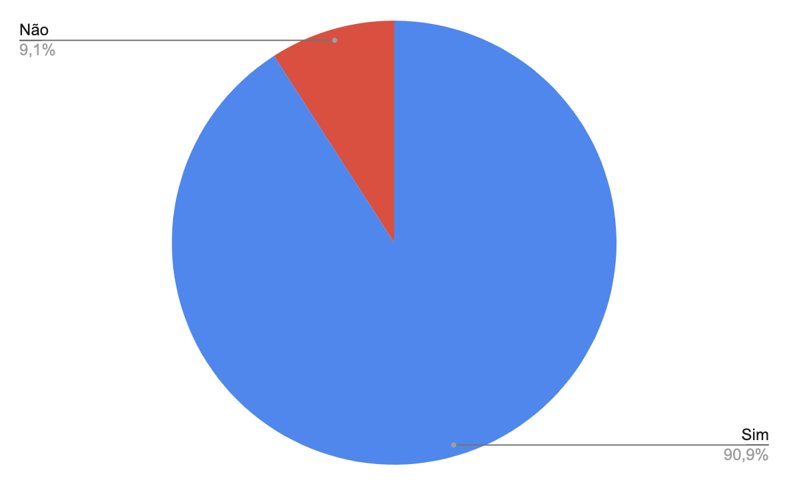

# Verificação Etapa 1

## Introdução

Este documento possui como objetivo documentar os resultados da verificação dos artefatos da etapa 1 do aplicativo Letterboxd. O responsável por esta avaliação é a avaliadora Clara Marcelino Ribeiro de Sousa e a data de execução foi no dia 16 de junho de 2023. Na tabela 1, pode-se observar os artefatos avaliados e a versão dos mesmos no dia da avaliação.

| Artefato      | Versão                          |
| ----------- | ------------------------------------ |
| Rich Picture       | `3.0`  |

Tabela 1: Artefatos avaliados da etapa 1

## Checklist

Na tabela 2 a seguir está disponível o checklist desenvolvido durante o [planejamento](./planejamento.md) respondido de acordo com o artefato avaliado.

### Rich Picture

| Número     | Pergunta | Resposta
| ----------- | ----------- | ----------- | 
| 1 | Possui palavras-chave para compreender a situação?¹ | Sim |
| 2 | Possui imagens e diagramas para representar os conceitos e relacionementos?¹ | Sim |
| 3 | Possui mais imagens e diagramas do que palavras?¹ | ==Não== |
| 4 | É compreensível para quem não possui conhecimento da aplicação/do problema?¹ | Sim |
| 5 | Possui atores com legendas descritivas?¹ | Sim |
| 6 | Possui operações? (Geralmente são ações que estão escritas dentro de uma elipse)¹ | Sim |
| 7 | Possui armazenamento de dados? (também conhecido como tabelas)¹ | Sim |
| 8 | Possui setas?¹ | Sim |
| 9 | Possui o limite do sistema?¹ | Sim |
| 10 | Os componentes possuem explicação?¹ | Sim |
| 11 | Possui linguagem de fácil entendimento para todos?¹ | Sim |

Tabela X: Checklist de verificação do artefato "Rich Picture"

## Resultados

É possível observar pela Figura 1 que das 11 perguntas do checklist, 10 foram respondidas como "Sim" (90,9%) enquanto 1 foi respondida como "Não" (9,1%). A seguir será documentado as observações feitas sobre cada um dos artefatos com os pontos de atenção que foram notados pela execução do checklist.

- Possui mais imagens e diagramas do que palavras?
> O Rich Picture é um artefato que utiliza de imagens e diagramas para representação de um sistema. Porém no rich picture executado, a parte visual é menor do que a textual, fugindo do propósito do artefato.

<figure markdown>
  
  <figcaption>Figura 1: gráfico das respostas do checklist da etapa 1</figcaption>
  
Fonte: Autoria própria

</figure>

## Referência Bibliográfica

> - [1] Introducing Rich Pictures - Rich Picture Drawing Guidelines. Disponível em: <https://aprender3.unb.br/>. Acessado em: 16 de junho de 2023

## Tabela de Versionamento

| Data | Versão | Descrição | Autor | Revisor |
| ---- | ------ | --------- | ----- | ------- |
| 18/06/2023 | `1.0`  | Documentação da execução da verificação | [Clara Ribeiro](https://github.com/clara-ribeiro) | [Natan Santana](https://github.com/Neitan2001) |