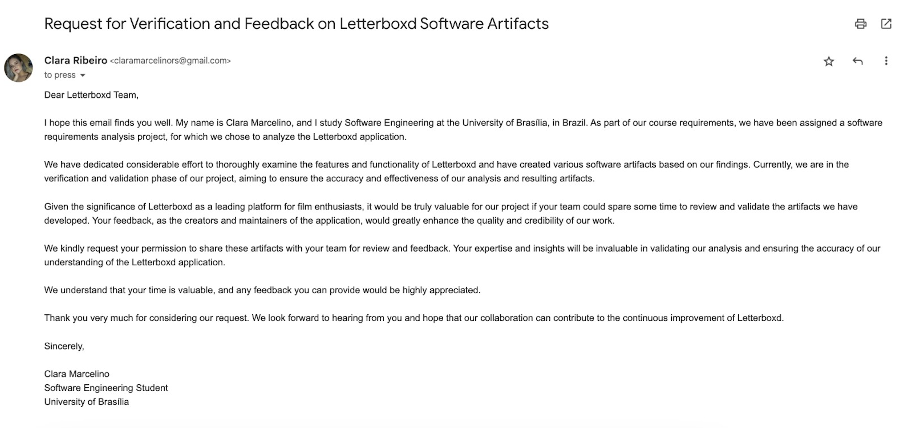

# Comprovação Informal

## 1. Introdução

A validação de requisitos, de acordo com SOMMERVILLE(2016)[¹](#ancora1), consiste em um processo que tem como objetivo garantir que os requisitos especificados definem o sistema que o cliente realmente deseja. Ou seja, ela busca assegurar que todas as necessidades das partes interessadas no escopo do projeto serão satisfeitas. O processso de validação dos requisitos é importante pois erros em um documento de requisitos podem gerar altos custos de retrabalho quando descobertos tardiamente.

## 2. Metodologia

Existem diferentes técnicas que podem ser utilizadas durante o processo de validação de requisitos, a seguir está detalhada como foi utilizada a técnica de comprovação informal, que segundo Milene Serrano e Maurício Serrano[²](#ancora2), envolve principalmente a análise de descrições em linguagem natural e o feedback dos clientes para identificar quaisquer problemas ou falhas na forma como os requisitos estão expressos. Dessa forma, uma mensagem foi elaborada e enviada para a equipe da plataforma Letterboxd. A mensagem enviada pode ser conferida na Figura 1 abaixo. Se necessário, clique sobre a imagem para visualizá-la em tamanho maior.

    <figure markdown>
    {:target="_blank"}
    <figcaption>Figura 1: Mensagem enviada para a equipe da plataforma Letterboxd</figcaption>
    
Autor: Clara Ribeiro

    </figure>

Além disso, para a realização da validação, foi utilizada também a técnica de prototipação, que poder ser conferida [aqui](./2-prototipacao.md).

## 3. Resultados

Até a data de criação deste documento (20/06/2023), não houve retorno da equipe da plataforma Letterboxd. No entanto, caso haja alguma resposta, o documento será atualizado o mais breve possível.

## 4. Referências

> - [1] SOMMERVILLE, I. Software engineering. 10.ed. Harlow: Pearson Education, 2016 p.76
> - [2] SERRANO, Maurício; SERRANO, Milene; Requisitos - Aula 23. Disponível em: Aprender3. Acesso em: 19 de junho de 2023.

## 4. Histórico de Versão

|    Data    | Versão |                  Descrição                   |                        Autor                        |                     Revisor                     |
| :--------: | :----: | :------------------------------------------: | :-------------------------------------------------: | :---------------------------------------------: |
| 18/06/2023 | `1.0`  | Criação do documento de comprovação informal | [Maciel Júnior](https://github.com/macieljuniormax) | [Arthur Loureiro](https://github.com/ArtAssLou) |
