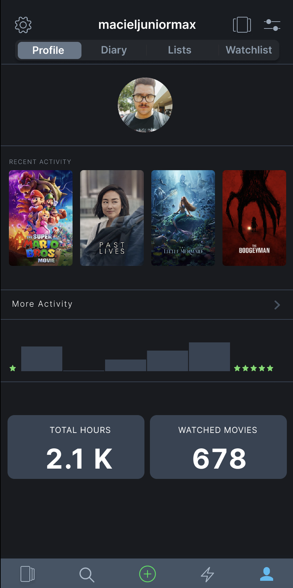
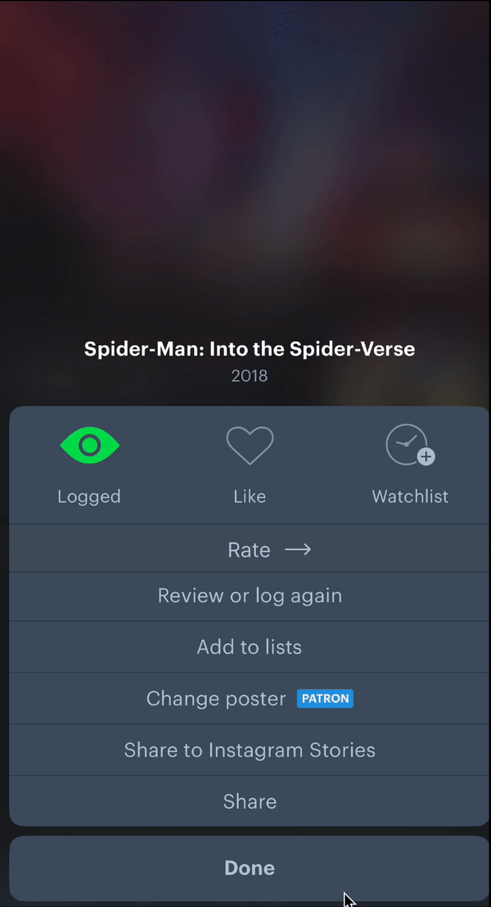
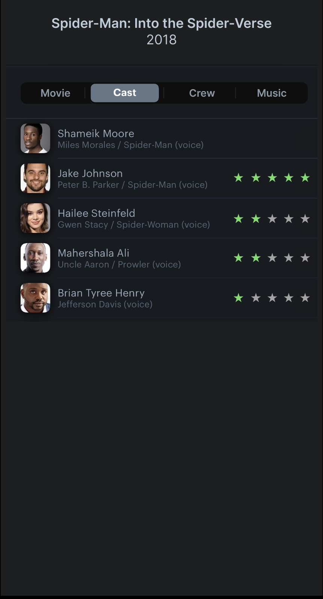
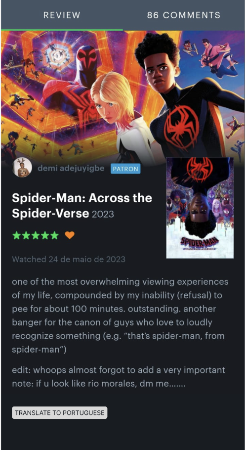
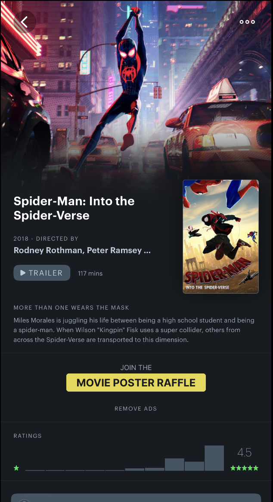
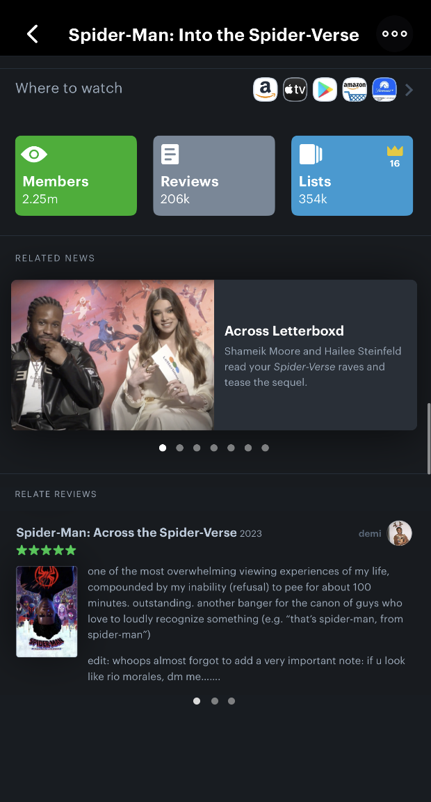

# Prototipação

## 1. Introdução

A prototipação, segundo SOMMERVILLE(2016)[¹](#ancora1), consiste em aprensentar um modelo executável do sistema aos clientes e usuários para que eles possam experimentar o sistema e decidir se ele atende às suas necessidades. Com esse objetivo, foram desenvolvidos, com base nos requisitos definidos na etapa de priorização, alguns protótipos que podem ser conferidos a seguir. A construção dos protótipos foi baseada em requisitos ainda não implementados pela plataforma e foi feita com o auxílio da plataforma Figma[²](#ancora2), que é uma ferramenta de design de interface de usuário com recursos de prototipagem.

## 2. Prototipação

Com base nos requisitos selecionados, foram desenvolvidos os protótipos abaixo. Para uma vizualização mais detalhada, é possível clicar em cima da imagem para ser redirecionado para a página do protótipo no Figma[²](#ancora2).

### 2.1 Protótipo 01 - Sortear Filme

O protótipo a seguir, representado pela Figura 1, tem como objetivo atender ao requisito QST13 (Sortear filme da watchlist). Para isso foi adicionado um botão na págin de Watchlist que, ao ser clicado, sorteia um filme da lista de filmes do usuário.

    <figure markdown>
    [{ width=250px}](https://www.figma.com/proto/uGlVKaZ4MEnLvRxQ4L9bYR/Prot%C3%B3tipos-Letterboxd?page-id=0%3A1&type=design&node-id=23-3&viewport=133%2C2365%2C0.29&scaling=min-zoom){:target="_blank"}
    <figcaption>Figura 1: Protótipo 1</figcaption>
    
Autor: Maciel Júnior

    </figure>

### 2.2 Protótipo 02 - Filmes em Comum

O protótipo a seguir, representado pela Figura 2, tem como objetivo representar o requisito QST08 (Encontrar filmes em comum na "watchlist" de dois ou mais usuários, exclusivos para usuários "Pro"). Para tal, foi adicionado na parte inferior da página de Watchlists a miniatura dos amigos do usuário. Ao clicar em um amigo, é exibida uma lista com os filmes em comum entre o usuário e o amigo selecionado.

    <figure markdown>
    [{ width=250px}](https://www.figma.com/proto/uGlVKaZ4MEnLvRxQ4L9bYR/Prot%C3%B3tipos-Letterboxd?page-id=0%3A1&type=design&node-id=23-3&viewport=133%2C2365%2C0.29&scaling=min-zoom){:target="_blank"}
    <figcaption>Figura 2: Protótipo 2</figcaption>
    
Autor: Maciel Júnior

    </figure>

### 2.3 Protótipo 03 - Grupos de Discussão

O protótipo a seguir, representado pela Figura 3, tem como objetivo representar o requisito DOC57 (Deve ser possível que os usuários criem e participem de grupos de discussão sobre temas específicos, como gêneros cinematográficos, diretores e filmes clássicos). Dessa forma, foi adicionado na página inicial uma aba a mais. Ao clicar nessa aba, são exibidos alguns grupos que o usuário pode fazer parte. Ao clicar em um grupo, é exibida uma página com as informações do grupo e uma lista com alguns usuários que fazem parte do grupo.

    <figure markdown>
    [{ width=250px}](https://www.figma.com/proto/uGlVKaZ4MEnLvRxQ4L9bYR/Prot%C3%B3tipos-Letterboxd?page-id=0%3A1&type=design&node-id=31-1148&viewport=193%2C3121%2C0.41&scaling=min-zoom){:target="_blank"}
    <figcaption>Figura 3: Protótipo 3</figcaption>
    
Autor: Maciel Júnior

    </figure>

### 2.4 Protótipo 04 - Acompanhamento de Séries

O protótipo a seguir, representado pela Figura 4, tem como objetivo representar o requisito DOC51 (Deve ser possível fazer o acompanhamento de séries no aplicativo). Para tal, foi adicionado na página inicial uma aba a mais. Ao clicar nessa aba, são exibidas algumas séries que o usuário pode acompanhar.

    <figure markdown>
    [{ width=250px}](https://www.figma.com/proto/uGlVKaZ4MEnLvRxQ4L9bYR/Prot%C3%B3tipos-Letterboxd?page-id=0%3A1&type=design&node-id=31-1148&viewport=193%2C3121%2C0.41&scaling=min-zoom){:target="_blank"}
    <figcaption>Figura 4: Protótipo 4</figcaption>
    
Autor: Maciel Júnior

    </figure>

### 2.5 Protótipo 05 - Tempo de Tela

O protótipo a seguir, representado pela Figura 5, tem como objetivo representar os requisitos DOC58 (Deve ser exibido no perfil do usuário a quantidade de filmes assistidos pelo usuário) e DOC59 (Deve ser exibido no perfil do usuário a quantidade de horas assistidas pelo usuário). Para isso foram adicionados dois quadros na página de perfil do usuário, um com a quantidade de filmes assistidos e outro com a quantidade de horas assistidas.

    <figure markdown>
     [{ width=250px}](https://www.figma.com/proto/uGlVKaZ4MEnLvRxQ4L9bYR/Prot%C3%B3tipos-Letterboxd?page-id=0%3A1&type=design&node-id=31-1809&viewport=199%2C2839%2C0.41&scaling=min-zoom){:target="_blank"}
    <figcaption>Figura 5: Protótipo 5</figcaption>
    
Autor: Maciel Júnior

    </figure>

### 2.6 Protótipo 06 - Emoções

O protótipo a seguir, representado pela Figura 6, tem como objetivo representar os requisitos DOC54 (Deve ser possível reagir com uma emoção sentida no filme (chocado, frustrado, triste, reflexivo, comovido, entretido, assustado, entediado, empolgada, confusa, tensa)). Para isso na tela de avaliar um filme, foi adicionado um atalho que leva para uma página onde o usuário pode avaliar o filme com estrelas e escolher dentre diversas opções de emoções.

    <figure markdown>
     [{ width=250px}](https://www.figma.com/proto/uGlVKaZ4MEnLvRxQ4L9bYR/Prot%C3%B3tipos-Letterboxd?page-id=0%3A1&type=design&node-id=68-125&viewport=-2037%2C4806%2C0.64&scaling=min-zoom&starting-point-node-id=68%3A125){:target="_blank"}
    <figcaption>Figura 6: Protótipo 6</figcaption>
    
Autor: Clara Marcelino

    </figure>

### 2.7 Protótipo 07 - Avaliação e Trilha Sonora

O protótipo a seguir, representado pela Figura 7, foi desenvolvido para representar os requisitos DOC52 (Deve ser possível avaliar os atores dos filmes), DOC53 (Deve ser possível avaliar o diretor dos filmes) e DOC56 (Deve ser exibido a trilha sonora de cada filme). Para tal, foi adicionado na página aba "Cast" estrelas ao lado dos nomes dos atores, atrizes e diretores para que o usuário possa avaliar o trabalho de cada um. Além disso, foi criada uma nova aba, onde ficará a trilha sonora do filme.

    <figure markdown>
     [{ width=250px}](https://www.figma.com/proto/uGlVKaZ4MEnLvRxQ4L9bYR/Prot%C3%B3tipos-Letterboxd?page-id=0%3A1&type=design&node-id=68-132&viewport=-2331%2C5439%2C0.79&scaling=min-zoom&starting-point-node-id=68%3A125){:target="_blank"}
    <figcaption>Figura 7: Protótipo 7</figcaption>
    
Autor: Clara Marcelino

    </figure>

### 2.8 Protótipo 08 - Traduzir Críticas

O protótipo a seguir, representado pela Figura 8, foi desenvolvido para representar o requisito ENT06 (Botão de traduzir nas críticas que estejam em um idioma diferente do usuário). Desta forma, foi adicionado um botão de tradução na página da crítica do filme, pelo qual usuário poderá traduzir as críticas que não estiverem no seu idioma.

    <figure markdown>
     [{ width=250px}](https://www.figma.com/proto/uGlVKaZ4MEnLvRxQ4L9bYR/Prot%C3%B3tipos-Letterboxd?page-id=0%3A1&type=design&node-id=68-168&viewport=-2331%2C5439%2C0.79&scaling=min-zoom&starting-point-node-id=68%3A125){:target="_blank"}
    <figcaption>Figura 8: Protótipo 8</figcaption>
    
Autor: Clara Marcelino

    </figure>

### 2.9 Protótipo 09 - Sorteio de Pôsteres

O protótipo a seguir, representado pela Figura 9, foi desenvolvido para representar o requisito QST09 (Sorteios de pôsteres assinados por elenco de filmes recentes, exclusivo para usuários "Pro"). Desta forma, foi adicionado na página do filme, um botão, pelo qual o usuário pode se inscrever para participar do sorteio.

    <figure markdown>
     [{ width=250px}](https://www.figma.com/proto/uGlVKaZ4MEnLvRxQ4L9bYR/Prot%C3%B3tipos-Letterboxd?page-id=0%3A1&type=design&node-id=68-171&viewport=-2331%2C5439%2C0.79&scaling=min-zoom&starting-point-node-id=68%3A125){:target="_blank"}
    <figcaption>Figura 9: Protótipo 9</figcaption>
    
Autor: Clara Marcelino

    </figure>

### 2.10 Protótipo 10 - Artigos Relacionados

O protótipo a seguir, representado pela Figura 10, foi desenvolvido para representar o requisito QST11 (Colocar artigos relacionados na tela de detalhes do filme). Desta forma, foi adicionado na página do filme, uma seção de artigos relacionados, n qual o usuário poderá ler artigos relacionados ao filme.

    <figure markdown>
     [{ width=250px}](https://www.figma.com/proto/uGlVKaZ4MEnLvRxQ4L9bYR/Prot%C3%B3tipos-Letterboxd?page-id=0%3A1&type=design&node-id=68-175&viewport=-2445%2C5341%2C0.79&scaling=min-zoom&starting-point-node-id=68%3A125){:target="_blank"}
    <figcaption>Figura 10: Protótipo 10</figcaption>
    
Autor: Clara Marcelino

    </figure>

## 4. Relato do usuario

### 4.1 Introdução

A entrevista da Prototipação foi feita a partir de uma entrevista online da plataforma teams, a qual foi apresentado os prototipos feitos no Figma e o usuario nos forneceu suas impressões sobre os prototipos criados.

### 4.2 Objetivos

O objetivo da entrevista foi validar se o produto da prototipação atende aos requisitos eleicitados com usuarios e suas impressões sobre.

### 4.3 Metologia

A metodologia utilizada para a avaliação foi a entrevista. A entrevista foi realizada por um membro do grupo. Na entrevista foram apresentadas questões acerca das políticas de termos de consentimento, uma pequena introdução acerca do nosso projeto e que o entrevistado teria total liberdade de não responder caso fosse solicitado.

### 4.4 Gravação da entrevista

<iframe width="560" height="315" src="https://www.youtube.com/embed/wDJx6E0gotc" title="YouTube video player" frameborder="0" allow="accelerometer; autoplay; clipboard-write; encrypted-media; gyroscope; picture-in-picture; web-share" allowfullscreen></iframe>

### 4.5 Resultado da entrevista

- Protótipo 01 - Sortear Filme: Usuario teve facilidade em reconhecer como essa funcionalidade opera e gostou de como a funcionalidade de sortear o filme pode ser aplicada.
- Protótipo 02 - Filmes em Comum: Usuario teve facilidade em reconhecer como essa funcionalidade opera, usuario questionou sobre como seria feita a seleção de filmes em comum com seus amigos e sugeriu a ideia do uso de IAs para achar filmes em comum e também sugeriu a possibilidade a função virar um esquema de encontros por meio de gostos por filmes em comum.
- Protótipo 03 - Grupos de Discussão: Usuario teve facilidade em reconhecer como essa funcionalidade opera e aprovou o prototipo. O usuario elogiou as possibilidades com o requisito, como o app virar uma especie de rede social.
- Protótipo 04 - Acompanhamento de Séries: Usuario teve facilidade em reconhecer como essa funcionalidade opera.
- Protótipo 06 - Emoções: Usuario teve facilidade em reconhecer como essa funcionalidade opera e gostou das possiblidades de ter novas reações

## 5. Referências

> - [1] SOMMERVILLE, I. Software engineering. 10.ed. Harlow: Pearson Education, 2016 p.77
> - [2] Figma. Disponível em: <https://www.figma.com>. Acesso em: 18 jun. 2023.

## 6. Histórico de Versão

|    Data    | Versão |                   Descrição                    |                        Autor                        |                       Revisor                       |
| :--------: | :----: | :--------------------------------------------: | :-------------------------------------------------: | :-------------------------------------------------: |
| 18/06/2023 | `1.0`  | Criação do documento de validação e protótipos | [Maciel Júnior](https://github.com/macieljuniormax) |   [Arthur Loureiro](https://github.com/ArtAssLou)   |
| 20/06/2023 | `2.0`  |       Criação do item Relato do usuario        |   [Arthur Loureiro](https://github.com/ArtAssLou)   | [Maciel Júnior](https://github.com/macieljuniormax) |
