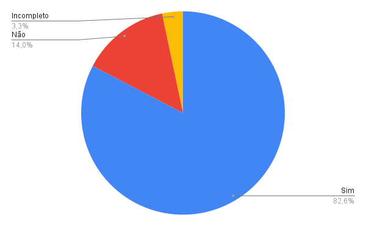

# Acompanhamento

## Introdução

Esta documentação apresenta um acompanhamento detalhado da correção de artefatos desenvolvidos nesse projeto sobre o aplicativo Letterboxd, após a conclusão da etapa de verificação e validação. A verificação e validação são processos essenciais para garantir a qualidade e a conformidade dos artefatos de requisitos. No entanto, mesmo com essas etapas rigorosas, é possível que algumas falhas ainda persistam. Portanto, é fundamental realizar a correção adequada desses artefatos, a fim de garantir que o software seja entregue sem problemas e atenda às expectativas dos usuários.

## Artefatos

Na Tabela 1 a seguir, encontram-se os artefatos que foram listados na etapa de verificação e validação e que precisam de correção.

| Artefato      | Etapa                          |
| ----------- | ------------------------------------ |
| Rich Picture       | Etapa 1  |
| Perfil de Usuário       | Etapa 2  |
| Personas      | Etapa 2  |
| Análise de documentos      | Etapa 2  |
| Cenários       | Etapa 3  |
| Especificação Suplementar       | Etapa 3  |
| Casos de uso       | Etapa 3  |
| Histórias de Usuário       | Etapa 4  |
| NFR Framework      | Etapa 4  |
| Checklist      | Etapa 5  |

Tabela 1: Artefatos a serem corrigidos. (Fonte: Débora Moreira, 2023)

## Visão geral

Na Tabela 2 a seguir, consegue ser visto um panorama geral de todos os artefatos a partir da etapa de verificação e validação realizada na etapa anterior.

| Artefato                 | Sim | Não | Incompleto |
|--------------------------|-----|-----|------------|
| Rich Picture             | 10  | 1   | 0          |
| Perfil de Usuário        | 2   | 2   | 0          |
| Personas                 | 4   | 1   | 0          |
| Análise de documentos    | 4   | 1   | 0          |
| Entrevista               | 7   | 0   | 0          |
| Introspecção             | 5   | 0   | 0          |
| Priorização              | 4   | 0   | 0          |
| Questionário             | 5   | 0   | 0          |
| Storytelling             | 5   | 0   | 0          |
| First Things First       | 5   | 0   | 0          |
| Cenários                 | 9   | 0   | 1          |
| Especificação Suplementar| 6   | 0   | 1          |
| Léxicos                  | 4   | 0   | 0          |
| Casos de Uso             | 11  | 1   | 2          |
| Histórias de Usuário     | 6   | 3   | 0          |
| Backlog                  | 4   | 0   | 0          |
| NFR Framework            | 5   | 3   | 0          |
| Checklist                | 4   | 5   | 0          |

Tabela 2: Visão geral do checklist de todos os artefatos. (Fonte: Débora Moreira, 2023)

Na figura 1 a seguir, tem-se um gráfico que representa de forma visual o percentual de checklist a ser corrigido. No total, os artefatos obtiveram até o dia 27 de junho de 2023 um total de 100 respostas "Sim" que representa 82,6% do total de perguntas do checklist. Já a resposta "Não", foram obtidas um total de 17 que representam 14% do total de perguntas do checklist. E por último foram obtidas 4 "Incompleto" como resposta que representam um total de 3,3%.

<figure markdown>
  
  <figcaption>Figura 1: Gráfico com visão geral do checklist de todos os artefatos.</figcaption>
  
Fonte: Autoria própria

</figure>

## Acompanhamento por artefato

| Artefato                | Responsável pela Correção | Data da Correção | Completo? |
|-------------------------|---------------------------|------------------|-----------|
| Rich Picture            |                           |                  | Não       |
| Perfil de Usuário       |                           |                  | Não       |
| Personas                |                           |                  | Não       |
| Análise de documentos   |                           |                  | Não       |
| Entrevista              | Não se aplica             | Não se aplica    | Sim       |
| Introspecção            | Não se aplica             | Não se aplica    | Sim       |
| Priorização             | Não se aplica             | Não se aplica    | Sim       |
| Questionário            | Não se aplica             | Não se aplica    | Sim       |
| Storytelling            | Não se aplica             | Não se aplica    | Sim       |
| First Things First      | Não se aplica             | Não se aplica    | Sim       |
| Cenários                |                            |                  | Não       |
| Especificação Suplementar|                           |                  | Não       |
| Léxicos                 | Não se aplica             | Não se aplica    | Sim       |
| Casos de Uso            |                           |                  | Não       |
| Histórias de Usuário    | Natan                     | 20/06 e 03/07    | Sim       |
| Backlog                 | Não se aplica             | Não se aplica    | Sim       |
| NFR Framework           |                           |                  | Não       |
| Checklist               |                           |                  | Não       |

Tabela 3: Visão geral do checklist de todos os artefatos. (Fonte: Débora Moreira, 2023)

## Evolução de correção

Neste tópico serão colocadas as evoluções das correções por artefato.

## Tabela de versionamento

| Data | Versão | Descrição | Autor | Revisor |
| ---- | ------ | --------- | ----- | ------- |
| 27/06/2023 | `1.0`  | Criação do documento de acompanhamento | [Débora Moreira](https://github.com/deboracaires) | [Maciel Júnior](https://github.com/macieljuniormax) |