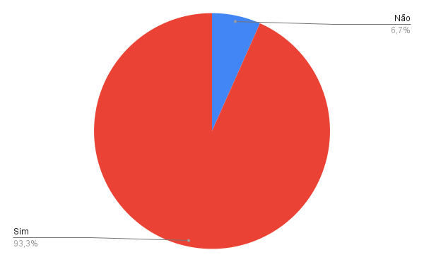

# Verificação Etapa 2

## Introdução

Este documento possui como objetivo documentar os resultados da verificação dos artefatos desenvolvidos na Etapa 2 desse projeto. A responsável por esta avaliação é a avaliadora Débora Moreira e a data de execução foi no dia 21 de junho de 2023. Na tabela 1, pode-se observar os artefatos avaliados e a versão dos mesmos no dia da avaliação.

| Artefato      | Versão                          |
| ----------- | ------------------------------------ |
| Perfil de Usuário       | `1.0`  |
| Personas       | `1.3`  |
| Análise de documentos     | `1.0`  |
| Entrevista      | `3.0`  |
| Introspecção | `1.0`     |
| Priorização   | `1.0`  |
| Questionário      | `2.0`  |
| Storytelling     | `1.0`  |

Tabela 1: Artefatos avaliados da etapa 2

## Checklist

Nas tabelas 2 a 10 a seguir estão disponíveis os checklists desenvolvidos durante o [planejamento](./planejamento.md) respondido de acordo com o artefato avaliado.

### Perfil de Usuário

| Número     | Pergunta     | Resposta
| ----------- | ----------- | ----------- |
| 1 | Os dados foram obtidos por meio de pesquisas, entrevistas, observação ou análise de dados existentes? | Sim |
| 2 | Os usuários foram agrupados em segmentos com base em características comuns? | ==Não== |
| 3 | Foram criadas personas fictícias que representem perfis típicos de usuários, com base nas informações coletadas | Sim |
| 4 | As porcentagens de usuários em cada segmento foram determinadas? | Não |

Tabela 2: Checklist de verificação do artefato "Perfil de Usuário"

### Personas

| Número     | Pergunta     | Resposta
| ----------- | ----------- | ----------- |
| 1 | Foram identificados os objetivos e as tarefas que os usuários desejam realizar ao interagir com o sistema ou produto? | Sim |
| 2 | As personas contém Nome, Idade, Gênero, Status, Objetivos, Habilidades, Relacionamentos, Requisitos e Expectativas? | Sim |
| 3 | Possui entre 3 a 12 personas? | Sim |
| 4 | Possui justificativa do número de personas? | Não |
| 5 | Possui uma pelo menos uma antipersona? | Sim |

Tabela 3: Checklist de verificação do artefato "Personas"

### Análise de Documentos

| Número     | Pergunta     | Resposta
| ----------- | ----------- | ----------- |
| 1 | Foi feita uma análise preliminar para selecionar os documentos mais relevantes para a coleta dos requisitos? | Sim |
| 2 | Foram listados quais documentos foram analisados? | ==Não== |
| 3 | Foram elicitados requisitos funcionais? | Sim |
| 4 | Foram elicitados requisitos não funcionais? | Sim |
| 5 | A classificação dos requisitos está correta? | Sim |

Tabela 4: Checklist de verificação do artefato "Análise de Documentos"

### Entrevista

| Número     | Pergunta     | Resposta
| ----------- | ----------- | ----------- |
| 1 | Foi utilizada alguma metodologia para o planejamento da entrevista? | Sim |
| 2 | Foi apresentado um roteiro para a entrevista? | Sim |
| 3 | Foi aplicado um termo de consentimento, para o devido uso das informações coletadas, aos entrevistados? | Sim |
| 4 | Foi realizado algum teste piloto? | Sim |
| 5 | Os entrevistados eram usuários da plataforma em estudo? | Sim |
| 6 | Foram escritos resumos das entrevistas? | Sim |
| 7 | Os requisitos elicitados foram documentados? | Sim |

Tabela 5: Checklist de verificação do artefato "Entrevista".

### Introspecção

| Número     | Pergunta     | Resposta
| ----------- | ----------- | ----------- |
| 1 | Foram levantados comportamentos esperados do aplicativo? | Sim |
| 2 | Cada comportamento esperado possui um cenário de utilização completo? | Sim |
| 3 | Foram elicitados requisitos funcionais? | Sim |
| 4 | Foram elicitados requisitos não funcionais? | Sim |
| 5 | A classificação dos requisitos está correta? | Sim |

Tabela 6: Checklist de verificação do artefato "Introspecção"

### Priorização - Escala de Três Níveis

| Número     | Pergunta     | Resposta
| ----------- | ----------- | ----------- |
| 1 | A priorização levou em consideração os critérios importância e urgência? | Sim |
| 2 | Os níveis de priorização foram divididos em Alta, Média e Baixa? | Sim |
| 3 | O modelo de quadrante utilizado para classificar os requisitos foi visualmente intuitivo e facilmente compreensível para os stakeholders? | Sim|
| 4 | As dependências entre requisitos foram consideradas no processo de ranqueamento e priorização, garantindo que requisitos dependentes tenham prioridades consistentes? | Sim |

Tabela 7: Checklist de verificação do artefato "Priorização - Escala de Três Níveis"

### Questionário

| Número     | Pergunta     | Resposta
| ----------- | ----------- | ----------- |
| 1 | Foi aplicado um termo de consentimento? | Sim |
| 2 | Foram aplicadas perguntas referente ao uso da plataforma? | Sim |
| 3 | Foram aplicadas perguntas referentes a quais recursos os usuários utilizam? | Sim |
| 4 | Foram elicitados requisitos funcionais e não funcionais? | Sim |
| 5 | Os resultados do questionário foram devidamente documentados? | Sim |

Tabela 8: Checklist de verificação do artefato "Questionário"

### Storytelling

| Número     | Pergunta     | Resposta
| ----------- | ----------- | ----------- |
| 1 | Os registros da atividade de priorização dos requisitos foram adequadamente documentados? | Sim |
| 2 | As histórias conseguem comunicar claramente a visão e as necessidades dos usuários para os membros da equipe de desenvolvimento? | Sim |
| 3 | O Storytelling incorpora elementos emocionais e contextuais para criar empatia e compreensão dos usuários e suas necessidades? | Sim |
| 4 | O Storytelling aborda as restrições e limitações do sistema, fornecendo informações importantes para a equipe de desenvolvimento considerar durante a implementação? | Sim |
| 5 | As histórias do Storytelling foram validadas e verificadas por meio de revisões e feedback dos stakeholders relevantes para garantir sua precisão e adequação? | Sim |

Tabela 9: Checklist de verificação do artefato "Storytelling"

### Priorização - First Things First

| Número     | Pergunta     | Resposta
| ----------- | ----------- | ----------- |
| 1 | A técnica foi aplicada em conjunto com um usuário real da plataforma? | Sim |
| 2 | Foram utilizados requisitos funcionais e não funcionais? | Sim |
| 3 | O benefício relativo foi estimado? | Sim |
| 4 | A penalidade relativa foi estimada? | Sim |
| 5 | O resultado foi devidamente documentado?  | Sim |

Tabela 10: Checklist de verificação do artefato "Priorização - First Things First"

## Resultados

É possível observar pela Figura 1 que das 45 perguntas do checklist, 42 foram respondidas como "Sim" (93,3%) enquanto 3 foram respondidas como "Não" (6,7%). A seguir será documentado as observações feitas sobre cada um dos artefatos com os pontos de atenção que foram notados pela execução do checklist.

- Os usuários foram agrupados em segmentos com base em características comuns?
> Não foram agrupados com base em características comuns, ficando muito amplo o perfil.

- Possui justificativa do número de personas?
> Colocar a justificativa da quantidade de personas definida pelo grupo

- Foram listados quais documentos foram analisados?
> Os documentos que foram analisados não foram documentados, apenas há uma citação de onde foram encontrados.

<figure markdown>
  
  <figcaption>Figura 1: gráfico das respostas do checklist da etapa 2</figcaption>
  
Fonte: Autoria própria

</figure>

## Tabela de Versionamento

| Data | Versão | Descrição | Autor | Revisor |
| ---- | ------ | --------- | ----- | ------- |
| 18/06/2023 | `1.0`  | Documentação da execução da verificação | [Débora Moreira](https://github.com/deboracaires) |  |