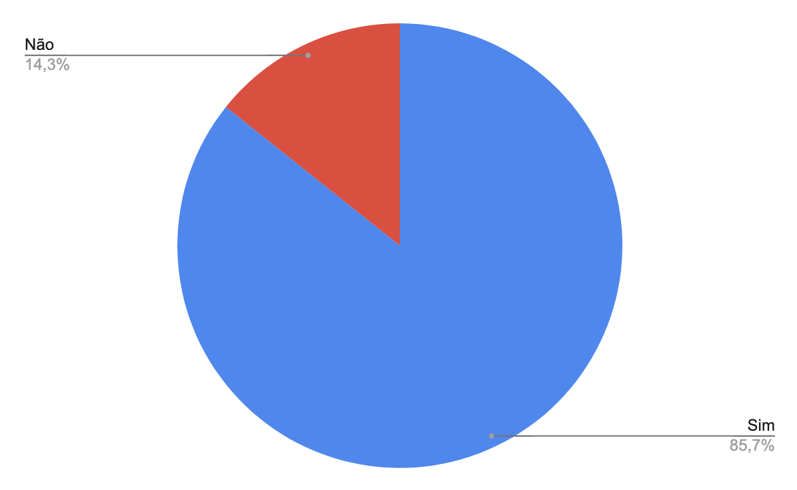

# Verificação Etapa 3

## Introdução

Este documento possui como objetivo documentar os resultados da verificação dos artefatos da etapa 3 do aplicativo Letterboxd. O responsável por esta avaliação é a avaliadora Clara Marcelino Ribeiro de Sousa e a data de execução foi no dia 18 de junho de 2023. Na tabela 1, pode-se observar os artefatos avaliados e a versão dos mesmos no dia da avaliação.

| Artefato      | Versão                          |
| ----------- | ------------------------------------ |
| Cenários | `1.0`  |
| Especificação Suplementar | `1.0`  |
| Léxicos | `1.0`  |
| Casos de Uso | `1.1`  |

  
Tabela 1: Artefatos avaliados da etapa 3
 

## Checklist

Nas tabelas 2, 3 e 4 a seguir está disponível o checklist desenvolvido durante o [planejamento](./planejamento.md) respondido de acordo com o artefato avaliado.

### Cenários
A tabela 2 a seguir possui as perguntas do checklist que será utilizado para fazer a verificação do artefato de Cenários.

| Número     | Pergunta | Resposta
| ----------- | ----------- |  ----------- |
| 1 | Os cenários possuem título?⁸ | Sim |
| 2 | Os cenários possuem metas/objetivos?⁸ | Sim |
| 3 | Os cenários possuem contexto?⁸ | Sim |
| 4 | Os cenários possuem atores?⁸ | Sim |
| 5 | Os cenários possuem recursos?⁸ | Sim |
| 6 | Os cenários possuem exceção?⁸ | Sim |
| 7 | Os cenários possuem episódios?⁸ | Sim |
| 8 | O título do cenário é de fácil compreensão?⁶ | Sim |
| 9 | As situações descritas são relevantes para o uso do sistema?⁶ | Sim |
| 10 | Os léxicos estão presentes nos cenários?⁶ | ==Incompleto== |

Tabela 2: Checklist de verificação do artefato "Cenários"

### Especificação Suplementar

| Número     | Pergunta | Resposta
| ----------- | ----------- |  ----------- |
| 1 | O modelo adotado na especificação é o FURPS?⁵ | Sim |
| 2 | É possível testar os requisitos analisados?⁵ | ==Incompleto== |
| 3 | A especificação explicita a funcionalidade do requisito?⁵ | Sim |
| 4 | A especificação explicita a usabilidade do requisito?⁵ | Sim |
| 5 | A especificação explicita a confiabilidade do requisito?⁵ | Sim |
| 6 | A especificação explicita a performance do requisito?⁵ | Sim |
| 7 | A especificação explicita a suportabilidade do requisito?⁵ | Sim |

Tabela 3: Checklist de verificação do artefato "Especificação Suplementar"

### Léxicos
| Número     | Pergunta | Resposta
| ----------- | ----------- | ----------- | 
| 1 | Os símbolos possuem noção (o significado so símbolo)?⁸ | Sim |
| 2 | Os símbolos possuem impacto (o efeito do símbolo na aplicação)?⁸ | Sim |
| 3 | Os símbolos possuem sinônimos?⁸ | Sim |
| 4 | Os símbolos possuem tipo (verbo/objeto/estado)?⁸ | Sim |

Tabela 4: Checklist de verificação do artefato "Léxicos"

### Casos de Uso

| Número     | Pergunta | Resposta
| ----------- | ----------- | ----------- | 
| 1 | Utiliza verbos no infinitivo?⁷ | ==Incompleto== |
| 2 | Possui um fluxo principal?⁵ | ==Incompleto== |
| 3 | O fluxo principal representa o modo “default”/padrão que o ator irá usar a funcionalidade?⁵ | Sim |
| 4 | Possui fluxo alternativo, quando aplicável?⁵ | Sim |
| 5 | Possui fluxo de excessão, quando aplicável? | ==Não== |
| 6 | Há relacionamentos extend e include?⁵ | Sim |
| 7 | Possui atores?⁷ | Sim |
| 8 | Possui sistemas?⁷ | Sim |
| 9 | Possui metas?⁷ | Sim |
| 10 | Possui as atividades e variantes usadas para atingir as metas?⁷ | Sim |
| 11 | O ator principal está ao lado esquerdo do sistema?⁷ | Sim |
| 12 | O usuário está fora das fronteiras da aplicação?⁷ | Sim |
| 13 | Os casos especificados são de requisitos funcionais?⁷ | Sim |
| 14 | Os casos de uso são representados com um formato oval na horizontal e representa os diferentes usos que um usuários pode ter?⁷ | Sim |

Tabela 5: Checklist de verificação do artefato "Casos de Uso"

## Resultados

Cenários

- Os léxicos estão presentes nos cenários?
> Não há uma referência clara dos léxicos nos cenários

Especificação Suplementar

- É possível testar os requisitos analisados?
> U07	- Registro no diário mais intuitivo e com menos cliques. Esse requisito é muito amplo e subjetivo. 
> D03 - O tempo de resposta do servidor deve ser rápido o suficiente para oferecer uma experiência de usuário satisfatória. Esse requisito precisa ser melhor especificado para conseguir ser testado eficientemente.

Casos de Uso

- Utiliza verbos no infinitivo?
> Alguns casos de uso não estão no infinitivo, como "UC04 - Botão de adicionar lista nova" e "UC07 - Fornece os dados de filmes assistidos". Ao não deixar os verbos no infinitivo não fica claro que o caso de uso é uma ação.

- Possui um fluxo principal?
> Alguns casos de uso não possuem, como "UC02 - Vizualizar todas as listas do usuário, incluindo listas curtidas", "UC07 - Fornece os dados de filmes assistidos" e "UC14 - Notificar usuários sobre artigos de filmes em suas listas".

- Possui fluxo de excessão, quando aplicável?
> Nenhum caso de uso possui um fluxo de excessão

<figure markdown>
  
  <figcaption>Figura 1: gráfico das respostas do checklist da etapa 3</figcaption>
  
Fonte: Autoria própria

</figure>

## Referência Bibliográfica

## Tabela de Versionamento

| Data | Versão | Descrição | Autor | Revisor |
| ---- | ------ | --------- | ----- | ------- |
| 18/06/2023 | `1.0`  | Documentação da execução da verificação | [Clara Ribeiro](https://github.com/clara-ribeiro) | [Natan Santana](https://github.com/Neitan2001) |