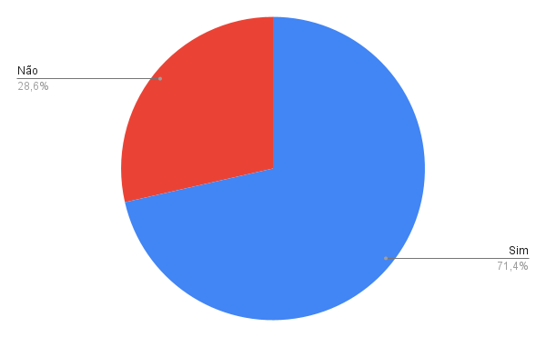

# Verificação Etapa 4

## Introdução

Este documento possui como objetivo documentar os resultados da verificação dos artefatos da etapa 4 do aplicativo Letterboxd. O responsável por esta avaliação é o avaliador Natan Tavares Santana e a data de execução foi no dia 16 de junho de 2023. Na tabela 1, pode-se observar os artefatos avaliados e a versão dos mesmos no dia da avaliação.

| Artefato      | Versão                          |
| ----------- | ------------------------------------ |
| Histórias de Usuário       | `2.0`  |
| Backlog       | `1.1` |
| NFR Framework    | `1.0` |

Tabela 1: Artefatos avaliados da etapa 4 (Fonte: Natan, 2023)

## Checklist

Nas tabela 2, 3 e 4 a seguir está disponível o checklist desenvolvido durante o [planejamento](./planejamento.md) respondido de acordo com os artefatos avaliados.

### Histórias de Usuário

| Número     | Pergunta | Resposta |
| ----------- | ----------- | ----------- | 
| 1 | As histórias de usuário seguem o padrão de voz de usuário? | ==Não== |
| 2 | As histórias de usuário estão escritas em primeira pessoa de acordo com o modelo de voz do usuário?  | Sim |
| 3 | As histórias de usuário possui o papel (quem) de acordo com o modelo de voz de usuário? | Sim |
| 4 | As histórias de usuário possui a ação (o que) de acordo com o modelo de voz de usuário?  | Sim |
| 5 | As histórias de usuário possui o resultado da ação ou o valor de negócio (porque) de acordo com o modelo de voz de usuário? | Sim |
| 6 | Nas história de usuário, o papel representa quem se beneficiará da funcionalidade, e não quem está solicitando a funcionalidade? | Sim |
| 7 | Nas histórias de usuário, é usado um termo representando o perfil em vez do termo genérico "usuário"?  | ==Não== |
| 8 | É explicado o papel dos stakeholders quanto a criação e/ou validação das histórias de usuário?  | ==Não== |
| 9 | As histórias de usuário possuem critérios de aceitação os quais permitem que elas sejam testáveis? | Sim |

Tabela 2: Checklist de verificação do artefato "Histórias de Usuário" (Fonte: Natan, 2023)

### Backlog

| Número     | Pergunta | Resposta |
| ----------- | ----------- | ----------- | 
| 10 | Foi usado uma metodologia para a construção do backlog? | Sim |
| 11 | O backlog possui épicos e temas bem definidos e descritos? | Sim |
| 12 | O PO participou da construção e/ou da validação do backlog? | Sim |
| 13 | Foi documentado se o PO pediu alguma mudança no backlog? | Sim |

Tabela 3: Checklist de verificação do artefato "Backlog" (Fonte: Natan, 2023)

### NFR Framework

| Número     | Pergunta | Resposta |
| ----------- | ----------- | ----------- | 
| 14 | Os softgoals NFR representam requisitos não-funcionais? | Sim |
| 15 | Os softgoals de operacionalização representam soluções de implementação para satisfazer softgoals NFR ou outros softgoals de operacionalização? | Sim |
| 16 | Os softgoal de afirmação fornecem as razões para as decisões de desenvolvimento? | Sim |
| 17 | Os softgoals NFR possuem um tipo e pode possuir um ou mais tópicos? | Sim |
| 18 | Os tipos de contribuição seguem as definições apresentada na dissertação "NFR4ES: Um Catálogo de Requisitos Não-Funcionais para Sistemas Embarcados"? | Sim |
| 19 | Os impactos foram corretamente propagados? | ==Não== |
| 20 | Foi construído cartões de especificação de acordo com o modelo apresentado na dissertação "NFR4ES: Um Catálogo de Requisitos Não-Funcionais para Sistemas Embarcados" ou de alguma outra referência? | ==Não== |
| 21 | Os diagramas documentados estão legíveis? | ==Não== |

Tabela 4: Checklist de verificação do artefato "NFR Framework" (Fonte: Natan, 2023)

## Resultados

É possível observar pela Figura 1 que das 21 perguntas do checklist, 6 foram respondidas como "Não" (28,6%) enquanto 17 foram respondidas como "Sim" (71,4%). A seguir será documentado as observações feitas sobre cada um dos artefatos com os pontos de atenção que foram notados pela execução do checklist.

Quanto às histórias de usuário:

- US26 está fora do padrão de voz de usuário
- É usado o termo genérico "usuário" em vez de um termo que represente o perfil
- Não foi documentado como o PO participou da construção e/ou validação das histórias de usuário

Quanto ao NFR Framework:

- A propagação da usabilidade não foi feita
- Não foram feitos os cartões de especificação dos NFR's
- As letras dos diagramas de usabilidade e de confiabilidade estão muito pequenas e difíceis de ler

<figure markdown>
  
  <figcaption>Figura 1: gráfico das respostas do checklist da etapa 4</figcaption>
  
Fonte: Autoria própria

</figure>

## Tabela de Versionamento

| Data | Versão | Descrição | Autor | Revisor |
| ---- | ------ | --------- | ----- | ------- |
| 16/06/2023 | `1.0`  | Documentação da execução da verificação | [Natan Santana](https://github.com/Neitan2001) |  |
