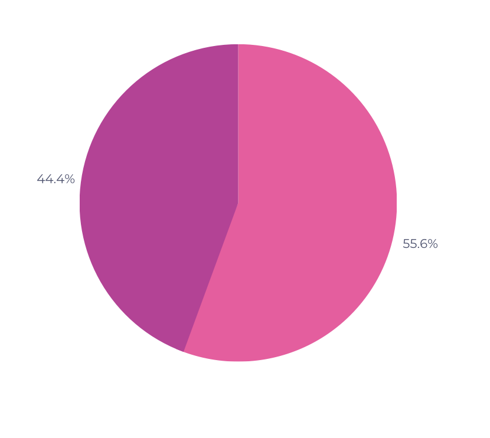

# Verificação Etapa 5

## Introdução

Este documento possui como objetivo documentar os resultados da verificação dos artefatos da etapa 5 do aplicativo Letterboxd. O responsável por esta avaliação é o avaliador Gustavo Barbosa de Oliveira e a data de execução foi no dia 20 de junho de 2023. O artefato avaliado será a Verificação do grupo 7.

## Checklist

| Número | Pergunta                                                                                | Resposta |
| ------ | --------------------------------------------------------------------------------------- | -------- |
| 1      | As etapas possuem uma introdução mostrando oque será avaliado? [Fonte:autoral]          | não      |
| 2      | Todas as etapas possuem Referência bibliográfica? [1](#ancora1)                         | não      |
| 3      | Todos os artefatos possuem checklist? [2](#ancora2)                                     | sim      |
| 4      | Cada uma das perguntas possuem referência bibliográfica? [2](#ancora2)                  | não      |
| 5      | Os documentos descrevem a metodologia utilizada? [2](#ancora2)                          | não      |
| 6      | Há um resumo explicando os principais pontos de melhoria dos artefatos? [Fonte:autoral] | sim      |
| 7      | Cada verificação possui uma análise simples de dados? [Fonte:autoral]                   | sim      |
| 8      | Possuem tabela de versionamento? [1](#ancora1)                                          | sim      |
| 9      | Todas as Etapas foram verificadas? [Fonte:autoral]                                      | não      |

Tabela 1: Checklist de verificação da Etapa 5 (Fonte: Gustavo Barbosa, 2023)

## Resultados

É possível observar pela Tabela 1 que das 9 perguntas do checklist, 5 foram respondidas como "Não" (55.6%) enquanto 4 foram respondidas como "Sim" (44,4%).

<figure markdown>
  
  <figcaption>Figura 1: gráfico das respostas do checklist da etapa 5</figcaption>
  
Fonte: Autoria própria

</figure>

## Tabela de Versionamento

| Data       | Versão | Descrição                               | Autor                                       | Revisor                                           |
| ---------- | ------ | --------------------------------------- | ------------------------------------------- | ------------------------------------------------- |
| 20/06/2023 | `1.0`  | Documentação da execução da verificação | [Gustavo Barbosa](https://github.com/brbsg) | [Clara Ribeiro](https://github.com/clara-ribeiro) |

## Referência bibliográfica

> - [1]  SALES, André Barros. Plano de ensino da disciplina. Disponível em: <a href="https://aprender3.unb.br">https://aprender3.unb.br</a>. Acesso em: 16 de junho de 2023.</ul>

> - [2]  Gerência e Qualidade de Software - Aula 05 - Verificação e Validação. Disponível em: <https://www.youtube.com/watch?v=1Y-1zz6rZxo&t=22s>.
