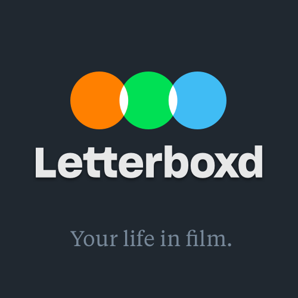

# Introdução

{width=100%}

---

## Sobre

Este projeto tem como objetivo analisar e documentar os requisitos do aplicativo Letterboxd. Para isso, serão utilizadas as ferramentas e técnicas aprendidas durante a disciplina de Requisitos de Software, ministrada no primeiro semestre de 2023 pelo Dr. Professor André Barros na Universidade de Brasília - FGA.

---

## O que é o Letterboxd?

Letterboxd é uma rede social global para a descoberta e discussão de filmes populares. Pode ser utilizada para registrar e compartilhar opiniões sobre filmes enquanto o usuário os assiste, ou ainda permite que o usuário acompanhe os filmes que já assistiu no passado. Na página de perfil, o usuário pode compartilhar com outros usuários e amigos suas opiniões sobre os filmes que já assistiu e criar listas de filmes que gostaria de assistir [1].

---

## Contribuidores

<html>
    <head>
        <link rel="stylesheet" type="text/css" href="./custom.css">
    </head>
    <body>
        

            
            

                <h2>Arthur D'Assumpção Loureiro </h2>
                
Github: <a href="https://github.com/ArtAssLou" target='_blank'>@ArtAssLou</a>

            

        

        

            
            

                <h2>Clara Marcelino Ribeiro de Sousa</h2>
                
Github: <a href="https://github.com/clara-ribeiro" target='_blank'>@clara-ribeiro</a>

            

        

        

            
            

                <h2>Débora Caires de Souza Moreira</h2>
                
Github: <a href="https://github.com/deboracaires" target='_blank'>@deboracaires</a>

            

        

        

            
            

                <h2>Gustavo Barbosa de Oliveira</h2>
                
Github: <a href="https://github.com/brbsg" target='_blank'>@brbsg</a>

            

        

        

            
            

                <h2>Maciel Ferreira Custódio Júnior</h2>
                
Github: <a href="https://github.com/macieljuniormax" target='_blank'>@macieljuniormax</a>

            

        

        

            
            

                <h2>Natan Tavares Santana</h2>
                
Github: <a href="https://github.com/Neitan2001" target='_blank'>@Neitan2001</a>

            

        

        

            
            

                <h2>Rhuan Marques Róbias dos Santos</h2>
                
Github: <a href="https://github.com/RhuanMr" target='_blank'>@RhuanMr</a>

            

        

    </body>
</html>

---

## Referência Bibliográfica

> [1] Letterboxd. FAQ. Disponível em: https://letterboxd.com/about/faq/. Acesso em: 15 Mês 2023.

---

## Tabela de Versionamento

| Data       | Versão | Descrição             | Autor                                             | Revisor                                             |
| ---------- | ------ | --------------------- | ------------------------------------------------- | --------------------------------------------------- |
| 14/04/2023 | `0.1`  | Introdução à Equipe | [Arthur Loureiro](https://github.com/ArtAssLou) | [Gustavo Barbosa](https://github.com/brbsg)
| 15/04/2023 | `0.2` | Introdução ao projeto e correção de layout |[Débora Moreira](https://github.com/deboracaires) | [Clara Ribeiro](https://github.com/clara-ribeiro) |
